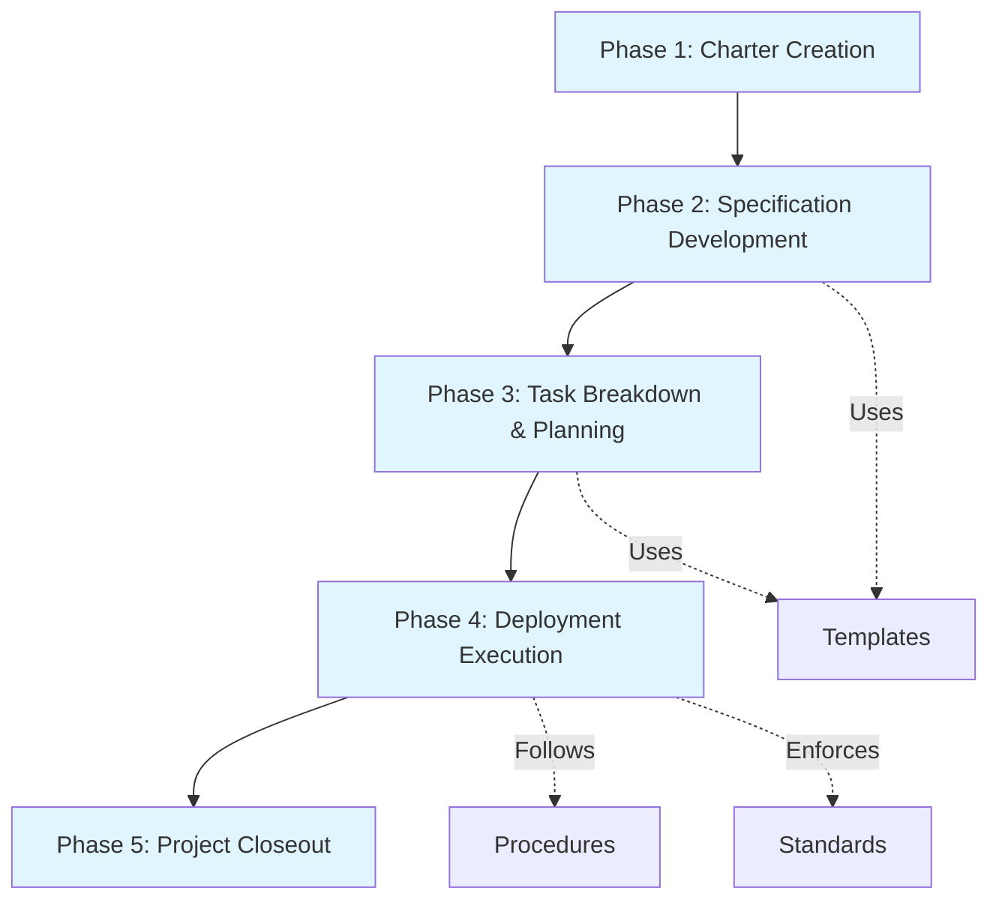
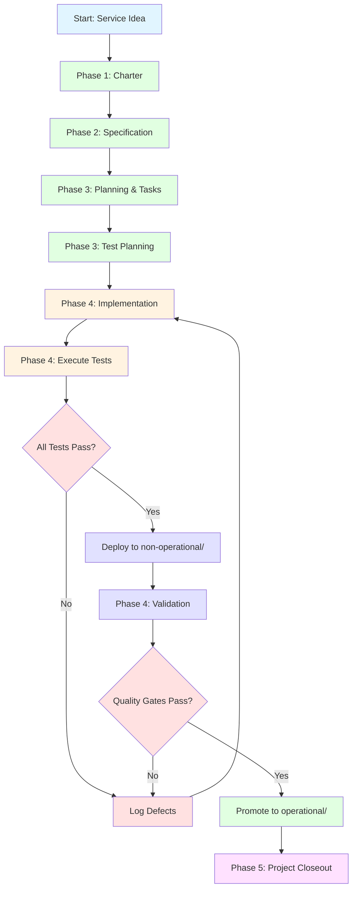
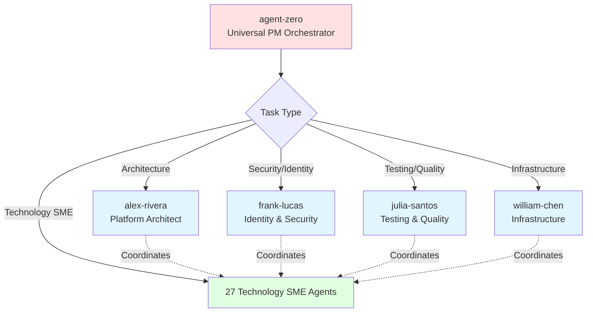

# HX-Infrastructure

**Foundational Infrastructure Management System**
**Version**: 2.0
**Last Updated**: 2025-11-23

**Major Updates in v2.0:**
- Corrected agent count (32 agents, not 45)
- Corrected repository count (58 repos, not 55)
- Added infrastructure philosophy section
- Added project lifecycle overview
- Added Mermaid diagrams for visualization
- Updated directory structure with actual paths
- Removed fabricated agent references
- Added document quality standards reference

---

## 📋 Overview

HX-Infrastructure is the foundational infrastructure management system for the Hana-X development environment. This repository provides comprehensive standards, templates, procedures, and documentation to guide agents (Claude Code, GitHub Copilot, and others) in maintaining consistent, high-quality infrastructure across all projects.

### Purpose

- **Standardization**: Establish consistent approaches to infrastructure management
- **Quality Assurance**: Ensure test-driven, documentation-first practices
- **Agent Coordination**: Enable 32 specialized agents to work together effectively
- **Knowledge Management**: Centralize infrastructure knowledge and best practices (58 repositories)
- **Operational Excellence**: Define clear procedures for deployment, testing, and maintenance

### Core Principles

1. **Quality Over Speed** - Accuracy is job #1 (see `standards/document-quality-checklist.md`)
2. **Documentation First** - Complete specifications before execution
3. **Test-Driven Deployment** - Services only operational after passing comprehensive tests (100% coverage)
4. **Iterative Approach** - Incremental development and continuous learning
5. **Clear Communication** - Lowest common denominator approach for all agents

---

## 🎯 How This System Works: Commands vs Workflows

### Understanding the Architecture

HX-Infrastructure uses a two-layer system for executing processes:

**Commands** (`.claude/commands/`) - **Executable Entry Points**
- Simple shortcuts that invoke workflows
- What you actually execute in Claude Code
- Tell Claude Code WHAT to do and WHERE files go
- Organized in subdirectories: `agents/`, `utilities/`, `workflows/`
- Examples: `/hx-charter`, `/hx-spec`, `/hx-task`

**Workflows** (`procedures/`) - **Comprehensive Process Documentation**
- Detailed step-by-step process guides
- Explain HOW to execute each phase
- Reference templates, standards, and other documents
- Examples: `charter-workflow.md`, `spec-workflow.md`, `task-execution-workflow.md`

### How They Work Together

```
You → Command File → Workflow Documentation → Templates & Standards
      (.claude/commands/)  (procedures/)         (templates/, standards/)

Example:
1. You execute /hx-charter (charter workflow command)
2. Command file tells Claude Code to follow charter-workflow.md
3. Workflow references charter-template.md and constitution.md
4. Output: Completed charter in /nodes/<node-name>/charter.md
```

### Why This Separation?

- **Usability**: Commands provide simple, memorable entry points
- **Maintainability**: Change the process without changing the command interface
- **Clarity**: Commands = UI/UX, Workflows = Process Logic
- **Documentation**: Workflows serve as both execution guides and documentation

### Key Principle

> **Commands call workflows. Workflows describe processes.**

When you execute a command, Claude Code reads the command file to understand what to do, then follows the referenced workflow documentation step-by-step to complete the process.

---

## 🗂️ Repository Structure

```
/home/agent0/HX-Infrastructure/
│
├── README.md                          # This file - start here
├── CLAUDE.md                          # Agent Zero orchestration guide
├── constitution.md                    # Infrastructure philosophy and governance
├── command-quick-reference.md         # Quick command lookup
│
├── .claude/commands/                  # Claude Code integration
│   ├── agents/                        # Agent-specific commands
│   ├── utilities/                     # Utility commands
│   └── workflows/                     # Workflow commands (charter, spec, task, etc.)
│
├── hx-agents/                         # Agent documentation and coordination
│   ├── hx-agent-inventory.md          # 32 agents - capabilities and specializations
│   ├── hx-knowledge-vault-catalog.md  # 58 repos - knowledge base reference
│   ├── hx-orchestration-guide.md      # Detailed multi-agent workflows
│   └── hx-orchestration-quick-ref.md  # Quick patterns and lookups
│
├── hx-knowledge/                      # Knowledge base (excluded from git)
│   ├── repos/                         # 58 repository references
│   └── docs/                          # Supporting documentation and guides
│
├── standards/                         # Infrastructure standards (mandatory compliance)
│   ├── naming-conventions.md          # Naming rules for all artifacts
│   ├── architecture-standards.md      # Architecture guidelines
│   ├── documentation-requirements.md  # Documentation standards
│   ├── testing-requirements.md        # Testing and coverage requirements (100%)
│   ├── deployment-requirements.md     # Deployment procedures
│   ├── credentials-vault-management.md # Credential storage (⚠️ .gitignored)
│   └── document-quality-checklist.md  # Quality assurance checklist
│
├── templates/                         # Reusable templates
│   ├── charter-template.md            # Project charter template
│   ├── charter-questions-template.md  # Charter discovery questions
│   ├── service-spec-template.md       # Service specification template
│   ├── service-plan-template.md       # Service deployment plan template
│   ├── service-tasks-template.md      # Service task breakdown template
│   ├── service-architecture-template.md # Service architecture documentation
│   ├── node-template.md               # Node documentation template
│   ├── node-deployment-plan-template.md # Node deployment plan
│   ├── poc-template.md                # Proof of concept template
│   ├── knowledge-vault-research-template.md # Research findings template
│   ├── research-findings-template.md  # Research documentation
│   ├── raidd-log-template.md          # RAIDD log template
│   └── testing/                       # Testing templates subdirectory
│       ├── test-plan-template.md      # Test planning template
│       ├── test-case-template.md      # Test case template
│       ├── test-execution-template.md # Test execution results template
│       ├── test-suite-index-template.md # Test suite index template
│       └── defect-template.md         # Defect tracking template
│
├── procedures/                        # How-to documentation (workflow procedures)
│   ├── charter-workflow.md            # Phase 1: Charter creation workflow
│   ├── spec-workflow.md               # Phase 2: Specification development workflow
│   ├── task-workflow.md               # Phase 3: Task breakdown & planning workflow
│   ├── task-execution-workflow.md     # Phase 4: Deployment execution workflow
│   ├── project-closeout-workflow.md   # Phase 5: Project closeout workflow
│   ├── node-deployment-workflow.md    # Node deployment procedures
│   ├── core-project-team.md           # Core Team SME coordination
│   ├── context-loading-process.md     # Context loading for agents
│   ├── testing-knowledge-research-process.md # Knowledge research procedures
│   └── examples/                      # Example artifacts and references
│
├── inventory/                         # Current infrastructure state
│   ├── nodes.md                       # All nodes in infrastructure (30 operational)
│   ├── config-placeholders.md         # Configuration placeholder definitions
│   └── (other inventory tracking files)
│
├── nodes/                             # Per-node documentation (20 nodes documented)
│   ├── hx-ca-server/                  # Certificate Authority server
│   ├── hx-control-node/               # Ansible control node
│   ├── hx-crawl4ai-mcp-server/        # Crawl4AI MCP server
│   ├── hx-crawl4ai-server/            # Crawl4AI worker server
│   ├── hx-dc-server/                  # Domain Controller (Samba AD)
│   ├── hx-docling-server/             # Docling document processing
│   ├── hx-fastmcp-server/             # FastMCP gateway server
│   ├── hx-litellm-server/             # LiteLLM proxy server
│   ├── hx-literag-server/             # LightRAG server
│   ├── hx-n8n-mcp-server/             # n8n MCP integration server
│   ├── hx-n8n-server/                 # n8n automation server
│   ├── hx-ollama1-server/             # Ollama inference server 1
│   ├── hx-ollama2-server/             # Ollama inference server 2
│   ├── hx-ollama3-server/             # Ollama inference server 3
│   ├── hx-postgres-server/            # PostgreSQL database server
│   ├── hx-qdrant-server/              # Qdrant vector database
│   ├── hx-qdrant-ui-server/           # Qdrant UI server
│   ├── hx-qmcp-server/                # QMCP server
│   ├── hx-redis-server/               # Redis server
│   ├── hx-ssl-server/                 # SSL/TLS management server
│   └── hx-webui-server/               # Open WebUI server
│
├── services/                          # Service deployment tracking
│   ├── operational/                   # Production-ready services
│   │   └── <service-name>/            # Service documentation and configs
│   └── non-operational/               # Services under development/testing
│       └── <service-name>/            # Service documentation and configs
│
├── network/                           # Network documentation
│   └── (network topology, port mapping, connectivity docs)
│
├── x-claude/                          # Analysis and working documents (not for production)
├── x-archive/                         # Archived content (historical reference)
└── x-files/                           # Working directory (temporary files)
```

---

## 🏗️ Infrastructure Philosophy

HX-Infrastructure follows strict deployment and operational principles defined in `constitution.md`:

### Deployment Standards

**Bare-Metal Deployment** (Production/Staging)
- All production and staging services deploy on bare-metal Ubuntu 24.04 LTS servers
- No containerization in production/staging environments
- Hardware specifications documented per node in `inventory/nodes.md`
- 30 operational nodes in IP range 192.168.10.200-229

**Systemd Service Management**
- All services managed via systemd units
- No Docker in production/staging (Docker dev-only on hx-dev-server)
- Service configurations versioned in repository
- Service files follow naming conventions in `standards/naming-conventions.md`

**Manual Procedures** (NO Automation Playbooks)
- Deployment executed via manual procedures in `procedures/`
- NO Ansible playbooks for deployment (Ansible Vault for credentials ONLY)
- Step-by-step task execution ensures understanding and control
- Each task documented and traceable

**Test-Driven Deployment**
- 100% test coverage mandatory (no exceptions)
- Services start in `services/non-operational/`
- Promotion to `services/operational/` only after all tests pass
- Test results documented with timestamps

### Development Standards

**Documentation-First**
- Specifications written before implementation (Phase 2)
- Plans documented before execution (Phase 3)
- Templates ensure consistency across all artifacts
- Quality checklist validates all documentation

**Quality Over Speed**
- Accuracy is job #1 (see `standards/document-quality-checklist.md`)
- Thorough testing required (100% coverage)
- Defects resolved before promotion
- Peer review mandatory for all changes

**Agent-Optimized**
- All documentation consumable by AI agents
- Clear, structured markdown
- Consistent templates and naming conventions
- Context and rationale provided, not just instructions

See `constitution.md` for complete infrastructure philosophy and governance.

---

## 📋 Project Lifecycle

HX-Infrastructure uses a **5-phase canonical lifecycle** for all infrastructure work defined in `procedures/core-project-team.md`:

### Phase Overview



### Phase 1: Charter Creation

**Purpose:** Define project scope and success criteria

- Identify stakeholders and resources
- Document approval requirements
- Define success criteria and constraints
- **Workflow:** `procedures/charter-workflow.md`
- **Template:** `templates/charter-template.md`
- **Command:** `/hx-charter`

### Phase 2: Specification Development

**Purpose:** Document service requirements (WHAT and WHY)

- Define functional and operational requirements
- Identify dependencies and integrations
- Document security and compliance needs
- **Workflow:** `procedures/spec-workflow.md`
- **Template:** `templates/service-spec-template.md`
- **Command:** `/hx-spec`

### Phase 3: Task Breakdown & Planning

**Purpose:** Create deployment plan (HOW)

- Create detailed deployment plan
- Break down into atomic tasks
- Define test plan (100% coverage required)
- **Workflow:** `procedures/task-workflow.md`
- **Templates:** `templates/service-plan-template.md`, `templates/service-tasks-template.md`, `templates/testing/test-plan-template.md`
- **Command:** `/hx-plan`, `/hx-task`

### Phase 4: Deployment Execution

**Purpose:** Implement, test, and deploy

- Execute tasks sequentially
- Run tests continuously
- Deploy to non-operational environment
- Validate and promote to operational
- **Workflow:** `procedures/task-execution-workflow.md`
- **Command:** `/hx-exec`

### Phase 5: Project Closeout

**Purpose:** Complete project and capture learnings

- Document lessons learned
- Update inventory and documentation
- Archive project artifacts
- Celebrate success
- **Workflow:** `procedures/project-closeout-workflow.md`
- **Command:** `/hx-close`

---

## 🔄 Service Deployment Workflow

### Complete Deployment Lifecycle



### Workflow Steps

1. **Charter Creation** → Define scope, success criteria, resources
2. **Specification** → Document requirements (WHAT & WHY)
3. **Planning & Tasks** → Create deployment plan, break into tasks, define tests
4. **Implementation** → Execute tasks, run tests, deploy to non-operational
5. **Promotion** → Pass quality gates, move to operational
6. **Closeout** → Document lessons learned, update inventory

### Quality Gates

Services MUST meet these criteria before promotion to operational:

- ✅ Complete specification (`spec.md`)
- ✅ Complete deployment plan (`plan.md`)
- ✅ All tasks completed and documented
- ✅ 100% test coverage achieved
- ✅ All tests passing
- ✅ No critical/high severity defects
- ✅ Documentation complete and reviewed
- ✅ Health checks passing

See `procedures/` directory for detailed workflow documentation.

---

## 🚀 Quick Start

### For Agents

1. **Read the Constitution**: Start with `constitution.md` to understand project philosophy
2. **Review Your Role**: Check `hx-agents/hx-agent-inventory.md` to understand your capabilities
3. **Learn Workflows**: See `hx-agents/hx-orchestration-guide.md` for collaboration patterns
4. **Use Quick Reference**: Keep `hx-agents/hx-orchestration-quick-ref.md` handy for fast lookups
5. **Follow Standards**: All work must comply with documents in `standards/`
6. **Use Templates**: All deliverables use templates from `templates/` and `templates/testing/`
7. **Quality Checklist**: Follow `standards/document-quality-checklist.md` for all documentation

### For Service Deployment

```bash
# Phase 1: Create charter
Command: /hx-charter
Template: templates/charter-template.md
Output: nodes/<node-name>/charter.md

# Phase 2: Create specification
Command: /hx-spec
Template: templates/service-spec-template.md
Output: services/non-operational/<service-name>/spec.md

# Phase 3: Create deployment plan
Command: /hx-plan
Template: templates/service-plan-template.md
Output: services/non-operational/<service-name>/plan.md

# Phase 3: Create tasks
Command: /hx-task
Template: templates/service-tasks-template.md
Output: services/non-operational/<service-name>/tasks/task-*.md

# Phase 3: Create test plan
Command: /hx-test-plan
Template: templates/testing/test-plan-template.md
Output: services/non-operational/<service-name>/tests/test-plan.md

# Phase 4: Implement and test
Follow: standards/testing-requirements.md (100% coverage required)
Execute: All tasks in sequence
Run: All tests continuously

# Phase 4: Deploy to non-operational
Location: services/non-operational/<service-name>/

# Phase 4: Promote to operational (after all tests pass)
Move to: services/operational/<service-name>/

# Phase 5: Project closeout
Command: /hx-close
Document: Lessons learned, update inventory
```

### For Documentation

All documentation must follow:
- **Naming Conventions**: `standards/naming-conventions.md`
- **Documentation Requirements**: `standards/documentation-requirements.md`
- **Quality Checklist**: `standards/document-quality-checklist.md`
- **Generic Placeholders**: Use `<service-name>`, `<node-name>`, etc. (never specific examples)

---

## 📚 Key Documents

### Essential Reading (In Order)

1. **constitution.md** - Infrastructure philosophy and core principles
2. **CLAUDE.md** - Agent Zero orchestration guide (if you're an AI agent)
3. **standards/naming-conventions.md** - How to name everything
4. **standards/documentation-requirements.md** - Documentation standards
5. **standards/testing-requirements.md** - Testing and coverage requirements (100%)
6. **standards/document-quality-checklist.md** - Quality assurance checklist
7. **hx-agents/hx-orchestration-guide.md** - How agents work together

### Agent References

- **hx-agents/hx-agent-inventory.md** - All 32 agents, their capabilities and specializations
- **hx-agents/hx-knowledge-vault-catalog.md** - 58 repositories and knowledge sources
- **hx-agents/hx-orchestration-quick-ref.md** - Fast pattern lookups
- **command-quick-reference.md** - Quick command reference

### Standards (Mandatory Compliance)

- **standards/naming-conventions.md** - Naming rules for all artifacts
- **standards/architecture-standards.md** - Architecture and design guidelines
- **standards/documentation-requirements.md** - Documentation standards
- **standards/testing-requirements.md** - Testing requirements (100% coverage mandatory)
- **standards/deployment-requirements.md** - Deployment procedures
- **standards/credentials-vault-management.md** - Credential storage (⚠️ never commit)
- **standards/document-quality-checklist.md** - Quality assurance checklist

### Templates (Use for All Work)

**Service Lifecycle:**
- `service-spec-template.md` - Service specifications
- `service-plan-template.md` - Deployment planning
- `service-tasks-template.md` - Task breakdown
- `service-architecture-template.md` - Architecture documentation
- `poc-template.md` - Proof of concept documentation

**Testing:**
- `testing/test-plan-template.md` - Test planning
- `testing/test-case-template.md` - Individual test cases
- `testing/test-execution-template.md` - Test results
- `testing/test-suite-index-template.md` - Test suite organization
- `testing/defect-template.md` - Defect tracking

**Infrastructure:**
- `charter-template.md` - Project charters
- `node-template.md` - Node documentation
- `node-deployment-plan-template.md` - Node deployment plans

**Research:**
- `knowledge-vault-research-template.md` - Research findings
- `research-findings-template.md` - Research documentation

---

## 👥 Agent Organization

HX-Infrastructure uses a **capability-based agent assignment model** with **32 specialized agents**:

### Core Team SMEs (5 Agents)

Strategic coordination and domain expertise:

- **agent-zero** - Universal PM Orchestrator, multi-agent synthesis, task coordination
- **alex-rivera** - Platform Architect, architecture decisions, design coordination
- **frank-lucas** - Identity & Security Specialist, DNS, certificates, authentication
- **julia-santos** - Testing & Quality Specialist, test strategy, quality gates, 100% coverage
- **william-chen** - Infrastructure Specialist, bare-metal deployment, systemd, operations

### Technology SMEs (27 Agents)

Specialized technology implementation across various domains.

**Complete agent profiles, capabilities, and coordination patterns are documented in:**
`/home/agent0/HX-Infrastructure/hx-agents/hx-agent-inventory.md`

### Agent Coordination Pattern



### Assignment Model

- **Capability-Based:** Agents assigned based on capability match to task requirements
- **No Rigid Hierarchy:** Core Team SMEs coordinate Technology SME agents based on expertise needed
- **Consult Inventory:** Always check `hx-agents/hx-agent-inventory.md` for specific agent capabilities
- **Orchestration Patterns:** Detailed workflows in `hx-agents/hx-orchestration-guide.md`

**Total:** 32 agents (5 Core Team SMEs + 27 Technology SMEs)

---

## 📖 Knowledge Base

### Repository Catalog

**58 repositories** documented in `hx-agents/hx-knowledge-vault-catalog.md`

The knowledge vault provides reference documentation, examples, and best practices for:
- Technology implementation patterns
- API references and usage examples
- Framework-specific best practices
- Integration guides and patterns

### Categories

**Agent Development:**
- agent-zero, mcp-client-cli, claude-code patterns

**Backend Development:**
- FastAPI, Flask, Django, Node.js, Express

**Data & ML:**
- numpy, pandas, scikit-learn, transformers
- LangChain, LangGraph, LightRAG
- Ollama, LiteLLM

**DevOps & Infrastructure:**
- Ansible (Vault only - no playbooks for deployment)
- systemd, network management, bare-metal operations

**Frontend Development:**
- React, Next.js, Tailwind CSS, Zod

**Testing & Quality:**
- pytest, Jest, testing frameworks, quality tools

**Databases:**
- PostgreSQL, Redis, Qdrant (vector database)

### Knowledge Organization

```
hx-knowledge/repos/              # 58 repositories
├── agent-zero/                  # Agent development patterns
├── fastapi/                     # FastAPI framework
├── langchain/                   # LangChain framework
├── langgraph-main/              # LangGraph orchestration
├── LightRAG-main/               # LightRAG knowledge graphs
├── ollama-main/                 # Ollama inference
├── qdrant-master/               # Qdrant vector database
├── redis-unstable/              # Redis data store
└── ... (50 more repositories)
```

### Usage

- Agents reference knowledge vault before implementation
- Research processes documented in `procedures/testing-knowledge-research-process.md`
- Complete catalog: `hx-agents/hx-knowledge-vault-catalog.md`

⚠️ **Note:** `hx-knowledge/` directory is git-ignored (excluded from version control)

---

## 🎯 Core Requirements

### Quality Standards

✅ **Test Coverage**: 100% required (no exceptions - see `standards/testing-requirements.md`)
✅ **Documentation**: Complete before deployment (see `standards/documentation-requirements.md`)
✅ **Code Review**: Required for all code changes
✅ **Peer Review**: Required for all documentation
✅ **Quality Checklist**: Follow `standards/document-quality-checklist.md` for all documents

### Security Requirements

⚠️ **Credentials**: Never commit to GitHub
⚠️ **Authentication**: Samba AD only (no local user accounts for humans)
⚠️ **Vaults**: Service vaults + node vaults only
⚠️ **Protected Content** (must be .gitignored):
   - All `*/vault/` directories (secret material only)
   - Any files containing secrets or keys
   - Note: `standards/credentials-vault-management.md` is a documentation file and SHOULD remain tracked
⚠️ **Ansible**: Vault for credentials ONLY (no playbooks for deployment)

### Deployment Requirements

📦 **Test-Driven**: Services start in `services/non-operational/`
✅ **Quality Gates**: All tests must pass before promotion
📋 **Documentation**: Complete documentation required
🔍 **Validation**: Health checks must pass
🏗️ **Bare-Metal**: Production/staging on Ubuntu 24.04 LTS (no Docker)
⚙️ **Systemd**: Service management via systemd units
📝 **Manual Procedures**: Step-by-step execution (no automation playbooks)

---

## 🛠️ Development Standards

### Naming Conventions

All artifacts must follow naming conventions from `standards/naming-conventions.md`:

```
Documents:     <type>-<identifier>-<description>.md
Tasks:         <service>-task-<sequence>-<brief-description>.md
Test Cases:    tc-<service>-<test-area>-<sequence>-<description>.md
Defects:       defect-<service>-<severity>-<sequence>-<brief-description>.md
Test Results:  <YYYY-MM-DD>-<test-case-id>-r<run>.md
Nodes:         <node-name> (lowercase, hyphens only)
Services:      <service-name> (lowercase, hyphens only)
```

### Generic Placeholders

Always use generic placeholders in documentation:

✅ **Correct**: `<service-name>`, `<node-name>`, `<description>`
❌ **Incorrect**: Specific examples like "docling", "postgres", etc.

### Test Coverage

From `standards/testing-requirements.md`:

- **Mandatory**: 100% test coverage (no exceptions)
- **Required Test Areas**: Deployment, Functionality, Integration, Health Check
- **Test-Driven Deployment**: No service goes operational without passing all tests
- **No Exceptions**: Coverage requirement is absolute

---

## 🔐 Security & Credentials

### Credential Management

**Storage Locations**:
- Service vaults: `services/<service-name>/vault/`
- Node vaults: `nodes/<node-name>/vault/`

**Security Rules**:
- ❌ NEVER commit credentials to GitHub
- ❌ NEVER use local user accounts for humans
- ✅ ALWAYS use Samba AD authentication
- ✅ ALWAYS store secrets in appropriate vaults
- ✅ Use Ansible Vault for credential storage ONLY (no deployment playbooks)

**Protected Files**:
- `standards/credentials-vault-management.md` - Must be in `.gitignore`
- All `*/vault/` directories - Must be in `.gitignore`

See `standards/credentials-vault-management.md` for complete credential management procedures.

---

## 📊 Current Infrastructure

### Operational Environment

- **Nodes:** 30 operational nodes (documented in `inventory/nodes.md`)
- **Documented Nodes:** 20 nodes with complete documentation in `nodes/` directory
- **IP Range:** 192.168.10.200-229
- **Operating System:** Ubuntu 24.04 LTS (bare-metal)
- **Services:** Multiple operational services across fleet
- **Agent Coordination:** 32 specialized agents (5 Core Team SMEs + 27 Technology SMEs)
- **Knowledge Base:** 58 repositories in hx-knowledge/repos/

### Documentation Status

**Complete:**
- ✅ Constitution and infrastructure philosophy (`constitution.md`)
- ✅ Standards (7 documents in `standards/`)
- ✅ Templates (13 templates in `templates/` and `templates/testing/`)
- ✅ Procedures (10 workflow documents in `procedures/`)
- ✅ Agent documentation and orchestration guides (`hx-agents/`)
- ✅ Quality checklist for document creation (`standards/document-quality-checklist.md`)
- ✅ Agent Zero orchestration guide (`CLAUDE.md`)

**Ongoing:**
- 🔄 Node documentation (20 of 30 nodes documented in `nodes/`)
- 🔄 Service deployments (tracked in `services/operational/` and `services/non-operational/`)
- 🔄 Network topology documentation (`network/`)
- 🔄 Inventory updates (`inventory/`)

---

## 🆘 Getting Help

### For Agents

1. **Orchestration Questions:** Consult **agent-zero** (Universal PM Orchestrator)
2. **Quick Patterns:** Check `hx-agents/hx-orchestration-quick-ref.md`
3. **Detailed Workflows:** See `hx-agents/hx-orchestration-guide.md`
4. **Standards Questions:** Review relevant document in `standards/`
5. **Template Questions:** Check template file in `templates/` or `templates/testing/`
6. **Quality Standards:** Follow `standards/document-quality-checklist.md`
7. **Command Reference:** See `command-quick-reference.md`

### For Specific Domains

- **Architecture:** alex-rivera (Platform Architect)
- **Security/Identity:** frank-lucas (Identity & Security Specialist)
- **Testing/Quality:** julia-santos (Testing & Quality Specialist)
- **Infrastructure:** william-chen (Infrastructure Specialist)
- **Technology SMEs:** See `hx-agents/hx-agent-inventory.md` for specific capabilities

### For Troubleshooting

1. Check relevant procedure in `procedures/`
2. Review applicable standards in `standards/`
3. Consult `hx-agents/hx-orchestration-guide.md` for coordination patterns
4. Engage appropriate Core Team SME based on domain
5. Review `constitution.md` for governance and philosophy

---

## 📝 Document Maintenance

### This README

- **Owner**: Infrastructure Team (coordinated by agent-zero)
- **Version**: 2.0
- **Last Updated**: 2025-11-23
- **Update Frequency**: As needed when structure changes
- **Review**: Monthly or when major changes occur
- **Quality Standard**: `standards/document-quality-checklist.md`

### Contributing

All contributions must:
1. Follow standards in `standards/` directory
2. Use templates from `templates/` and `templates/testing/`
3. Pass peer review
4. Include complete documentation
5. Achieve 100% test coverage (if code)
6. Follow `standards/document-quality-checklist.md`
7. Use generic placeholders (no specific examples)

---

## ⚠️ Important Notes

### Critical Reminders

- **Quality Over Speed**: Accuracy is job #1 (`standards/document-quality-checklist.md`)
- **Documentation First**: Spec before code (Phases 1-3 before Phase 4)
- **Test-Driven**: 100% coverage is mandatory (`standards/testing-requirements.md`)
- **Generic Placeholders**: No specific examples in docs (`standards/naming-conventions.md`)
- **Security First**: Never commit credentials
- **Bare-Metal**: Production/staging on Ubuntu 24.04 LTS (no Docker)
- **Manual Procedures**: No Ansible playbooks for deployment
- **Systemd**: All services managed via systemd units

### Common Pitfalls to Avoid

❌ Deploying without complete tests
❌ Skipping documentation
❌ Using specific examples instead of placeholders
❌ Committing credentials to git
❌ Bypassing quality gates
❌ Promoting services before tests pass
❌ Using Docker in production/staging
❌ Creating Ansible playbooks for deployment
❌ Skipping the quality checklist

---

## 🎯 Success Criteria

A successfully deployed service in HX-Infrastructure:

✅ Has complete charter (`charter.md`)
✅ Has complete specification (`spec.md`)
✅ Has deployment plan (`plan.md`)
✅ Has task breakdown (`task-*.md` files)
✅ Has test plan (`test-plan.md`)
✅ Has test cases (`tc-*.md` files)
✅ Achieves 100% test coverage
✅ Passes all tests
✅ Has complete documentation
✅ Passes quality checklist (`standards/document-quality-checklist.md`)
✅ Deployed on bare-metal (production/staging)
✅ Managed via systemd
✅ Resides in `services/operational/`

---

## 📞 Contact & Coordination

### Universal Orchestration

**agent-zero** - Universal PM Orchestrator
Role: Overall coordination, multi-agent synthesis, task orchestration

### Core Team SME Coordination

- **alex-rivera** - Platform Architect (architecture decisions, design coordination)
- **frank-lucas** - Identity & Security Specialist (authentication, certificates, DNS)
- **julia-santos** - Testing & Quality Specialist (test strategy, quality gates, 100% coverage)
- **william-chen** - Infrastructure Specialist (bare-metal, systemd, operations)

### Technology SME Agents

27 specialized Technology SME agents provide domain-specific expertise.

### Agent Coordination Resources

For complete agent profiles, capabilities, and coordination patterns:
- **Agent Inventory:** `hx-agents/hx-agent-inventory.md` (32 agents)
- **Orchestration Guide:** `hx-agents/hx-orchestration-guide.md` (detailed workflows)
- **Quick Reference:** `hx-agents/hx-orchestration-quick-ref.md` (fast lookups)
- **Agent Zero Guide:** `CLAUDE.md` (comprehensive orchestration guide)

---

**HX-Infrastructure** - Building Quality Infrastructure Through Standards, Testing, and Collaboration

**Version:** 2.0
**Last Updated:** 2025-11-23
**Repository:** <https://github.com/Hana-X-AI/HX-Infrastructure.git>
**Location:** /home/agent0/HX-Infrastructure

**Major Updates in v2.0:**
- Corrected agent count (32 agents: 5 Core Team SMEs + 27 Technology SMEs)
- Corrected repository count (58 repositories in knowledge vault)
- Added infrastructure philosophy section (bare-metal, systemd, manual procedures)
- Added project lifecycle overview (5 canonical phases with Mermaid diagrams)
- Added service deployment workflow visualization
- Added agent coordination pattern diagram
- Updated directory structure with all actual paths verified
- Removed all fabricated agent references from v1.0
- Added document quality standards reference
- Comprehensive Mermaid diagram integration
- Complete accuracy verification against authoritative sources
