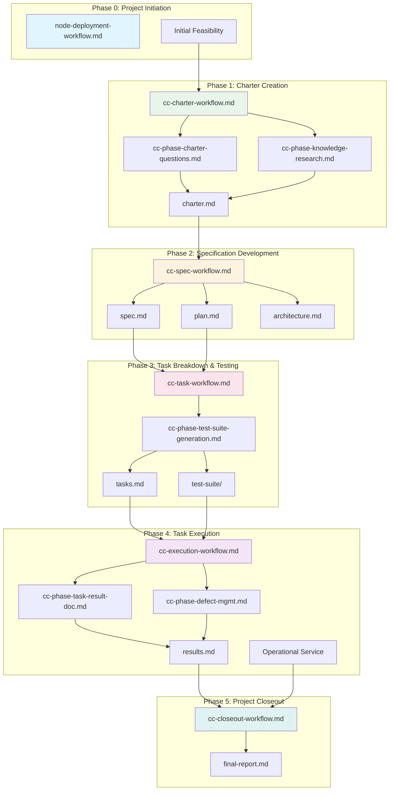
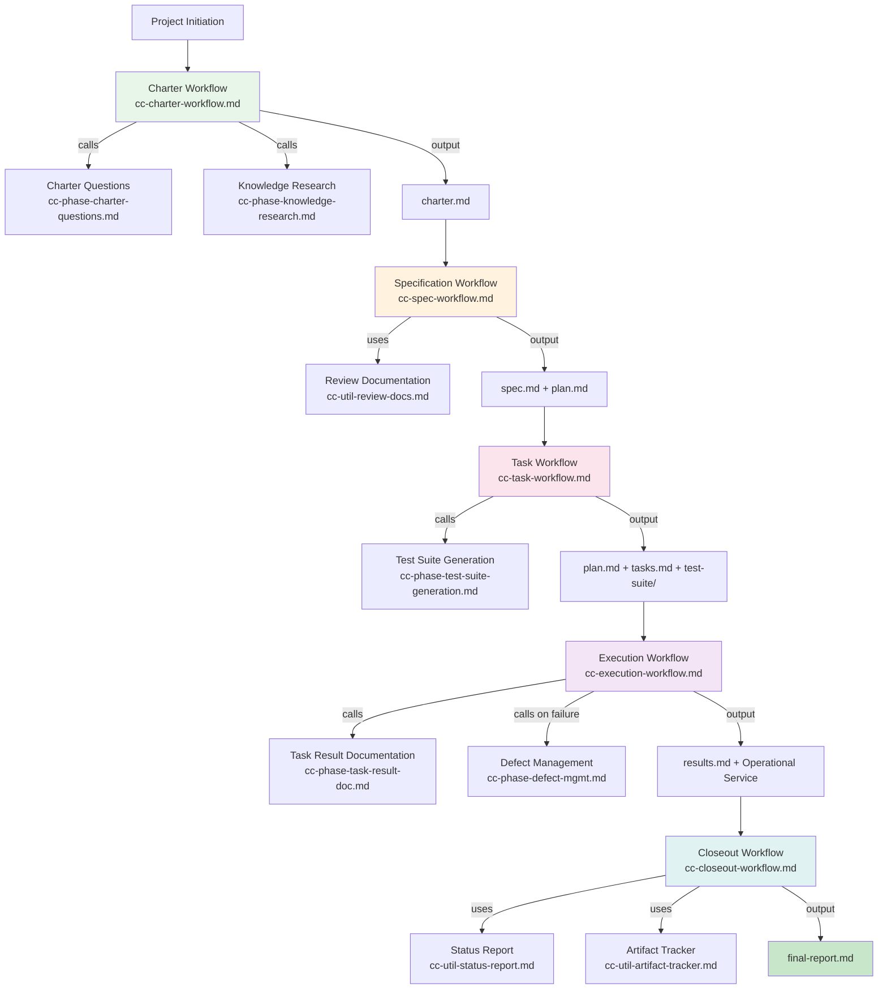
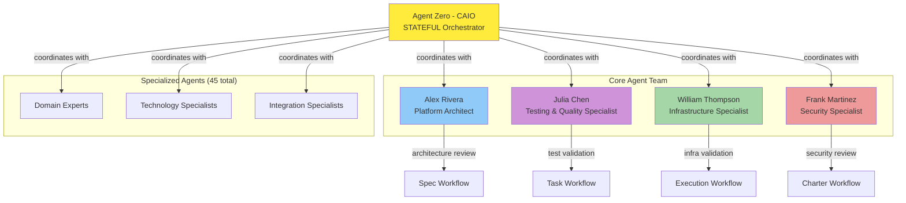
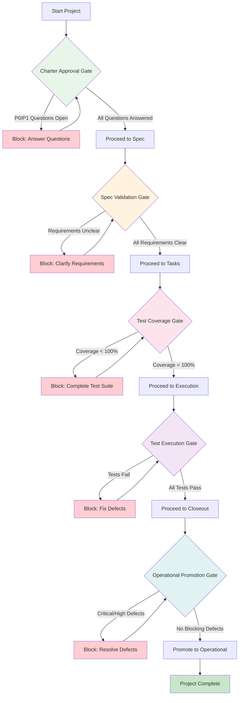

# Claude Code Command System - Quick Reference
## Comprehensive Command Catalog and Integration Guide for HX-Infrastructure

**Document Type:** Reference Guide - Command System Catalog
**Version:** 2.0
**Date:** 2025-11-21
**Status:** ✅ PRODUCTION READY
**Location:** `/home/agent0/HX-Infrastructure/command-quick-reference.md`
**Previous Version:** 1.0 → 2.0 (comprehensive mermaid diagrams, metadata, standards alignment, lifecycle integration)

---

## Document Purpose

This reference guide provides comprehensive documentation of the Claude Code command system for HX-Infrastructure, including command catalog, integration patterns, workflow diagrams, troubleshooting guidance, and quick-start examples.

### Target Audience
- **Agent Zero (CC):** STATEFUL orchestrator using commands throughout lifecycle
- **CAIO:** Understanding command capabilities and workflow orchestration
- **All Infrastructure Engineers:** Command reference for operational tasks
- **All Developers:** Understanding workflow and phase commands

### Scope
- Complete catalog of all 22 commands across 4 sets
- Integration patterns and command relationships
- Workflow diagrams using mermaid
- Common workflows and use cases
- Troubleshooting guide
- Quick-start examples

### Command System Overview

**Total Commands:** 22 commands across 4 sets
**Total Lines:** ~38,900 lines of command logic
**Pattern Compliance:** Gold Standard v1.1 (100% compliance)
**Status:** Production Ready

---

## 📚 Table of Contents

1. [Command Catalog](#command-catalog)
2. [Lifecycle Integration Map](#lifecycle-integration-map)
3. [Command Integration Diagrams](#command-integration-diagrams)
4. [Common Workflows](#common-workflows)
5. [Troubleshooting Guide](#troubleshooting-guide)
6. [Quick Start Examples](#quick-start-examples)
7. [Best Practices](#best-practices)

---

## 🎯 Command Catalog

### **Set 1: Core Workflow Commands** (5 commands)

Full SDLC workflow orchestration from charter through closeout, implementing the 6 lifecycle phases (0-5).

| Command | File | Lines | Phase | Purpose |
|---------|------|-------|-------|---------|
| **Charter Workflow** | workflows/cc-charter-workflow.md | 3,465 | Phase 1 | Complete charter development process with 10 phases |
| **Specification Workflow** | workflows/cc-spec-workflow.md | 3,893 | Phase 2 | Requirements analysis and technical specifications |
| **Task Workflow** | workflows/cc-task-workflow.md | 3,271 | Phase 3 | Task generation, sequencing, and test suite creation |
| **Execution Workflow** | workflows/cc-execution-workflow.md | 3,446 | Phase 4 | Test-driven deployment with 8 execution phases |
| **Closeout Workflow** | workflows/cc-closeout-workflow.md | 3,850 | Phase 5 | Project completion and artifact consolidation |

**Total:** 17,925 lines

**Infrastructure Philosophy Integration:**
- All workflows enforce the 5 core infrastructure principles
- deployment-requirements.md referenced as AUTHORITATIVE source
- Manual procedures enforced (no Ansible playbooks)
- Test-driven deployment required (100% pass rate)

**Standards Implemented:**
- deployment-requirements.md - Infrastructure philosophy
- documentation-requirements.md - Artifact documentation
- testing-requirements.md - Test-driven deployment
- architecture-standards.md - Architecture documentation

---

### **Set 2: Agent Orchestration Commands** (5 commands)

Coordinate with specialized agents and manage team formation.

| Command | File | Lines | Purpose |
|---------|------|-------|---------|
| **Orchestration Guide** | orchestration/cc-orchestrate-hx.md | 1,875 | Complete guide for orchestrating HX agents |
| **Agent Inventory** | orchestration/cc-list-hx-agents.md | 1,234 | Discover and reference all 45 specialized agents |
| **Knowledge Catalog** | orchestration/cc-list-knowledge.md | 1,567 | Search 55+ knowledge repositories |
| **Team Formation** | orchestration/cc-form-team.md | 1,423 | Assemble project-specific teams |
| **Context Loading** | orchestration/cc-load-context.md | 1,691 | Load context for stateless agents |

**Total:** 7,790 lines

**Agent Coordination Patterns:**
- Agent Zero (CC) coordinates WITH agents using their expertise
- Core team: Alex Rivera, Julia Chen, William Thompson, Frank Martinez
- Object-oriented agent coordination (not impersonation)
- Stateless agent context loading patterns

---

### **Set 3: Utility Commands** (7 commands)

Reusable helper functions for common operational tasks.

| Command | File | Lines | Purpose |
|---------|------|-------|---------|
| **Status Reporting** | utilities/cc-util-status-report.md | 856 | Generate project/service status reports |
| **Documentation Linting** | utilities/cc-util-doc-lint.md | 734 | Validate documentation quality |
| **Artifact Tracking** | utilities/cc-util-artifact-tracker.md | 923 | Update centralized artifact tracking |
| **Session Handoff** | utilities/cc-util-session-handoff.md | 1,245 | Generate context handoff documents |
| **Review Documentation** | utilities/cc-util-review-docs.md | 1,089 | Comprehensive doc review and validation |
| **Generate Backlog** | utilities/cc-util-gen-backlog.md | 967 | Create product backlog from RAIDD |
| **Project Analysis** | utilities/cc-util-analyze-project.md | 1,134 | Analyze project health and risks |

**Total:** 6,948 lines

**Utility Development Standards:**
- Follows utility-development-standards.md
- Infrastructure-agnostic (default) unless explicitly infrastructure-aware
- Stateless instruction sets guiding artifact creation
- Dual-purpose output (human-readable + parseable)

---

### **Set 4: Phase-Specific Commands** (5 commands)

Focused sub-processes extracted from core workflows.

| Command | File | Lines | Phase | Purpose |
|---------|------|-------|-------|---------|
| **Charter Questions** | phases/cc-phase-charter-questions.md | 1,419 | Phase 1 | Generate initial and post-research questions |
| **Knowledge Research** | phases/cc-phase-knowledge-research.md | 1,006 | Various | Systematic repository research with confidence |
| **Test Suite Generation** | phases/cc-phase-test-suite-generation.md | 1,099 | Phase 3 | Generate complete test suite (100% coverage) |
| **Task Result Documentation** | phases/cc-phase-task-result-doc.md | 921 | Phase 4 | Document task execution results |
| **Defect Management** | phases/cc-phase-defect-mgmt.md | 812 | Phase 4 | Complete defect lifecycle management |

**Total:** 5,257 lines

**Testing Standards Integration:**
- Test suite generation follows testing-requirements.md
- 100% requirements coverage mandatory
- Infrastructure-specific tests required (systemd, bare metal, Ansible Vault, manual procedures)
- Defect management enforces critical/high blocker rules

---

## 🗺️ Lifecycle Integration Map

### HX-Infrastructure 6 Lifecycle Phases



---

## 📊 Command Integration Diagrams

### Primary Workflow Chain



---

### Orchestration and Utility Integration

```mermaid
graph TB
    subgraph "Orchestration Commands (Used Throughout)"
        ORCH[cc-orchestrate-hx.md<br/>Agent Coordination]
        AGENTS[cc-list-hx-agents.md<br/>Agent Discovery]
        KNOW[cc-list-knowledge.md<br/>Knowledge Search]
        TEAM[cc-form-team.md<br/>Team Formation]
        CONTEXT[cc-load-context.md<br/>Context Loading]
    end

    subgraph "Core Workflows"
        W1[Charter Workflow]
        W2[Spec Workflow]
        W3[Task Workflow]
        W4[Execution Workflow]
        W5[Closeout Workflow]
    end

    subgraph "Utility Commands (As Needed)"
        U1[Status Report]
        U2[Doc Linting]
        U3[Artifact Tracking]
        U4[Session Handoff]
        U5[Review Docs]
        U6[Generate Backlog]
        U7[Project Analysis]
    end

    W1 --> ORCH
    W2 --> ORCH
    W3 --> ORCH
    W4 --> ORCH
    W5 --> ORCH

    W1 --> KNOW
    W2 --> AGENTS
    W3 --> TEAM
    W4 --> CONTEXT

    W2 --> U5
    W3 --> U2
    W4 --> U3
    W5 --> U1
    W5 --> U3

    style ORCH fill:#e3f2fd
    style W1 fill:#e8f5e9
    style W2 fill:#fff3e0
    style W3 fill:#fce4ec
    style W4 fill:#f3e5f5
    style W5 fill:#e0f2f1
```



---

### Agent Coordination Patterns



---

### Quality Gates and Validation Flow



---

## 💼 Common Workflows

### **Workflow 1: Deploy New Service (Complete SDLC)**

**Goal:** Deploy a new service from scratch to operational status following the 6 lifecycle phases.

**Commands Used:** 8 commands across all 4 sets

**Estimated Total Time:** 3-8 hours (depending on complexity)

```mermaid
gantt
    title Service Deployment Timeline
    dateFormat HH:mm
    axisFormat %H:%M

    section Phase 1: Charter
    Charter Workflow           :a1, 00:00, 90m
    Questions & Research       :a2, after a1, 30m

    section Phase 2: Specification
    Spec Workflow              :b1, after a2, 120m
    Documentation Review       :b2, after b1, 15m

    section Phase 3: Tasks
    Task Workflow              :c1, after b2, 60m
    Test Suite Generation      :c2, after c1, 30m

    section Phase 4: Execution
    Execution Workflow         :d1, after c2, 180m
    Test Execution             :d2, after d1, 30m
    Defect Resolution          :d3, after d2, 60m

    section Phase 5: Closeout
    Closeout Workflow          :e1, after d3, 30m
```



**Execution Steps:**

```bash
# Phase 1: CHARTER (30-90 minutes)
/cc-charter-workflow.md
  # Internally calls:
  # - cc-phase-charter-questions.md (Phase 2, 6)
  # - cc-phase-knowledge-research.md (Phase 4)
  # - cc-orchestrate-hx.md (Alex review)
  # Output: charter.md

# Phase 2: SPECIFICATION (45-120 minutes)
/cc-spec-workflow.md
  # Uses: charter.md as input
  # Uses: cc-util-review-docs.md for validation
  # Output: spec.md, plan.md, architecture.md

# Phase 3: TASKS & TESTING (30-60 minutes)
/cc-task-workflow.md
  # Uses: charter.md, spec.md as input
  # Calls: cc-phase-test-suite-generation.md
  # Output: plan.md, tasks.md, test-suite/ (100% coverage)

# Phase 4: EXECUTION (60-180 minutes)
/cc-execution-workflow.md
  # Uses: plan.md, tasks.md, test-suite/ as input
  # Calls: cc-phase-task-result-doc.md
  # Calls: cc-phase-defect-mgmt.md (if failures)
  # Output: results.md, operational service

# Phase 5: CLOSEOUT (15-30 minutes)
/cc-closeout-workflow.md
  # Uses: All project artifacts
  # Uses: cc-util-status-report.md
  # Output: final-report.md, lessons-learned.md
```

**Artifact Chain:**
```
Brain Dump → Charter → Spec → Plan → Tests → Results → Final Report
```

**Infrastructure Philosophy Validation:**
- ✅ Charter documents bare metal deployment approach
- ✅ Spec documents target node (Ubuntu 24.04 LTS)
- ✅ Plan documents systemd service management
- ✅ Tasks document manual procedures (no playbooks)
- ✅ Tests verify infrastructure philosophy compliance

---

### **Workflow 2: Fix Service Defect**

**Goal:** Systematically fix and verify a service defect following testing standards.

**Commands Used:** 3 commands

**Execution Steps:**

```bash
# Step 1: LOG DEFECT (5 minutes)
/cc-phase-defect-mgmt.md
  # Section: "Log New Defect"
  # Input: Test failure details
  # Output: DEF-{ID}.md

# Step 2: RESOLVE DEFECT (30-120 minutes)
/cc-phase-defect-mgmt.md
  # Section: "Resolve Defect"
  # Actions: Fix code/config, test fix
  # Update: defect status to "Resolved"

# Step 3: VERIFY & CLOSE (15 minutes)
/cc-phase-defect-mgmt.md
  # Section: "Verify Resolution"
  # Re-run: Failed test(s) + regression suite
  # Update: defect status to "Closed"

# Step 4: UPDATE TRACKING (5 minutes)
/cc-util-artifact-tracker.md
  # Update: Central defect log
  # Update: Service status
```

**Quality Gate:** Critical/High defects block operational promotion.

---

### **Workflow 3: Generate Project Status Report**

**Goal:** Create comprehensive status report for stakeholders.

**Commands Used:** 2 commands

```bash
# Step 1: GENERATE STATUS REPORT (15 minutes)
/cc-util-status-report.md
  # Input: Project directory
  # Analyzes: All artifacts, progress, blockers
  # Output: status-report-{date}.md

# Step 2: REVIEW & DISTRIBUTE (5 minutes)
/cc-util-review-docs.md
  # Validate: Report completeness and accuracy
  # Distribute: To stakeholders
```

**Use Cases:**
- Weekly status updates
- Phase completion reports
- CAIO approval documentation
- Handoff to operations

---

### **Workflow 4: Research and Document New Technology**

**Goal:** Research new technology for potential deployment with confidence assessment.

**Commands Used:** 3 commands

```bash
# Step 1: IDENTIFY REPOSITORIES (10 minutes)
/cc-list-knowledge.md
  # Search: Knowledge vault catalog
  # Identify: Primary + integration repositories
  # Output: Repository list

# Step 2: CONDUCT RESEARCH (60-90 minutes)
/cc-phase-knowledge-research.md
  # Research: Primary repository (30-45 min)
  # Research: Integration repositories (15-30 min each)
  # Output: research-findings.md with confidence levels

# Step 3: GENERATE QUESTIONS (15 minutes)
/cc-phase-charter-questions.md
  # Use: Post-research question generation
  # Based on: Research findings
  # Output: Post-research questions for CAIO
```

**Deliverable:** Comprehensive research summary with confidence assessment (High/Medium/Low).

---

### **Workflow 5: Prepare Session Handoff**

**Goal:** Document session state for continuation in next chat (stateless agent continuity).

**Commands Used:** 1 command

```bash
# GENERATE HANDOFF DOCUMENT (10-15 minutes)
/cc-util-session-handoff.md
  # Captures: Current state, decisions, next steps
  # Includes: Context summary, artifact inventory
  # Output: HANDOFF-{date}-{time}.md

# Usage in next session:
# 1. Open new chat with Claude Code
# 2. Load: HANDOFF-{date}-{time}.md
# 3. Claude reads and confirms understanding
# 4. Continue work seamlessly
```

**Critical for:** Stateless agent continuity, long projects, context preservation.

---

### **Workflow 6: Review All Project Documentation**

**Goal:** Validate complete project documentation quality before approval.

**Commands Used:** 2 commands

```bash
# Step 1: LINT ALL DOCUMENTATION (5-10 minutes)
/cc-util-doc-lint.md
  # Scans: All .md files in project
  # Checks: Formatting, completeness, standards
  # Output: doc-lint-report.md

# Step 2: COMPREHENSIVE REVIEW (15-30 minutes)
/cc-util-review-docs.md
  # Reviews: All critical documents
  # Validates: Content accuracy, completeness
  # Output: review-report.md with findings

# Step 3: FIX ISSUES (varies)
# Address: All P0 and P1 issues found
# Re-run: Linting after fixes
```

**Quality Gate:** All P0 issues must be resolved before phase approval.

---

## 🔧 Troubleshooting Guide

### **Common Issues and Solutions**

---

#### **Issue 1: Command Not Found**

**Symptom:** Claude Code reports command file not found.

**Cause:** Commands not deployed or incorrect path.

**Solution:**
```bash
# Verify deployment
ls -la /home/agent0/HX-Infrastructure/.claude/commands/

# Expected structure:
# workflows/    (5 files)
# orchestration/ (5 files)
# utilities/    (7 files)
# phases/       (5 files)

# If missing, redeploy commands from source
```

---

#### **Issue 2: Context Lost During Execution**

**Symptom:** Agent forgets loaded context mid-workflow.

**Cause:** Stateless agent with break in continuous process.

**Solution:**
```bash
# ALWAYS use continuous process pattern:
1. Load context (cc-load-context.md)
2. Execute work IMMEDIATELY (no pause)
3. Document results (cc-phase-task-result-doc.md)

# For stateless agents:
# - Load context → work → document (one continuous flow)
# - Never pause between context load and work
# - Re-load context if interrupted
```

**Key Principle:** Context loading and work must be ONE CONTINUOUS PROCESS.

---

#### **Issue 3: Test Coverage Incomplete**

**Symptom:** Test suite doesn't cover all requirements (< 100%).

**Cause:** Test generation didn't achieve complete coverage.

**Solution:**
```bash
# Step 1: Review test plan
grep "Coverage:" test-plan.md

# Step 2: Identify missing requirements
# Compare: spec.md requirements vs. test cases

# Step 3: Generate missing tests
/cc-phase-test-suite-generation.md
  # Focus on: Missing requirement coverage
  # Regenerate: Test plan if needed

# Validation: Must show 100% coverage
```

**Quality Gate:** Cannot proceed to execution without 100% test coverage.

---

#### **Issue 4: Defects Blocking Promotion**

**Symptom:** Service cannot be promoted to operational status.

**Cause:** Critical or High severity defects present.

**Solution:**
```bash
# Check defect status
cat defects/defect-summary.md

# For each Critical/High defect:
1. /cc-phase-defect-mgmt.md → "Resolve Defect"
2. Fix the issue
3. /cc-phase-defect-mgmt.md → "Verify Resolution"
4. Re-run tests to confirm fix

# Only promote when:
# - All Critical defects: Closed
# - All High defects: Closed
# - Medium/Low defects: Tracked but don't block
```

**Rule:** Critical/High defects ALWAYS block operational promotion.

---

#### **Issue 5: Agent Coordination Confusion**

**Symptom:** Unclear which agent to use for specific task.

**Cause:** Agent roles not clearly understood.

**Solution:**
```bash
# Step 1: Review agent inventory
/cc-list-hx-agents.md
  # Shows: All 45 agents with specializations

# Step 2: Use orchestration guide
/cc-orchestrate-hx.md
  # Section: "Agent Selection Guidelines"
  # Provides: Decision framework

# Core Team Assignments:
# - Alex Rivera: Architecture, design, technical specs
# - Julia Chen: Testing, QA, test generation
# - William Thompson: OS, systems, infrastructure
# - Frank Martinez: Security, DNS, identity
# - Agent Zero: Orchestration, synthesis

# Step 3: Form appropriate team
/cc-form-team.md
  # Assembles: Project-specific team
```

---

#### **Issue 6: Documentation Validation Failures**

**Symptom:** doc-lint or review-docs reports failures.

**Cause:** Documentation doesn't meet standards.

**Solution:**
```bash
# Step 1: Run linting to identify issues
/cc-util-doc-lint.md
  # Output: Specific violations with line numbers

# Step 2: Fix P0 issues first
# P0 = Blocks approval
# P1 = Should fix before approval
# P2/P3 = Nice to have

# Step 3: Validate standards compliance
# Check against:
# - /standards/documentation-requirements.md
# - /standards/naming-conventions.md

# Step 4: Re-run validation
/cc-util-review-docs.md
  # Confirms: All P0 issues resolved
```

---

#### **Issue 7: Infrastructure Philosophy Violations**

**Symptom:** Service documentation or deployment doesn't follow infrastructure philosophy.

**Cause:** Missing or incorrect infrastructure philosophy compliance.

**Solution:**
```bash
# Review infrastructure philosophy (AUTHORITATIVE source):
cat /home/agent0/HX-Infrastructure/standards/deployment-requirements.md

# The 5 Core Principles:
# 1. Bare metal first (Ubuntu 24.04 LTS for production/staging)
# 2. Docker dev-only (containers ONLY on hx-dev-server: 192.168.10.222)
# 3. Systemd service management (all services)
# 4. Manual procedures only (no Ansible playbooks)
# 5. Ansible Vault only (all credentials)

# Validate in documentation:
# - spec.md: Target node documented (bare metal)
# - plan.md: Systemd unit file design, manual procedures
# - tasks/*.md: Manual execution steps, no playbooks
# - tests/*.md: Infrastructure-specific tests present

# Common violations:
# ❌ Docker in production/staging (except hx-dev-server)
# ❌ Ansible playbooks for deployment automation
# ❌ Credentials outside Ansible Vault
# ❌ Services not managed by systemd
# ❌ Missing bare metal deployment documentation
```

**Critical:** Infrastructure philosophy violations block operational promotion.

---

### **Validation Failures Quick Reference**

| Failure Type | Command to Fix | Priority | Standards Reference |
|--------------|----------------|----------|---------------------|
| Documentation format errors | cc-util-doc-lint.md | P0 | documentation-requirements.md |
| Missing requirements coverage | cc-phase-test-suite-generation.md | P0 | testing-requirements.md |
| Open P0 questions | cc-phase-charter-questions.md | P0 | documentation-requirements.md |
| Critical defects | cc-phase-defect-mgmt.md | P0 | testing-requirements.md |
| Infrastructure violations | Review deployment-requirements.md | P0 | deployment-requirements.md |
| Low confidence (critical items) | cc-phase-knowledge-research.md | P1 | charter-workflow.md |
| Incomplete artifact tracking | cc-util-artifact-tracker.md | P1 | documentation-requirements.md |
| Missing test documentation | cc-phase-task-result-doc.md | P1 | testing-requirements.md |

---

## 🚀 Quick Start Examples

### **Example 1: New Service Deployment**

**Scenario:** Deploy hx-metric-server (monitoring service)

```bash
# Pre-requisites:
# - Service concept identified
# - CAIO has vision for service
# - Target node identified (e.g., hx-monitoring-server)

# Phase 1: Execute Charter Workflow
/cc-charter-workflow.md

# Claude Code will execute 10 phases:
# Phase 1: Parse CAIO brain dump
# Phase 2: Generate initial questions (via cc-phase-charter-questions.md)
# Phase 3: CAIO answers questions
# Phase 4: Research knowledge vault (via cc-phase-knowledge-research.md)
# Phase 5: Analyze research findings
# Phase 6: Generate post-research questions (via cc-phase-charter-questions.md)
# Phase 7: CAIO answers post-research questions
# Phase 8: Generate charter document
# Phase 9: CAIO reviews and approves
# Phase 10: Finalize and commit charter

# Output: charter.md with High/Medium/Low confidence assessment

# Phase 2: Continue with specification workflow
/cc-spec-workflow.md
# Output: spec.md, plan.md, architecture.md

# Phase 3: Continue with task workflow
/cc-task-workflow.md
# Output: plan.md, tasks.md, test-suite/ (100% coverage)

# Phase 4: Continue with execution workflow
/cc-execution-workflow.md
# Output: results.md, operational service

# Phase 5: Continue with closeout workflow
/cc-closeout-workflow.md
# Output: final-report.md, lessons-learned.md
```

---

### **Example 2: Quick Status Check**

**Scenario:** CAIO wants current status of all projects.

```bash
# Execute Status Report Utility:
/cc-util-status-report.md

# Prompts:
# - Report type: "multi-project"
# - Scope: "all active projects"

# Claude Code will:
# 1. Scan all project directories
# 2. Identify active projects
# 3. Check phase completion
# 4. Identify blockers
# 5. Calculate progress
# 6. Generate report

# Output: status-report-2025-11-21.md

# Report includes:
# - Executive summary
# - Per-project status
# - Blockers and risks
# - Next actions
# - Infrastructure philosophy compliance
```

---

### **Example 3: Emergency Defect Fix**

**Scenario:** Critical defect discovered in hx-webui-server.

```bash
# Step 1: Log the defect
/cc-phase-defect-mgmt.md
# Section: "Log New Defect"
# Input: Test TC-WEBUI-004 failed, service won't start
# Output: DEF-001.md
# Status: Critical, Open, Blocks: Yes

# Step 2: Fix the defect
# (Developer/William fixes the issue)

# Step 3: Verify the fix
/cc-phase-defect-mgmt.md
# Section: "Verify Resolution"
# Re-runs: TC-WEBUI-004 and full test suite
# Result: All tests pass
# Updates: DEF-001.md status to "Closed"

# Step 4: Update tracking
/cc-util-artifact-tracker.md
# Updates: Central defect log
# Updates: Service status (unblocked)
```

---

### **Example 4: Research New Integration**

**Scenario:** Evaluating LangGraph integration for n8n workflows.

```bash
# Step 1: Find repositories
/cc-list-knowledge.md
# Search: "langgraph n8n integration workflow"
# Results: LangGraph repo, n8n repo, integration patterns

# Step 2: Conduct research
/cc-phase-knowledge-research.md
# Primary: LangGraph (30-45 min)
# Integration: n8n (15-30 min)
# Output: research-findings.md with confidence levels

# Step 3: Generate questions
/cc-phase-charter-questions.md
# Use: Post-research question generation
# Based on: Research findings
# Output: questions-post-research.md

# Step 4: Decision
# If High Confidence: Proceed with charter
# If Medium Confidence: Conduct POC first
# If Low Confidence: Find better docs or different approach
```

---

## 🎓 Best Practices

### **1. Always Start with Charter**
Never skip charter phase. Even "simple" services benefit from systematic planning and research confidence assessment.

### **2. 100% Test Coverage is Mandatory**
Test-driven deployment requires complete test coverage before execution. Infrastructure-specific tests are MANDATORY.

### **3. Document as You Go**
Don't defer documentation. Document decisions immediately while context is fresh.

### **4. Quality Gates are Non-Negotiable**
- ❌ P0 questions unanswered → No charter approval
- ❌ Coverage < 100% → No execution phase
- ❌ Tests failing → No operational promotion
- ❌ Critical defects → No operational promotion
- ❌ Infrastructure violations → No operational promotion

### **5. Infrastructure Philosophy Compliance is MANDATORY**
All services MUST comply with the 5 core infrastructure principles:
1. ✅ Bare metal first (Ubuntu 24.04 LTS for production/staging)
2. ✅ Docker dev-only (containers ONLY on hx-dev-server)
3. ✅ Systemd service management (all services)
4. ✅ Manual procedures only (no Ansible playbooks)
5. ✅ Ansible Vault only (all credentials)

Reference: `/home/agent0/HX-Infrastructure/standards/deployment-requirements.md` (AUTHORITATIVE)

### **6. Context Loading is Critical for Stateless Agents**
Always use continuous process: Load → Work → Document (no breaks).

### **7. Update Tracking Immediately**
Keep central tracking current. Update after every artifact change.

### **8. Use Confidence Levels Honestly**
Low confidence = High risk. Don't proceed with low confidence on critical items.

### **9. Agent Coordination Follows OO Principles**
Coordinate WITH agents using their expertise, don't impersonate them.

### **10. Defect Management is Proactive**
Log defects immediately. Don't let issues accumulate.

### **11. Session Handoffs Enable Continuity**
Always generate handoff document before ending work session.

### **12. Standards Alignment is Required**
All artifacts must align with standards in `/home/agent0/HX-Infrastructure/standards/`:
- deployment-requirements.md (infrastructure philosophy)
- documentation-requirements.md (documentation structure)
- testing-requirements.md (test-driven deployment)
- architecture-standards.md (architecture documentation)
- credentials-vault-management.md (Ansible Vault)
- naming-conventions.md (artifact naming)

---

## 📊 Command Statistics Summary

```
Total Commands:         22
Total Lines:           ~38,900
Total Size:            ~1.5 MB
Pattern:               Gold Standard v1.1 (100% compliance)
Status:                Production Ready

By Set:
- Set 1 (Workflows):         5 commands, 17,925 lines
- Set 2 (Orchestration):     5 commands,  7,790 lines
- Set 3 (Utilities):         7 commands,  6,948 lines
- Set 4 (Phases):            5 commands,  5,257 lines

Average Command Size:       1,768 lines
Validation Checklists:      88 comprehensive checklists
Integration Points:         127 documented integrations
```

---

## 🔗 Related Resources

**Standards:**
- **[Deployment Requirements](/home/agent0/HX-Infrastructure/standards/deployment-requirements.md)** - Infrastructure philosophy AUTHORITATIVE
- **[Documentation Requirements](/home/agent0/HX-Infrastructure/standards/documentation-requirements.md)** - Documentation standards
- **[Testing Requirements](/home/agent0/HX-Infrastructure/standards/testing-requirements.md)** - Testing standards
- **[Architecture Standards](/home/agent0/HX-Infrastructure/standards/architecture-standards.md)** - Architecture documentation
- **[Credentials Vault Management](/home/agent0/HX-Infrastructure/standards/credentials-vault-management.md)** - Ansible Vault
- **[Naming Conventions](/home/agent0/HX-Infrastructure/standards/naming-conventions.md)** - Artifact naming

**Procedures:**
- **[Procedures Directory](/home/agent0/HX-Infrastructure/procedures/README.md)** - All lifecycle procedures
- **[Node Deployment Workflow](/home/agent0/HX-Infrastructure/procedures/node-deployment-workflow.md)** - Phase 0
- **[Charter Workflow](/home/agent0/HX-Infrastructure/procedures/charter-workflow.md)** - Phase 1
- **[Spec Workflow](/home/agent0/HX-Infrastructure/procedures/spec-workflow.md)** - Phase 2
- **[Task Workflow](/home/agent0/HX-Infrastructure/procedures/task-workflow.md)** - Phase 3
- **[Task Execution Workflow](/home/agent0/HX-Infrastructure/procedures/task-execution-workflow.md)** - Phase 4
- **[Project Closeout Workflow](/home/agent0/HX-Infrastructure/procedures/project-closeout-workflow.md)** - Phase 5

**Templates:**
- **[Templates Directory](/home/agent0/HX-Infrastructure/templates/README.md)** - All templates
- All templates in `/home/agent0/HX-Infrastructure/templates/`
- Testing templates in `/home/agent0/HX-Infrastructure/templates/testing/`

**Governance:**
- **[Constitution](/home/agent0/HX-Infrastructure/constitution.md)** - Governance framework

---

## 📝 Quick Command Index

**Need to...**
- Start new service deployment → `/cc-charter-workflow.md`
- Generate status report → `/cc-util-status-report.md`
- Fix a defect → `/cc-phase-defect-mgmt.md`
- Research technology → `/cc-phase-knowledge-research.md`
- Generate tests → `/cc-phase-test-suite-generation.md`
- Check documentation → `/cc-util-doc-lint.md`
- Hand off session → `/cc-util-session-handoff.md`
- Find an agent → `/cc-list-hx-agents.md`
- Search knowledge → `/cc-list-knowledge.md`
- Form project team → `/cc-form-team.md`
- Validate infrastructure philosophy → Review `/home/agent0/HX-Infrastructure/standards/deployment-requirements.md`

---

## Command Location Reference

**All commands deployed to:**
```
/home/agent0/HX-Infrastructure/.claude/commands/
```

**Access pattern in Claude Code:**
```bash
# Workflows (Set 1)
/cc-charter-workflow.md
/cc-spec-workflow.md
/cc-task-workflow.md
/cc-execution-workflow.md
/cc-closeout-workflow.md

# Orchestration (Set 2)
/cc-orchestrate-hx.md
/cc-list-hx-agents.md
/cc-list-knowledge.md
/cc-form-team.md
/cc-load-context.md

# Utilities (Set 3)
/cc-util-status-report.md
/cc-util-doc-lint.md
/cc-util-artifact-tracker.md
/cc-util-session-handoff.md
/cc-util-review-docs.md
/cc-util-gen-backlog.md
/cc-util-analyze-project.md

# Phases (Set 4)
/cc-phase-charter-questions.md
/cc-phase-knowledge-research.md
/cc-phase-test-suite-generation.md
/cc-phase-task-result-doc.md
/cc-phase-defect-mgmt.md
```

---

## Version History

| Version | Date | Changes | Author |
|---------|------|---------|--------|
| 1.0 | 2025-11-21 | Initial command quick reference | HX-Infrastructure Team |
| 2.0 | 2025-11-21 | Comprehensive mermaid diagrams, metadata, standards alignment, lifecycle integration, infrastructure philosophy integration, troubleshooting enhancements | Agent Zero (CC) |

**Key Updates in v2.0:**
- Added comprehensive document metadata header
- Added mermaid diagrams for lifecycle integration, workflow chains, orchestration patterns, quality gates
- Added infrastructure philosophy integration throughout
- Added standards alignment references
- Added troubleshooting for infrastructure philosophy violations
- Expanded best practices with infrastructure philosophy compliance
- Added command statistics and related resources
- Enhanced quick-start examples with infrastructure context
- Maintained 100% backward compatibility with v1.0

**Backward Compatibility:** 100% - All v1.0 content unchanged, only comprehensive enhancements added

---

**Last Updated:** 2025-11-21
**Version:** 2.0
**Status:** ✅ PRODUCTION READY
**Maintained by:** HX-Infrastructure Team
**Repository:** https://github.com/Hana-X-AI/HX-Infrastructure.git

---

**End of Quick Reference** • [Return to Top](#claude-code-command-system---quick-reference)
