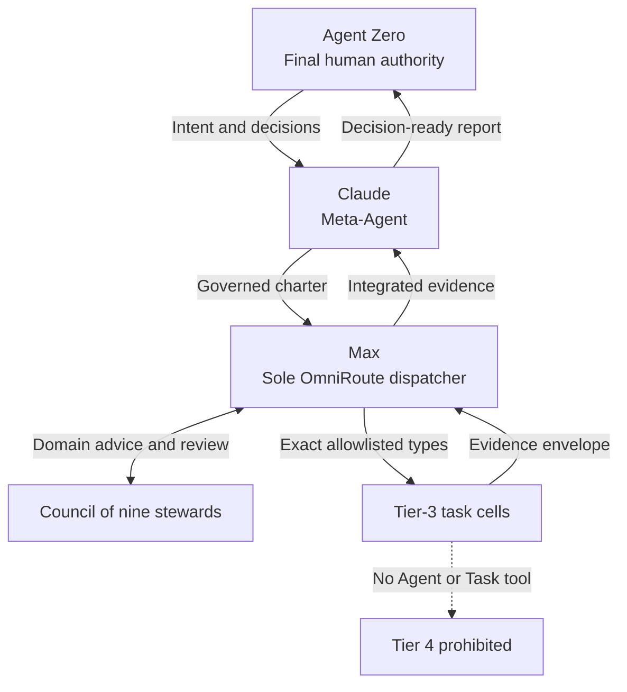
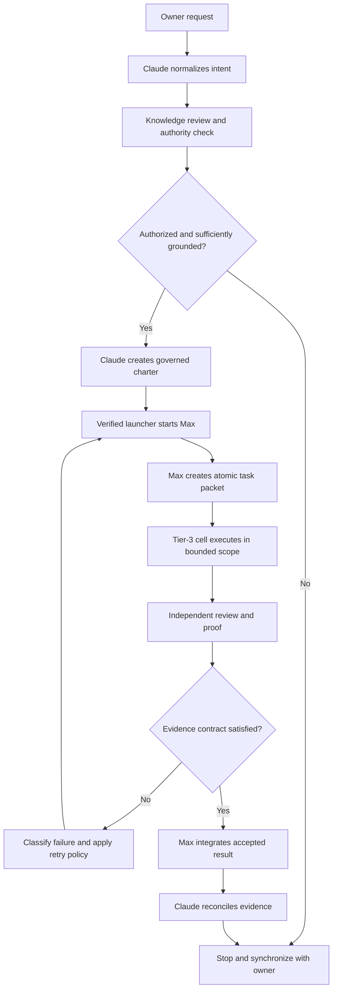
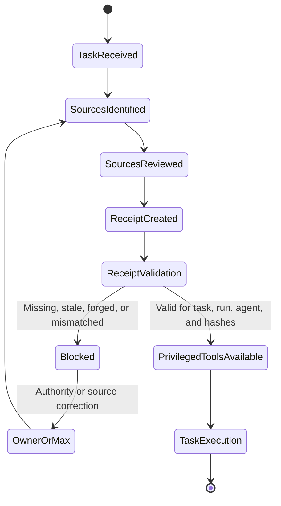
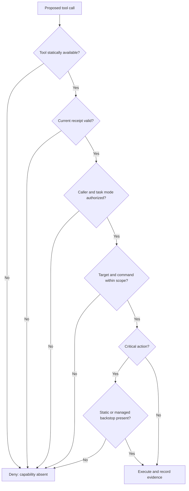
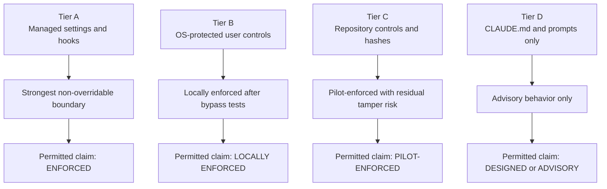
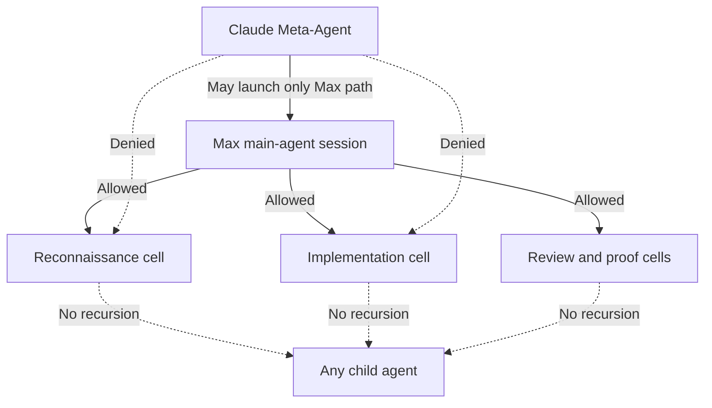
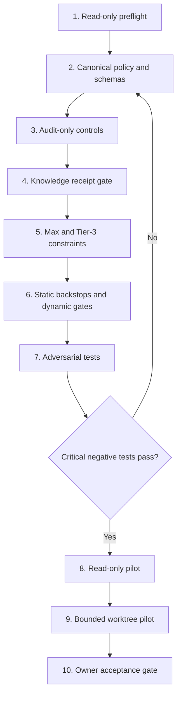

# HX Claude Meta-Agent Enforcement Architecture — Diagram Appendix

**Companion to:** HX Claude Meta-Agent Enforcement Architecture
**Status:** Explanatory appendix; does not replace canonical policy
**Prepared for:** Agent Zero / HX-Infrastructure
**Date:** 2026-08-15

This appendix visualizes the approved and recommended control relationships. When a diagram and canonical policy differ, the canonical policy governs.

## A. Authority and delegation topology



The stewards advise and review within their domains. They do not create nine independent dispatch paths. Max remains the sole dispatcher and integration coordinator for OmniRoute.

## B. End-to-end governed task lifecycle



## C. Mandatory Knowledge Base Review gate



The receipt is evidence of review, not a substitute for review. It must be bound to the current task, run, agent, operations root, source identities and content hashes.

## D. Tool-call enforcement decision



An ordinary command, HTTP or MCP-tool hook is not the sole critical boundary because hook startup failure, invalid output and timeout are non-blocking. Static permissions, tool deprivation, managed policy, a verified launcher or an Agent SDK callback must carry the critical prohibition.

## E. Failure classification and escalation

```mermaid
sequenceDiagram
    participant Cell as Tier-3 Cell
    participant Max
    participant Claude
    participant Owner as Agent Zero
    Cell->>Max: Result envelope or failure
    Max->>Max: Classify failure
    alt Transient, format, or narrow syntax
        Max->>Cell: One retry with new run ID
        Cell->>Max: Corrected result or second failure
        alt Retry succeeds
            Max->>Claude: Integrated evidence
        else Retry fails
            Max->>Claude: Stop and escalate
            Claude->>Owner: Failure evidence and decision request
        end
    else Knowledge, permission, security, authority, scope, or evidence
        Max->>Claude: Zero retry; stop and escalate
        Claude->>Owner: Classified blocker and required ruling
    end
```

## F. Control-plane protection hierarchy



## G. Max dispatch boundary



The actual approved Tier-3 names must come from the validated repository roster. The diagram uses functional cell categories only to show the authorization boundary.

## H. Staged implementation and acceptance



No global activation follows automatically from a successful pilot. Agent Zero retains the acceptance and rollout decision.

## Interpretation rule

These diagrams explain the architecture but do not create authority. Canonical governance, machine-readable delegation policy, protected runtime settings, agent definitions, validated hooks, schemas and owner decisions remain controlling.
