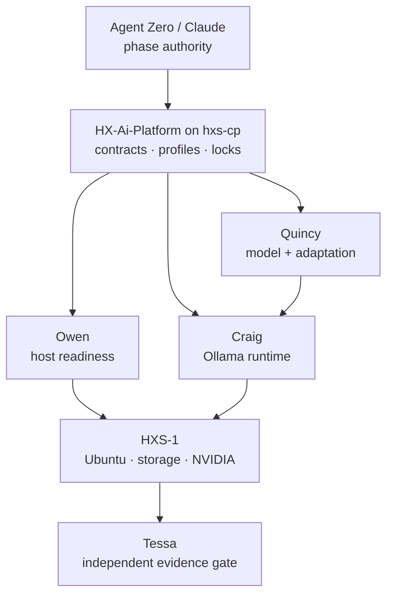

# HX Qwen3.8-27B on Ollama — Deployment, Optimization, Adaptation, and Fleet Runbook

**Status:** RESEARCH COMPLETE / PROPOSED PLAN — NO HOST, REPOSITORY, OR RUNTIME CHANGES AUTHORIZED  
**Prepared:** 2026-08-17 15:24 EDT  
**Author:** Codex (GPT-5.6)  
**Target:** HXS-1, Ubuntu Server 24.04, 2 × NVIDIA RTX 4070 Ti Super 16 GB, 128 GB system RAM  
**Fleet scope:** Repeatable pattern for HXS-1 through HXS-4, each with a distinct approved model  

## Executive verdict

Proceed, but split the effort into four governed stages rather than treating it as one Ollama install:

1. **Host readiness:** Owen prepares and proves Ubuntu, NVIDIA drivers, PCIe topology, thermals, storage, systemd, and SSH control from `hxs-cp`.
2. **Runtime deployment:** Craig installs a pinned Ollama release, configures local-only service operation and dedicated model storage, pulls a pinned Qwen artifact, and proves both GPUs are used without CPU spill.
3. **Runtime/model optimization:** Craig and Quincy benchmark quantization, MTP, context, KV-cache precision, thinking mode, and workload quality. Tessa independently verifies the evidence.
4. **Model adaptation:** Quincy leads a separate, reversible LoRA/QLoRA pilot only after a baseline and evaluation suite exist. Training does not occur “inside Ollama.” The adapter/export/import path remains **VERIFICATION REQUIRED** for Qwen3.8.

The recommended first artifact is the explicit, non-MTP `qwen3.8:27b-q4_K_M`, currently shown by Ollama as 18 GB, 27.3B parameters, Q4_K_M, with a 461M BF16 vision projector and short display ID `25b843619e94`. After that baseline is stable, compare the default `qwen3.8:27b`, which is the MTP-enabled Q4_K_M artifact with `draft_num_predict: 4` and short display ID `22130167c4c2`.

Do **not** begin with Q8 or BF16. Q8 is 30 GB and BF16 is 56 GB. On 32 GB aggregate VRAM split across two independent 16 GB GPUs, Q8 leaves almost no room for the vision projector, KV cache, runtime buffers, and CUDA overhead; BF16 cannot reside fully in VRAM. System RAM makes CPU spill possible, not desirable.

LM Studio Bionic should not be introduced as a second production runtime on HXS-1. Bionic is an agent/user experience, not a fine-tuning or optimization engine. LM Studio's `llmster` can run headlessly on Linux and exposes useful load controls, but the vendor says Ubuntu versions newer than 22 are not well tested for the desktop app. Use LM Studio only in an isolated comparison trial, with Ollama stopped, distinct storage, a distinct port, and identical GGUF/evaluation inputs.

## What changed from the prior HX position

The earlier HX stack-alignment artifact correctly reserved HXS-1 for Qwen reasoning but recorded Qwen3.8-27B as unreleased. That statement is now superseded. As of 2026-08-17:

- Ollama lists twelve Qwen3.8 tags and shows the 27B artifacts as published three days earlier.
- Qwen's official Hugging Face model card identifies a 27B dense, native vision-language model under Apache-2.0.
- The model has a native 262,144-token context and is described as extensible to 1,000,000 tokens; that is a model capability, not a promise that this host can serve those lengths efficiently.
- Thinking is enabled by default; the model card defines `xhigh`, `medium`, and `low` reasoning effort and supports disabling thinking.
- Qwen recommends dedicated engines such as SGLang, vLLM, or TokenSpeed for high-throughput production. Ollama remains appropriate here because HX's immediate goal is bounded local inference, development, testing, and controlled evaluation—not maximum production throughput.

## Authority and ownership

| Responsibility | Agent | Decision boundary |
|---|---|---|
| Owner authority, repository creation, phase approval | Agent Zero through Claude meta-agent | Neither Owen nor Craig independently creates the canonical repository or broadens scope. |
| Ubuntu, kernel, packages, systemd, NVIDIA driver, PCIe, storage, SSH/SCP fleet control | **Owen** | No Ollama/model configuration and no model acceptance. No Ansible. |
| Ollama install, service configuration, model store, runtime diagnostics, model pull, runtime rollback | **Craig** | No OS/storage repartitioning, model provenance ruling, or training claims. Loopback-only by default. |
| Qwen provenance, license, artifact identity, quantization selection, dataset/eval design, adaptation disposition | **Quincy** | Does not configure the host or runtime. |
| Independent acceptance, evidence integrity, negative tests, regressions | **Tessa** | Must not be the implementer. |
| Optional vLLM comparison if Ollama misses accepted requirements | **Victor** | A later evidence-driven comparison, not a parallel default install. |

### Required agent-structure correction

The existing HX agent definitions include a blocking Knowledge Base Review but hard-code a Windows path under `C:\Users\JarvisRichardson\Desktop\HX-Infrastructure`. That will fail when the canonical repository becomes `HX-Ai-Platform` on Linux `hxs-cp`.

Preserve the gate, but make resolution portable and fail-closed:

1. Determine the Git worktree root with `git rev-parse --show-toplevel`.
2. Require a repository marker such as `.hx-platform-root` plus the expected repository identity.
3. Resolve an agent's knowledge path from a versioned registry, for example `governance/operations/agents.yaml`.
4. Verify the required upstream snapshot directory and its recorded commit/tag/hash.
5. Stop if the repository, mapping, or pinned source is missing, ambiguous, or stale.

This is a portability repair, not a weakening of the agent structure.

## Repository decision and proposed product-quality layout

Create one canonical private repository named exactly **`HX-Ai-Platform`** in the owner-approved enterprise GitHub organization. The organization/remote URL is still an owner decision and must not be inferred. Repository creation is a meta-agent/repository bootstrap action; Owen and Craig contribute bounded files after the repository exists.

Clone only the canonical repository to `hxs-cp`. Model servers receive reviewed deployment payloads through the validated Bash/SSH/SCP fleet-control path; they do not each become competing source repositories.

```text
HX-Ai-Platform/
├── .hx-platform-root
├── .claude/agents/
│   ├── claude-meta-agent.md
│   ├── owen-ubuntu-platform.md
│   ├── craig-ollama.md
│   ├── quincy-model-portfolio.md
│   └── tessa-independent-verification.md
├── .specify/memory/constitution.md
├── knowledge/instructions.md
├── governance/
│   ├── decisions/
│   ├── policies/
│   ├── registries/
│   │   ├── agents.yaml
│   │   ├── servers.yaml
│   │   ├── model-assignments.yaml
│   │   └── upstream-locks.yaml
│   └── operations/
│       ├── ubuntu/upstream/<pinned-snapshot>/
│       ├── ollama/upstream/<pinned-snapshot>/
│       ├── qwen/upstream/<pinned-snapshot>/
│       └── lm-studio/upstream/<pinned-snapshot>/
├── contracts/
│   ├── host-readiness.schema.json
│   ├── storage-plan.schema.json
│   ├── runtime-profile.schema.json
│   ├── model-lock.schema.json
│   └── acceptance-evidence.schema.json
├── platform/
│   ├── fleet/
│   │   ├── inventory/hosts/hxs-{1..4}.yaml
│   │   └── scripts/hx-fleet-control.sh
│   ├── hosts/hxs-1/
│   │   ├── desired-state.yaml
│   │   ├── storage.yaml
│   │   └── nvidia.yaml
│   ├── runtimes/ollama/
│   │   ├── systemd/
│   │   ├── profiles/
│   │   └── tests/
│   ├── models/qwen3.8-27b/
│   │   ├── model-lock.yaml
│   │   ├── profiles/
│   │   ├── evals/
│   │   └── modelfiles/
│   └── adaptation/qwen3.8-27b/
│       ├── datasets/
│       ├── configs/
│       ├── evals/
│       └── export/
├── bin/hx-model-node
├── tests/
├── evidence/                 # generated results; retention policy applies
└── docs/
```

Do not commit model weights, datasets containing sensitive information, checkpoints, secrets, generated logs with prompts, or Ollama's internal blob tree. Commit manifests, hashes, configurations, schemas, tests, decisions, and sanitized evidence.

## Fleet deployment architecture



The control-plane pattern remains native Bash + SSH/SCP with explicit host/IP mapping, remote staging under `/tmp`, passwordless scoped sudo, `host`/`fleet`/`verify` modes, and no Ansible. Ollama stays on `127.0.0.1:11434`. Craig verifies it remotely with SSH-executed local curls; consumers use an approved SSH tunnel or later governed routing rather than changing Ollama to `0.0.0.0`.

## Storage design

### Required discovery before any mutation

Owen first captures, from `hxs-cp`, read-only evidence for HXS-1:

```bash
ssh hxsa@hxs-1 'hostnamectl; uname -a; cat /etc/os-release'
ssh hxsa@hxs-1 'lsblk -e7 -o NAME,PATH,SIZE,TYPE,FSTYPE,FSVER,MOUNTPOINTS,UUID,MODEL,SERIAL'
ssh hxsa@hxs-1 'findmnt --real --output TARGET,SOURCE,FSTYPE,OPTIONS,USE%'
ssh hxsa@hxs-1 'df -hT; free -h; swapon --show'
ssh hxsa@hxs-1 'lspci -nnk | grep -A3 -Ei "VGA|3D|NVIDIA"'
ssh hxsa@hxs-1 'nvidia-smi -L; nvidia-smi --query-gpu=index,uuid,name,memory.total,driver_version,pstate,temperature.gpu,power.limit --format=csv'
ssh hxsa@hxs-1 'nvidia-smi topo -m'
```

The actual block device, filesystem, existing data, encryption, RAID/LVM state, SMART/NVMe health, and mount conflicts are **NOT ESTABLISHED**. No partitioning or formatting command belongs in an executable work order until Owen produces a device-by-serial plan and Agent Zero approves that exact destructive target.

### Recommended layout

Use a dedicated NVMe-backed filesystem mounted at `/srv/hx-ai`, referenced in `/etc/fstab` by filesystem UUID. Prefer ext4 for operational simplicity unless the as-built storage already establishes another standard. Use `noatime`, retain periodic `fstrim`, monitor free space and device health, and keep the OS/root filesystem separate.

```text
/srv/hx-ai/
├── models/
│   ├── ollama/               # OLLAMA_MODELS; owned by ollama:ollama
│   ├── huggingface/          # source/cache for model adaptation
│   └── lm-studio/            # isolated pilot only; no shared internal blob tree
├── adaptation/
│   ├── datasets/
│   ├── checkpoints/
│   ├── adapters/
│   ├── merged/
│   └── exports/
├── benchmarks/
├── evidence/
└── scratch/
```

### Capacity recommendation

| Use | Approximate planning allowance |
|---|---:|
| Approved Q4 Ollama artifact + projector | 20–25 GB |
| Non-MTP and MTP A/B artifacts, worst case before dedupe | 40–50 GB |
| Optional Q8 comparison | 30–35 GB additional |
| Hugging Face BF16 source | roughly 56 GB plus metadata/cache |
| Merged model + GGUF export + Q4 output | roughly 75–130 GB during conversion |
| Datasets, checkpoints, adapters, failed experiments | workload-dependent; budget at least 200–500 GB |
| Operational headroom | keep at least 20% free |

**Minimum:** 1 TB dedicated NVMe for inference plus a small adaptation pilot.  
**Recommended:** 2 TB dedicated NVMe if HXS-1 will routinely fine-tune, convert, compare quantizations, and retain checkpoints.  

Weights and public caches are reproducible and need not be backed up. Back up versioned manifests, private/curated datasets, adapters, accepted checkpoints, evaluation records, and the exact conversion recipe. Prove restore of an adapter and its manifest; a backup claim without a restore test is not acceptance evidence.

## Step-by-step implementation plan

### Phase 0 — ratify the work order

Owner decisions required before mutation:

1. Exact GitHub organization, visibility, and remote URL for `HX-Ai-Platform`.
2. Exact HXS-1 storage device/volume after discovery, and whether repartitioning is authorized.
3. Initial accepted context target: recommended 32,768 tokens, with 65,536 as an experiment rather than a promise.
4. Primary workload and success measures: coding, agentic tool use, research, vision/document analysis, or a weighted mix.
5. Whether “fine-tune” means prompt/profile tuning, retrieval augmentation, supervised LoRA/QLoRA, or multimodal adaptation. These are not interchangeable.

**Gate G0:** signed work order, current inventory, explicit destructive target if any, rollback point, and named agents.

### Phase 1 — bootstrap the repository on hxs-cp

1. Claude/meta-agent creates the private `HX-Ai-Platform` repository in the approved enterprise organization.
2. Apply branch protection, required review, secret scanning, `.gitignore`, license/policy decision, and repository ownership.
3. Clone to an owner-approved location on `hxs-cp`; do not hard-code a Windows desktop path.
4. Add the root marker, constitution, local knowledge router, registries, contracts, agent definitions, and native fleet script.
5. Pin the upstream Ollama, Ubuntu/NVIDIA, Qwen, and optional LM Studio sources in `upstream-locks.yaml`.
6. Run repository structure, schema, path, secret, and agent-knowledge-gate tests.

**Gate G1:** clean repository, protected remote, reproducible clone, no secrets, valid agent paths, and no Ansible references.

### Phase 2 — Owen discovers and prepares HXS-1

1. Confirm identity using hostname, authoritative IP mapping, machine ID, NIC/MAC, and SSH host key.
2. Capture OS, kernel, packages, pending reboot, time synchronization, DNS, memory, swap, CPU, PCIe, and firmware state.
3. Capture both GPU UUIDs, driver version, kernel module, Secure Boot state, PCIe link width/speed, topology, temperature, and power limits.
4. Inspect storage by model and serial; produce a no-change plan first.
5. If storage is approved, create the dedicated filesystem, mount by UUID at `/srv/hx-ai`, create directories and ownership, reboot if required, and prove persistence.
6. Reuse a passing NVIDIA driver. Change it only if compatibility or health evidence fails.
7. If a driver change is required, use a current NVIDIA/Ubuntu package repository method, install kernel headers, choose the approved compute-capable driver branch, reboot, and verify both GPUs. Ollama inference requires a compatible NVIDIA driver; it does not require installing the entire CUDA developer toolkit.
8. Run a sustained GPU/thermal/PCIe health test before runtime installation.

**Gate G2 — host readiness:** both GPUs stable and visible; storage persistent and healthy; no package/reboot debt; chrony/DNS/SSH valid; temperatures/power/PCIe acceptable; evidence schema passes.

### Phase 3 — Craig installs a pinned Ollama release

1. Review the pinned local Ollama upstream source before execution.
2. Record the current installed state and back up any prior service override/model manifest metadata.
3. Install an exact Ollama version using the vendor's supported `OLLAMA_VERSION` mechanism; never depend on an unrecorded “latest.”
4. Use the system `ollama` service account and the vendor systemd service pattern.
5. Point `OLLAMA_MODELS` to `/srv/hx-ai/models/ollama` and give only `ollama:ollama` the necessary write access.
6. Use a systemd drop-in, not edits to a vendor unit. Recommended initial profile:

```ini
[Service]
Environment="OLLAMA_HOST=127.0.0.1:11434"
Environment="OLLAMA_MODELS=/srv/hx-ai/models/ollama"
Environment="OLLAMA_NO_CLOUD=1"
Environment="OLLAMA_CONTEXT_LENGTH=32768"
Environment="OLLAMA_FLASH_ATTENTION=1"
Environment="OLLAMA_KV_CACHE_TYPE=q8_0"
Environment="OLLAMA_NUM_PARALLEL=1"
Environment="OLLAMA_MAX_LOADED_MODELS=1"
Environment="OLLAMA_MAX_QUEUE=32"
Environment="CUDA_VISIBLE_DEVICES=0,1"
```

7. Reload systemd, start Ollama, capture `ollama -v`, service status, journal, listening sockets, effective environment, and local API health.
8. Prove the service is not exposed on a non-loopback interface and cloud features are disabled.

`q8_0` above applies to the KV cache, not the model weights. Ollama documents it as about half the KV memory of `f16` with usually very small quality loss. It requires Flash Attention and must be tested against HX tasks.

**Gate G3 — runtime:** pinned version, healthy service, correct storage, local-only socket, local-only/cloud-disabled evidence, both GPUs detectable, clean restart and reboot behavior.

### Phase 4 — pull and lock the baseline model

1. Check free space and abort below the repository threshold.
2. Pull the explicit baseline:

```bash
ollama pull qwen3.8:27b-q4_K_M
```

3. Record the complete local manifest and all blob SHA-256 identities. The website's `25b843619e94` is a short display ID, not sufficient as the only immutable lock.
4. Capture `ollama show`, `ollama list`, a service journal slice, and filesystem usage.
5. Preload with a local API call, then capture `ollama ps` and `nvidia-smi` while generation is active.
6. Require `100% GPU` in `ollama ps`. Because 18 GB exceeds either 16 GB card, Ollama should spread the model across both GPUs. Confirm actual per-GPU allocation; do not infer it from aggregate VRAM.
7. Run smoke tests for text, thinking on/off, tool calling, structured output, and image input.
8. Create an HX-local approved name only after acceptance, referencing the locked upstream artifact and versioned parameters.

**Gate G4 — model load:** correct identity/license, full GPU residency, both GPUs used, no OOM, no CPU spill, all core capabilities respond, evidence retained.

### Phase 5 — optimize empirically

Run one controlled change at a time against fixed prompts, fixed seeds where supported, fixed outputs limits, and the same host state.

| Experiment | Baseline | Candidate | Promotion rule |
|---|---|---|---|
| MTP | `27b-q4_K_M` | `27b` / `27b-mtp-q4_K_M` | Promote only if end-to-end throughput improves without quality/tool/streaming regression. |
| KV cache | `q8_0` | `f16`, then optional `q4_0` | Prefer q8 unless f16 materially improves quality or q4 is necessary for accepted context. |
| Context | 32K | 64K, then evidence-driven higher step | Promote only with full GPU residency, stable latency, no truncation, and workload value. |
| Thinking | enabled/xhigh | medium, low, or disabled | Use per workload; faster turns are not a win if retries raise total latency. |
| Concurrency | 1 | 2 only if memory permits | No CPU spill, OOM, or p95 collapse. |
| Quantization | Q4_K_M | Q8 only as a controlled spill/headroom experiment | Q8 is not a production candidate unless it preserves required context and full GPU residency. |

Measure cold load, prompt evaluation tokens/s, generation tokens/s, time to first token, end-to-end completion time, p50/p95, peak VRAM per GPU, system RAM, CPU utilization, power, temperature, correctness, tool success, structured-output validity, vision accuracy, and retry count.

### Context-memory reality

The model advertises 256K native context, while Ollama defaults to 32K for 24–48 GiB VRAM. Qwen3.8 has 16 gated-attention layers, 4 KV heads, and 256-dimensional heads. A rough f16 KV-only estimate is about 64 KiB per token: about 2 GiB at 32K, 4 GiB at 64K, 8 GiB at 128K, and 16 GiB at 256K, before runtime buffers, vision state, and other model state. Q8 KV roughly halves this component.

This is an architectural estimate, not measured acceptance evidence. Start at 32K, test 64K, and treat 128K/256K as conditional. Enforce the accepted maximum in a deterministic request gate so oversized prompts fail closed rather than being silently truncated.

**Gate G5 — approved profile:** a versioned runtime/model profile wins against baseline on the declared workload, passes all negative tests, survives reboot and soak, and includes reversal criteria.

### Phase 6 — fine-tuning/model adaptation pilot

Do not fine-tune until the base model has a stable evaluation baseline and there is a demonstrated gap that prompting, tool design, retrieval, or a Modelfile cannot solve.

1. Write the adaptation hypothesis: exact behavior to improve, tasks affected, expected gain, unacceptable regressions.
2. Freeze a training/evaluation split and data provenance/license/privacy record.
3. Begin with **text-only LoRA/QLoRA**, short context (for example 2K–4K), batch size 1, gradient accumulation, gradient checkpointing, and conservative rank. Full 27B fine-tuning is not appropriate for 2 × 16 GB.
4. Prove trainer support for the exact `Qwen/Qwen3.8-27B` architecture and vision-language configuration with a tiny overfit test before committing a long run. Current Qwen training documentation covers Qwen3 generally; the new Qwen3.8 model card does not yet provide a fine-tuning recipe.
5. Keep the base immutable. Version the dataset hash, code/environment lock, seed, hyperparameters, adapter, metrics, and lineage.
6. Compare base versus adapter on held-out HX tasks, reasoning, tool use, vision, safety, and general capability.
7. Prove the serving path. Ollama's current adapter-import documentation lists Llama, Mistral, and Gemma adapter architectures, not Qwen. Therefore direct Qwen3.8 Safetensors adapter import is **NOT ESTABLISHED**.
8. Preferred conditional route: merge the accepted adapter outside Ollama, convert the merged model to a Qwen3.8-compatible GGUF with a pinned llama.cpp toolchain, quantize to Q4_K_M, import the full GGUF into Ollama, and compare it against the original base. Every step requires hash and quality verification.
9. Reject the adaptation if the export route is unsupported, gains do not survive quantization, reasoning/vision/tool behavior regresses, or the improvement can be achieved more safely with retrieval/prompting.

**Gate G6 — adaptation:** reproducible training, licensed/provenanced data, held-out improvement, no material regression, supported export, Ollama load, full-GPU residency, and reversible model promotion.

## LM Studio / Bionic disposition

### What it is

- **Bionic:** an agent interface with Work and Code projects; it can use local, remote, or cloud models.
- **LM Studio desktop:** a Linux AppImage GUI for downloading, configuring, chatting with, and serving GGUF models.
- **llmster:** LM Studio's recommended headless daemon for Linux servers.

### Value to HX

LM Studio exposes convenient controlled load experiments: context length, Flash Attention, evaluation batch size, GPU offload, whether KV cache remains on GPU, model lifecycle, REST/OpenAI-compatible endpoints, JIT loading, and a visual comparison surface. It can be useful for a human-led GGUF fit/quality lab.

### Constraints

1. It does not fine-tune Qwen or “optimize” Ollama.
2. It is a separate runtime with separate model management, APIs, service state, and possible duplicate storage.
3. Bionic's remote-model experience uses LM Link/LM Studio mechanisms; do not assume it is a generic front end for an arbitrary Ollama endpoint without a proved supported integration.
4. LM Studio documents Ubuntu 20.04+ but says versions newer than 22 are not well tested for the desktop app. HXS-1 is Ubuntu 24.04.
5. Running Ollama and llmster concurrently would compete for the same GPUs and invalidate measurements.

### Recommendation

**PILOT NARROWLY / DO NOT ADOPT AS PRIMARY RUNTIME.** If used:

1. Use Bionic on a supported operator workstation.
2. Install `llmster` on HXS-1 only in an owner-approved isolated trial.
3. Stop and disable Ollama for the duration; use port 1234 and `/srv/hx-ai/models/lm-studio`.
4. Import the same locked non-MTP GGUF or an independently hash-matched equivalent.
5. Run the same HX evaluation and telemetry suite.
6. Remove/disable llmster after the comparison unless it earns a distinct role.

If the need is merely to compare llama.cpp load settings, a direct pinned llama.cpp benchmark may be a smaller and more reproducible experiment than adding Bionic/LM Studio to the server.

## Repeatable HXS-1 through HXS-4 pattern

Each server gets a declarative host profile and model lock, not a copied one-off shell history.

```yaml
host: hxs-1
role: qwen-reasoning
runtime: ollama
runtime_version: <pinned-after-preflight>
listen: 127.0.0.1:11434
model:
  source: ollama
  reference: qwen3.8:27b-q4_K_M
  manifest_sha256: <full-local-manifest-digest>
  accepted_context: 32768
  kv_cache: q8_0
  flash_attention: true
  num_parallel: 1
gpu:
  expected_count: 2
  expected_model: NVIDIA GeForce RTX 4070 Ti SUPER
  expected_vram_mib_each: 16384
storage:
  mount: /srv/hx-ai
  filesystem_uuid: <inventory-derived>
  minimum_free_gib_before_pull: 200
network:
  api_exposure: loopback-only
acceptance_profile: qwen38-hx-v1
```

The same command surface should support:

```text
hx-model-node discover hxs-1
hx-model-node plan hxs-1
hx-model-node apply --stage host hxs-1
hx-model-node apply --stage runtime hxs-1
hx-model-node apply --stage model hxs-1
hx-model-node verify hxs-1
hx-model-node benchmark hxs-1 --profile qwen38-hx-v1
hx-model-node rollback hxs-1 --to <recorded-state>
```

The implementation must be Bash/SSH/SCP, idempotent, fail-closed, schema-validated, previewable, and evidence-producing. `plan` never mutates. Storage mutation requires a second explicit authorization bound to the exact device serial and plan hash. Fleet mode may run read-only discovery and verification broadly; mutable deployment should begin host-by-host.

## Acceptance suite

### Host

- Correct host identity and authoritative IP mapping.
- Ubuntu 24.04, kernel, reboot state, time and DNS valid.
- Exactly two expected GPUs with recorded UUIDs; stable driver and kernel module.
- PCIe topology/link state captured; no correctable error flood.
- Sustained temperatures and power within policy.
- Dedicated storage mounted by UUID, ownership correct, free-space threshold passing.

### Runtime

- Exact Ollama version recorded and service starts after reboot.
- Only loopback port 11434 is listening.
- Cloud features disabled.
- Model path is the dedicated filesystem.
- Logs contain no CUDA fallback or repeated restart.
- Rollback to previous service/profile state is proved.

### Model

- Exact full manifest/blob digests and Apache-2.0 provenance recorded.
- `ollama ps` shows 100% GPU and accepted context.
- Both GPUs carry expected allocation during inference; no system-RAM weight spill.
- Text, image, thinking on/off, structured output, streaming, and tool calling pass.
- Oversized prompt is rejected by the HX gate, not silently truncated.
- Golden HX tasks pass quality thresholds.

### Performance and reliability

- Cold/warm latency, TTFT, prompt/generation throughput, p50/p95 retained.
- 30–60 minute soak at accepted context/concurrency with no OOM, crash, thermal throttle, or progressive memory growth.
- Service restart and full host reboot tests pass.
- Network-denial and non-loopback exposure tests pass.
- A corrupted/mismatched manifest or insufficient-storage case fails before mutation.

## Risks and reversal criteria

| Risk | Control | Reverse when |
|---|---|---|
| Aggregate VRAM mistaken for unified VRAM | Observe per-GPU allocation and PCIe topology; require full GPU residency. | CPU spill, OOM, or transfer bottleneck violates target. |
| 256K model claim mistaken for host capacity | Adopt measured context limit and fail-closed request gate. | Context increase harms reliability or latency without workload value. |
| Q8 selected for perceived quality | Q4 first; identical HX quality suite. | Q8 cannot retain runtime/context headroom. |
| MTP/default silently changes behavior | Explicit non-MTP baseline and A/B. | Tool, stream, quality, or compatibility regression. |
| Driver install destabilizes a working host | Reuse passing driver; record rollback and reboot gate. | GPU/driver health regresses. |
| Fine-tuning degrades general capability | Immutable base, held-out suite, adapter lineage, no promotion on regression. | Gain is narrow, unreproducible, or lost after GGUF quantization. |
| LM Studio becomes a second authority plane | Isolated, time-boxed comparison; distinct port/storage; Ollama stopped. | It adds no measurable value or creates drift. |
| Hard-coded Windows agent paths break Linux control plane | Repo-root discovery + registry-based knowledge mapping. | Agent cannot prove exact knowledge source. |
| Model blobs fill root filesystem | Dedicated mount, pre-pull threshold, monitoring, no internal-store symlinks. | Free space drops below policy. |

## What not to do

- Do not install Ansible.
- Do not let Owen and Craig both create or own the canonical repository.
- Do not expose Ollama on `0.0.0.0` to make remote testing convenient.
- Do not install the full CUDA toolkit merely because the NVIDIA driver is needed for Ollama.
- Do not pull `latest`, Q8, BF16, and multiple experimental variants before storage and acceptance gates exist.
- Do not treat the 128 GB of system RAM as equivalent to VRAM for performance.
- Do not call prompt/Modelfile changes “fine-tuning.”
- Do not train before defining the gap, dataset, baseline, held-out evaluation, and export path.
- Do not assume Ollama supports a Qwen3.8 Safetensors adapter because it supports adapters for other architectures.
- Do not run Ollama and llmster simultaneously during comparison.
- Do not back up public model caches while neglecting private datasets, adapters, manifests, and restore tests.

## Recommended owner decisions

1. **Approve the four-stage approach**: host readiness → Ollama baseline → optimization → optional adaptation.
2. **Approve Owen as the dedicated Ubuntu/platform agent**, with explicit NVIDIA driver, PCIe, storage, filesystem, capacity, thermal, and systemd responsibilities added to his charter.
3. **Retain Craig as Ollama specialist**, extending his existing HXS-4 full-audit obligation into a reusable HXS-1–HXS-4 deployment/audit contract.
4. **Require Quincy and Tessa** for model/adaptation authority and independent proof; do not force fine-tuning into Owen or Craig.
5. **Approve Q4_K_M non-MTP as the first HXS-1 baseline** and MTP as the first optimization A/B.
6. **Approve 32K as the initial acceptance context**, with 64K as the next measured target.
7. **Approve LM Studio/llmster only as a narrow comparison pilot**, not part of the initial HXS-1 build.
8. **Confirm the enterprise GitHub organization and remote URL** for `HX-Ai-Platform`.
9. **Provide or authorize read-only HXS-1 storage discovery** before deciding capacity/partition actions.

## Immediate next artifact after approval

The next deliverable should be a repository-ready implementation packet containing:

1. Owen's revised agent definition.
2. Craig's revised fleet deployment/audit definition.
3. Quincy/Tessa task charters for Qwen3.8 acceptance and adaptation.
4. JSON schemas for host readiness, storage plan, model lock, and evidence.
5. HXS-1 declarative host/model profile.
6. Native Bash/SSH/SCP `discover`, `plan`, `apply`, `verify`, `benchmark`, and `rollback` scripts.
7. Deterministic tests and an owner-facing execution prompt for Claude Code.

No execution should begin until the repository owner/URL and HXS-1 storage target are resolved.

## Source register

### Current primary sources

- [Ollama Qwen3.8 tag index](https://ollama.com/library/qwen3.8/tags)
- [Ollama Qwen3.8 27B default/MTP Q4_K_M](https://ollama.com/library/qwen3.8%3A27b)
- [Ollama Qwen3.8 27B explicit non-MTP Q4_K_M](https://ollama.com/library/qwen3.8%3A27b-q4_K_M)
- [Ollama Qwen3.8 27B Q8_0](https://ollama.com/library/qwen3.8%3A27b-q8_0)
- [Ollama Qwen3.8 27B BF16](https://ollama.com/library/qwen3.8%3A27b-bf16)
- [Official Qwen/Qwen3.8-27B model card](https://huggingface.co/Qwen/Qwen3.8-27B)
- [Ollama Linux installation](https://docs.ollama.com/linux)
- [Ollama context length](https://docs.ollama.com/context-length)
- [Ollama FAQ: storage, multi-GPU, concurrency, Flash Attention, KV-cache quantization](https://docs.ollama.com/faq)
- [Ollama model import and quantization](https://docs.ollama.com/import)
- [Ollama Modelfile reference](https://docs.ollama.com/modelfile)
- [NVIDIA driver installation for Ubuntu 24.04](https://docs.nvidia.com/datacenter/tesla/driver-installation-guide/latest/ubuntu.html)
- [NVIDIA CUDA compatibility model](https://docs.nvidia.com/deploy/cuda-compatibility/latest/why-cuda-compatibility.html)
- [LM Studio Bionic documentation](https://lmstudio.ai/docs/bionic)
- [LM Studio headless/llmster](https://lmstudio.ai/docs/developer/core/headless)
- [LM Studio Linux startup task](https://lmstudio.ai/docs/developer/core/headless_llmster)
- [LM Studio system requirements](https://lmstudio.ai/docs/app/system-requirements)
- [LM Studio model load controls](https://lmstudio.ai/docs/developer/rest/load)
- [Qwen training documentation: Unsloth](https://qwen.readthedocs.io/en/latest/training/unsloth.html)
- [Qwen training documentation: Axolotl](https://qwen.readthedocs.io/en/latest/training/axolotl.html)

### Current HX authority and retained project evidence

- Agent Zero's current instruction in this request.
- HX validated Bash/SSH/SCP fleet-control baseline; Ansible permanently excluded.
- HX server-role alignment reserving HXS-1 for Qwen reasoning.
- HX proposed technology agent roster: Owen, Craig, Quincy, Tessa, and Victor responsibility boundaries.
- Craig's retained durable Ollama role and full HXS-4 audit obligation.
- HX agentic SDLC decision: capability-first catalogue, lean activation, deterministic evidence gates, and state in files rather than conversation memory.
- HX current operating scope: development, testing, and demos; later assurance must not block standing up the core platform.

## Evidence states

- **VERIFIED CURRENT:** Qwen3.8-27B is available from Ollama; Q4/Q8/BF16 sizes and tags; official model architecture/context/license; Ollama multi-GPU behavior and storage controls; LM Studio/llmster Linux capability.
- **OWNER DECISION:** repository organization/remote, storage target, accepted context/workload, fine-tuning objective.
- **NOT ESTABLISHED:** HXS-1 current disks/filesystems/driver/PCIe/thermals; exact Ollama version required on the host; Qwen3.8 trainer support on the selected stack; direct Qwen3.8 adapter import into Ollama.
- **INFERENCE TO VERIFY:** 32K and likely 64K fit with Q4_K_M and Q8 KV while remaining fully GPU-resident; MTP improves end-to-end performance on HX workloads.

