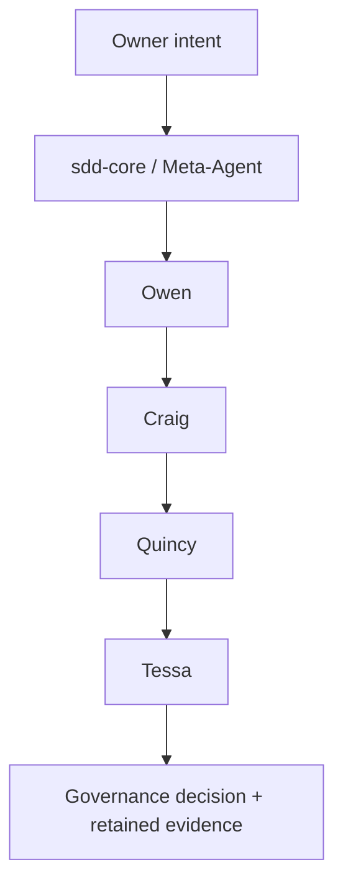

# ADR-0001 — Focused agentic control flow

**Status:** ACCEPTED  
**Date:** 2026-08-18  
**Authority:** Owner direction

## Decision

The first HX-Ai-Platform mission uses this fixed flow:

Owen owns host readiness, Craig owns Ollama, Quincy owns the model artifact and Tessa independently validates. The Meta-Agent owns routing, not specialist work or acceptance.

## Consequence

Only these five agent definitions are active. Additional technology agents remain undefined until a mission requires them.

