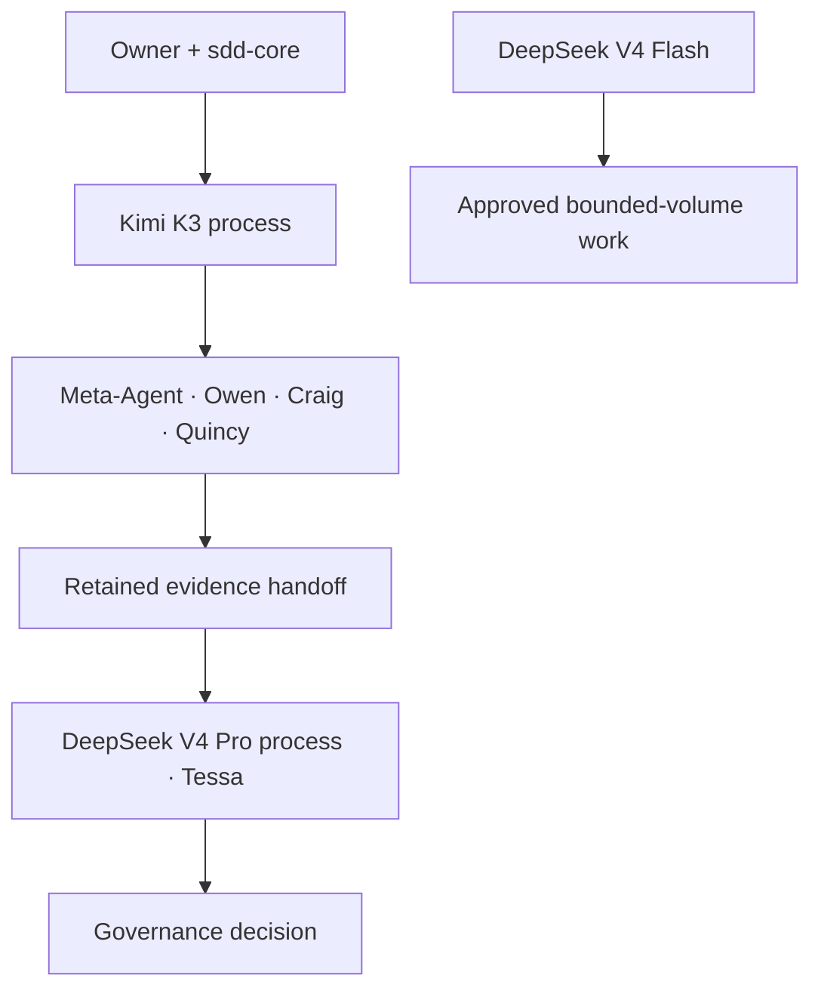

# ADR-0004 — Claude Code provider isolation

**Status:** OWNER-APPROVED ARCHITECTURE; NOT IMPLEMENTED
**Date:** 2026-08-18
**Decision owner:** Hana-X CAIO

## Decision

**Kimi K3: adopt as the default HX Claude Code execution provider, pending configuration acceptance.** **DeepSeek V4 Pro: adopt as Tessa's default independent-validation provider, pending configuration acceptance.** **DeepSeek V4 Flash: adopt as the preferred provider for approved bounded-volume agent workloads, pending configuration acceptance.**

Provider selection is process-scoped and fail-closed:

One Claude Code process must not mix a Kimi `ANTHROPIC_BASE_URL` with DeepSeek model identifiers, or the reverse. Native subagents inherit the process provider boundary. Cross-provider agent routing, if later required inside one orchestration, belongs behind the approved HX traffic plane and requires its own acceptance evidence.

## Permanent configuration pattern

1. `hx-claude` is the stable HX entry point; its default profile is `kimi`.
2. `hx-claude --provider deepseek` launches a separate DeepSeek process for Tessa or an explicitly approved DeepSeek workload.
3. Provider variables are not stored in `~/.claude/settings.json`, because its `env` values override shell variables and would defeat profile switching.
4. API keys remain outside the repository in owner-readable files with mode `0600`.
5. The raw `claude` executable remains available as the rollback and diagnostic path.
6. The launcher clears every provider-routing variable before loading exactly one profile and refuses ambiguous state.

## Model locks for the configuration pilot

| Profile | Main and Opus/Sonnet | Haiku/background | Native subagents | Auto-compact |
|---|---|---|---|---|
| Kimi | `kimi-k3[1m]` | `kimi-k3[1m]` | `kimi-k3[1m]` | `1000000` |
| DeepSeek | `deepseek-v4-pro[1m]` | `deepseek-v4-flash` | `deepseek-v4-flash` | `786432` |

Kimi documents `1048576` for the auto-compact variable, while current Claude Code documentation constrains the accepted range to a maximum of `1000000`. HX uses the enforceable Claude Code ceiling and records the divergence as a verification item.

The provider model names are API routes, not immutable local artifacts. DeepSeek currently identifies the backing service versions as V4-Pro-0813 and V4-Flash-0731; Kimi exposes the unversioned K3 route. Re-verify both routes at execution and retain the observed response metadata.

## Agent assignment boundary

- Kimi K3 is the default execution provider for the Meta-Agent and the active Owen → Craig → Quincy implementation chain.
- Tessa runs from a separate DeepSeek profile with `deepseek-v4-pro[1m]` as her default independent-validation model.
- DeepSeek V4 Flash is preferred only for approved, bounded-volume agent workloads. It does not own final acceptance and must not silently replace Kimi for the primary execution chain.
- The Kimi process ends its implementation stage by writing a complete, immutable evidence handoff. Tessa reads and independently retests that handoff from a new DeepSeek process.
- Until HX traffic-plane routing is separately accepted, the Meta-Agent must not claim that it launched Tessa as a native DeepSeek subagent from a Kimi-backed Claude Code process.
- Owner intent, sdd-core, agent contracts and retained evidence—not model output—remain the authority for the governance decision.

## Independence standard

Provider diversity strengthens Tessa's procedural independence but does not replace it. Tessa must not implement or repair the work she validates, may not change the acceptance contract after seeing results, and returns failed conditions to the owning Kimi-lane agent.

## Credential boundary

No API key may appear in Git, `settings.json`, reports, prompts, command history, captured evidence, or process arguments. The implementation may create secret-file locations and permission checks, but the owner supplies key values out of band.

## Known capability boundaries

- A custom `ANTHROPIC_BASE_URL` disables Claude Code Remote Control and disables MCP tool search by default unless the endpoint supports the required tool-reference protocol.
- Kimi's current documentation says WebFetch is unavailable and Kimi K3 web search is being updated and is not recommended for near-term production use.
- DeepSeek documents Claude Code web search support, with additional model calls and token cost.
- User-observed Kimi performance on prior HX work is strong adoption evidence, but it is not yet a controlled benchmark.

## Reversal criteria

Revisit the routing decision if Kimi fails tool fidelity, background/subagent execution, context integrity, availability, cost control or governance compliance; if DeepSeek V4 Pro fails validation fidelity or evidence traceability; or if Flash produces unacceptable error or escalation rates on bounded workloads.
