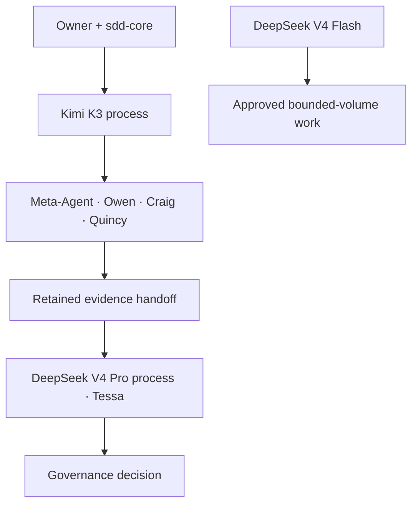

# Claude Code implementation prompt — HX isolated provider profiles

**Status:** READY FOR OWNER-AUTHORIZED EXECUTION; DO NOT RUN YET
**Target:** `hxs-cp`, Ubuntu, user `hxsa`
**Authority:** ADR-0004 and current HX repository governance

Copy the prompt below into a new Claude Code session when the CAIO authorizes configuration.

---

## Prompt for Claude Code

You are implementing the owner-approved Hana-X Claude Code provider architecture on `hxs-cp`. Work from the current `HX-Ai-Platform` repository. Read, in order:

1. `AGENTS.md`
2. `.specify/memory/constitution.md`
3. `knowledge/instructions.md`
4. `governance/decisions/0004-claude-code-provider-isolation.md`
5. `governance/registries/claude-code-provider-routing.md`
6. `library/technologies/claude-code/`
7. `library/technologies/kimi/`
8. `library/technologies/deepseek/`

The required architecture is:



### Objective

Create an idempotent, fail-closed HX launcher named `hx-claude` that permanently makes Kimi K3 the default Claude Code execution provider while preserving an explicit, isolated DeepSeek profile. After acceptance, the Kimi process runs Meta-Agent → Owen → Craig → Quincy; a new DeepSeek V4 Pro process runs Tessa against their retained evidence. DeepSeek V4 Flash is reserved for explicitly approved bounded-volume work. Do not alias, overwrite or replace the vendor `claude` executable. Do not configure cross-provider native subagents.

### Non-negotiable controls

- Never ask the owner to paste either API key into chat.
- Never print, log, inspect, checksum, commit or capture an API key.
- Never put provider credentials or provider-routing variables in repository files or `~/.claude/settings.json`.
- Never mutate `~/.claude/settings.json` without creating a timestamped, mode-`0600` backup and validating both old and new JSON.
- Preserve every unrelated Claude Code setting.
- Never use `.bashrc` exports for provider variables.
- Clear all relevant `ANTHROPIC_*`, provider-selection flags, `CLAUDE_CODE_SUBAGENT_MODEL`, `CLAUDE_CODE_EFFORT_LEVEL`, and `CLAUDE_CODE_AUTO_COMPACT_WINDOW` values before loading one profile.
- Refuse to launch when the selected token file is absent, empty, not owned by the current user, or more permissive than `0600`.
- Refuse to launch if provider-routing keys remain in `~/.claude/settings.json`.
- Do not install, update or downgrade Node.js or Claude Code without a separate owner-approved change. Record the current versions.
- Do not enable MCP tool search merely to suppress a warning. It requires protocol acceptance.
- Do not run Tessa in the Kimi process and label the result provider-independent.
- Do not give DeepSeek V4 Flash final acceptance authority.

### Phase 1 — Read-only preflight

Report, without secrets:

- hostname and current user;
- repository path and clean/dirty Git state;
- `node --version`, `npm --version`, `claude --version` and the absolute vendor Claude executable path;
- whether `jq` is present;
- existence, owner and mode only for the intended secret locations;
- the names, not values, of conflicting provider keys in the current process, shell profiles and `~/.claude/settings.json`;
- whether `CLAUDE_CODE_PROVIDER_MANAGED_BY_HOST` is present; if it is, stop because host-managed routing outranks this design;
- a redacted JSON summary of existing settings.

Stop if the host is not `hxs-cp`, the user is not `hxsa`, the repository is dirty in overlapping paths, JSON is invalid, or the vendor executable cannot be resolved unambiguously. Present the preflight and wait for explicit approval before mutation.

### Phase 2 — Implement after approval

Create these user-owned locations:

```text
~/.config/hx-ai/claude/
├── profiles/
│   ├── kimi.env
│   └── deepseek.env
└── secrets/
    ├── kimi.token
    └── deepseek.token
~/.local/bin/hx-claude
```

Directories must be `0700`; profile and token files must be `0600`; the launcher must be `0750`. Profile files contain non-secret configuration only. Token files contain only the raw key, with no variable name or quotes, and are populated by the owner out of band.

Remove only these provider-routing entries from the `env` object in `~/.claude/settings.json`, if present, while preserving all other keys:

```text
ANTHROPIC_BASE_URL
ANTHROPIC_API_KEY
ANTHROPIC_AUTH_TOKEN
ANTHROPIC_MODEL
ANTHROPIC_SMALL_FAST_MODEL
ANTHROPIC_DEFAULT_OPUS_MODEL
ANTHROPIC_DEFAULT_OPUS_MODEL_NAME
ANTHROPIC_DEFAULT_OPUS_MODEL_DESCRIPTION
ANTHROPIC_DEFAULT_OPUS_MODEL_SUPPORTED_CAPABILITIES
ANTHROPIC_DEFAULT_SONNET_MODEL
ANTHROPIC_DEFAULT_SONNET_MODEL_NAME
ANTHROPIC_DEFAULT_SONNET_MODEL_DESCRIPTION
ANTHROPIC_DEFAULT_SONNET_MODEL_SUPPORTED_CAPABILITIES
ANTHROPIC_DEFAULT_HAIKU_MODEL
ANTHROPIC_DEFAULT_HAIKU_MODEL_NAME
ANTHROPIC_DEFAULT_HAIKU_MODEL_DESCRIPTION
ANTHROPIC_DEFAULT_HAIKU_MODEL_SUPPORTED_CAPABILITIES
ANTHROPIC_DEFAULT_FABLE_MODEL
ANTHROPIC_DEFAULT_FABLE_MODEL_NAME
ANTHROPIC_DEFAULT_FABLE_MODEL_DESCRIPTION
ANTHROPIC_DEFAULT_FABLE_MODEL_SUPPORTED_CAPABILITIES
ANTHROPIC_CUSTOM_MODEL_OPTION
ANTHROPIC_CUSTOM_MODEL_OPTION_NAME
ANTHROPIC_CUSTOM_MODEL_OPTION_DESCRIPTION
ANTHROPIC_CUSTOM_MODEL_OPTION_SUPPORTED_CAPABILITIES
CLAUDE_CODE_SUBAGENT_MODEL
CLAUDE_CODE_EFFORT_LEVEL
CLAUDE_CODE_AUTO_COMPACT_WINDOW
CLAUDE_CODE_USE_ANTHROPIC_AWS
CLAUDE_CODE_USE_BEDROCK
CLAUDE_CODE_USE_FOUNDRY
CLAUDE_CODE_USE_MANTLE
CLAUDE_CODE_USE_VERTEX
ENABLE_TOOL_SEARCH
```

Create mode-`0600` timestamped backups of every shell profile that contains a direct assignment or export of one of these keys. Remove only those exact direct-assignment lines and show the redacted diff. If a profile sources another file or computes a provider value dynamically, stop and report it instead of rewriting the logic.

The Kimi profile must contain exactly this routing/model baseline:

```bash
ANTHROPIC_BASE_URL=https://api.moonshot.ai/anthropic
ANTHROPIC_MODEL=kimi-k3[1m]
ANTHROPIC_DEFAULT_OPUS_MODEL=kimi-k3[1m]
ANTHROPIC_DEFAULT_SONNET_MODEL=kimi-k3[1m]
ANTHROPIC_DEFAULT_HAIKU_MODEL=kimi-k3[1m]
ANTHROPIC_DEFAULT_FABLE_MODEL=kimi-k3[1m]
CLAUDE_CODE_SUBAGENT_MODEL=kimi-k3[1m]
CLAUDE_CODE_AUTO_COMPACT_WINDOW=1000000
CLAUDE_CODE_EFFORT_LEVEL=max
```

The DeepSeek profile must contain exactly this routing/model baseline:

```bash
ANTHROPIC_BASE_URL=https://api.deepseek.com/anthropic
ANTHROPIC_MODEL=deepseek-v4-pro[1m]
ANTHROPIC_DEFAULT_OPUS_MODEL=deepseek-v4-pro[1m]
ANTHROPIC_DEFAULT_SONNET_MODEL=deepseek-v4-pro[1m]
ANTHROPIC_DEFAULT_HAIKU_MODEL=deepseek-v4-flash
ANTHROPIC_DEFAULT_FABLE_MODEL=deepseek-v4-flash
CLAUDE_CODE_SUBAGENT_MODEL=deepseek-v4-flash
CLAUDE_CODE_AUTO_COMPACT_WINDOW=786432
CLAUDE_CODE_EFFORT_LEVEL=max
```

The launcher must:

1. default to `--provider kimi`;
2. accept only `kimi` or `deepseek`;
3. resolve and execute the previously recorded absolute vendor Claude path;
4. unset all provider-routing variables and all `CLAUDE_CODE_USE_*` provider-selection flags before loading a profile;
5. validate profile ownership, permissions, syntax and exact allowed key names;
6. read the selected raw token without printing it and export it only as `ANTHROPIC_AUTH_TOKEN`;
7. reject unexpected variables, duplicate keys, missing values, CRLF, whitespace and shell control characters; permit only the literal characters required by the approved URLs and model IDs, including the `[1m]` suffix;
8. display only provider, model, context trigger, effort, Claude version and endpoint hostname;
9. pass every remaining argument to the vendor Claude executable unchanged;
10. return the vendor process exit status.

Do not source unvalidated profile text. Parse the restricted `KEY=VALUE` format and export only the allowlisted keys.

### Phase 3 — Acceptance

Run provider acceptance as two explicit stages and retain redacted evidence under one new timestamped attempt directory.

**Stage 3A — Kimi implementer:** verify controls 1, 2, 4–6, 9–11; record the non-secret implementation state; write a complete handoff containing the attempt path and exact remaining gates; then stop. Do not start a nested Claude Code process and do not impersonate Tessa.

**Operator boundary:** after Stage 3A stops, the owner or operator starts a new process from the same repository with `hx-claude --provider deepseek`. This is a process-boundary action, not work the Kimi session can claim to have completed.

**Stage 3B — Tessa:** read this prompt, the Stage 3A handoff and the acceptance contract; verify controls 3, 4, 7–9 and 12; independently inspect the evidence and rerun the applicable gates. Tessa must not repair a failed control. She writes the consolidated 1–12 verdict, marking any unavailable prerequisite `BLOCKED`.

`PASS` requires:

1. raw `claude` still resolves and starts through its original executable;
2. `hx-claude` defaults to Kimi and reports the Kimi endpoint and `kimi-k3[1m]` in `/status`;
3. `hx-claude --provider deepseek` reports the DeepSeek endpoint and `deepseek-v4-pro[1m]` in `/status`;
4. neither API key appears in the repository, settings, output, evidence, shell history or process arguments;
5. Kimi returns the exact known-answer marker `HX_KIMI_READY_391`;
6. a Kimi native subagent completes a bounded read-only task using Kimi;
7. DeepSeek returns the exact known-answer marker `HX_DEEPSEEK_READY_391`;
8. a DeepSeek native subagent completes an explicitly approved, bounded read-only task using `deepseek-v4-flash`, and its output is returned to the DeepSeek V4 Pro parent for review;
9. the launcher refuses an invalid provider, an insecure token file, a conflicting settings entry and an unexpected profile key;
10. rollback consists only of invoking the original `claude` binary or removing the HX launcher/profile files; unrelated settings remain unchanged;
11. the Kimi process writes a redacted evidence handoff and stops before the operator starts Tessa;
12. Tessa starts through `hx-claude --provider deepseek`, reports `deepseek-v4-pro[1m]`, reads the retained Kimi evidence, independently reruns the applicable gates, and records `PASS`, `FAIL` or `BLOCKED` without modifying the implementation.

Do not test Kimi WebFetch as a required gate. Do not invoke DeepSeek Web Search without owner approval because it incurs additional model calls and cost. Do not claim that a native Kimi session routed a DeepSeek subagent. Cross-provider orchestration occurs through retained evidence and a new process until HX traffic-plane routing is separately accepted.

### Required completion report

The Stage 3A implementer returns:

- files created or changed, with ownership and modes;
- exact non-secret profile values;
- before/after redacted settings diff;
- Claude/Node versions;
- its assigned acceptance conditions as `PASS`, `FAIL` or `BLOCKED` with evidence paths;
- the attempt directory and the exact operator command `hx-claude --provider deepseek`;
- rollback verification;
- remaining limitations and no unsupported claims.

Tessa returns the consolidated acceptance conditions 1–12 as `PASS`, `FAIL` or `BLOCKED`, including provider, requested model route, observed response metadata, evidence paths, rollback status and her independent verdict.

Stop on the first material control failure. Do not repair around a failed identity, permission, provider-isolation or credential check without owner direction.

---

## End of prompt
