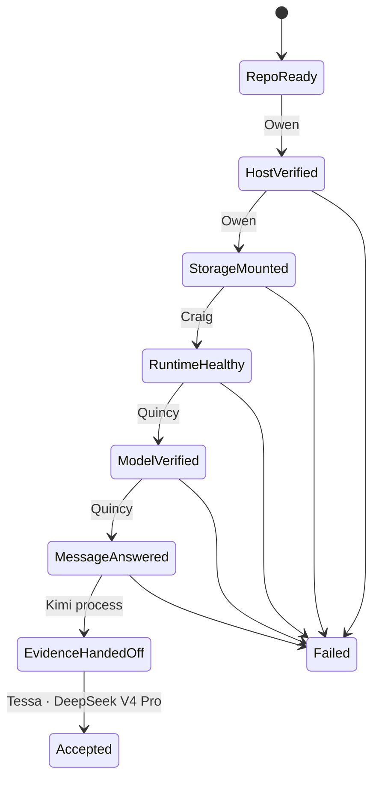

# MVP-1 execution plan

## State progression

## Eight-hour envelope

| Window | Work | Owner |
|---:|---|---|
| 0:00–0:30 | repository and knowledge preflight | Meta-Agent |
| 0:30–1:30 | HXS-1 identity, GPU and storage | Owen |
| 1:30–2:30 | Ollama install and service | Craig |
| 2:30–5:00 | model download and manifest verification | Quincy |
| 5:00–6:00 | first response and GPU/context proof | Quincy |
| 6:00–7:00 | independent re-run from accepted DeepSeek V4 Pro profile | Tessa |
| 7:00–8:00 | failure reserve or governance handoff | Meta-Agent |

If the model has not begun downloading by 2:30, or no response exists by 6:00, the Meta-Agent reports the timebox at risk immediately.
