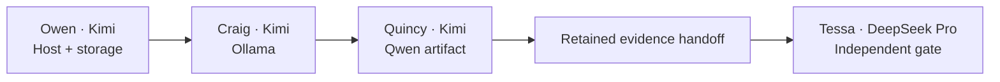

# Specification 001 — HXS-1 Qwen3.8-27B Ollama MVP-1

**Status:** READY FOR EXECUTION  
**Timebox:** 8 hours from execution start  
**Goal:** HXS-1 returns one coherent answer from the local Ollama endpoint using the exact approved Qwen artifact.

## Blocking decisions

None. Runtime, artifact, storage, context, thinking effort and sampler settings are locked by ADR-0003.

## Agent team

| Agent | Owns | Completion event |
|---|---|---|
| Owen | host identity, disk, GPU UUIDs, PCIe evidence | signed host-readiness handoff |
| Craig | Ollama installation and service | healthy loopback runtime handoff |
| Quincy | model manifest and explicit request | model response evidence |
| Tessa | independent smoke validation from accepted DeepSeek V4 Pro profile | PASS, FAIL or BLOCKED record |

## Definition of done

A POST to `http://127.0.0.1:11434/api/chat` on HXS-1 using `qwen3.8:27b-q4_K_M` returns HTTP 200, `done:true`, a non-empty `message.content`, and the correct product `391`; `ollama ps` reports context `8192` and `100% GPU`; Tessa records `PASS`.

## Non-goals

Anything that does not directly enable or prove that event belongs to `governance/backlog.md`.
