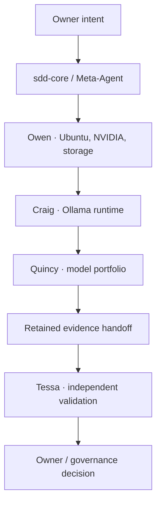

# HX-Ai-Infrastructure repository bootstrap prompt

**Document registry ID:** `doc-012`  
**State:** ACTIVE EXECUTION INSTRUCTION  
**Captured from:** Current Hana-X conversation  
**Executor reported by owner:** Kimi K3 through GitHub Copilot

Use this prompt in GitHub Copilot Agent mode from the root of the new, empty `HX-Ai-Infrastructure` repository.

---

You are establishing the foundational repository for the Hana-X local AI infrastructure platform.

## Repository identity

The repository name is exactly:

`HX-Ai-Infrastructure`

Do not use `HX-Ai-Platform`, “locally stood up,” “good to go,” or other obsolete or ambiguous names and status language.

This is a professional, specification-driven infrastructure control repository operated under the authority of the Hana-X Chief AI Officer.

## Objective

Create the approved repository structure, foundational governance documents, agent contracts, technology library, server hierarchy, specification templates, platform automation locations, evidence model, and deterministic repository validation.

This task establishes the repository baseline only.

Do not:

- configure `hxs-cp` or any model server;
- install software;
- connect to infrastructure hosts;
- use or introduce Ansible;
- download model weights or upstream source repositories;
- add API keys, credentials, tokens, private keys, host secrets, or generated evidence;
- claim any infrastructure, model, provider, or service is deployed;
- invent server facts, device identifiers, storage devices, model digests, software versions, or acceptance results;
- push, publish, or open a pull request unless separately instructed.

Preserve any existing repository content. If an existing file conflicts with this structure, stop and report the conflict instead of overwriting it.

## Governing operating model

The repository must encode this workflow:



Provider targets are approved but not configured:

- Kimi K3 is the default Claude Code execution provider for the Meta-Agent, Owen, Craig, and Quincy.
- DeepSeek V4 Pro is Tessa’s default independent-validation provider.
- DeepSeek V4 Flash is preferred for explicitly approved bounded-volume workloads.
- Kimi and DeepSeek must run in separate Claude Code processes until HX traffic-plane routing receives separate acceptance.
- Models execute work; owner intent, sdd-core, agent contracts, acceptance criteria, and retained evidence remain authoritative.

## Required repository structure

Create the following structure. Add concise `README.md` files or `.gitkeep` files where Git would otherwise omit an intentionally empty directory.

```text
HX-Ai-Infrastructure/
├── .claude/
│   ├── AGENTS.md
│   └── agents/
│       ├── meta-agent.md
│       ├── owen-ubuntu-platform.md
│       ├── craig-ollama.md
│       ├── quincy-model-portfolio.md
│       └── tessa-independent-validation.md
├── .github/
│   ├── copilot-instructions.md
│   └── pull_request_template.md
├── .specify/
│   └── memory/
│       └── constitution.md
├── evidence/
│   ├── README.md
│   ├── hxs-1/
│   ├── hxs-2/
│   ├── hxs-3/
│   └── hxs-4/
├── governance/
│   ├── AGENTS.md
│   ├── backlog.md
│   ├── decisions/
│   │   ├── README.md
│   │   ├── 0001-agentic-control-flow.md
│   │   ├── 0002-critical-path-and-mvp-ladder.md
│   │   └── 0003-claude-code-provider-isolation.md
│   ├── operations/
│   │   ├── README.md
│   │   ├── ubuntu-server/README.md
│   │   ├── nvidia-cuda/README.md
│   │   ├── ollama/README.md
│   │   ├── qwen/README.md
│   │   ├── claude-code/README.md
│   │   ├── kimi/README.md
│   │   └── deepseek/README.md
│   ├── policy/
│   │   ├── authority-precedence.md
│   │   ├── human-artifact-standard.md
│   │   ├── evidence-retention.md
│   │   └── secret-management.md
│   ├── provenance/
│   │   └── source-register.yaml
│   ├── registries/
│   │   ├── agent-catalog.yaml
│   │   ├── claude-code-provider-routing.md
│   │   ├── fleet-hardware.yaml
│   │   └── workload-assignments.yaml
│   └── reports/
│       └── README.md
├── knowledge/
│   └── instructions.md
├── library/
│   ├── README.md
│   ├── catalog.yaml
│   ├── _schemas/
│   │   └── technology-library.schema.json
│   ├── _shared/
│   │   └── bash-ssh/
│   │       └── README.md
│   └── technologies/
│       ├── ubuntu-server/
│       ├── nvidia-cuda/
│       ├── ollama/
│       ├── qwen/
│       ├── claude-code/
│       ├── kimi/
│       └── deepseek/
├── platform/
│   ├── README.md
│   ├── _shared/bash/
│   ├── hxs-cp/
│   │   ├── README.md
│   │   ├── bin/
│   │   └── config/
│   ├── hxs-1/
│   │   ├── README.md
│   │   ├── ollama/
│   │   ├── models/
│   │   └── storage/
│   ├── hxs-2/
│   │   ├── README.md
│   │   ├── ollama/
│   │   ├── models/
│   │   └── storage/
│   ├── hxs-3/
│   │   ├── README.md
│   │   ├── ollama/
│   │   ├── models/
│   │   └── storage/
│   └── hxs-4/
│       ├── README.md
│       ├── ollama/
│       ├── models/
│       └── storage/
├── servers/
│   ├── README.md
│   ├── hxs-cp/
│   ├── hxs-1/
│   ├── hxs-2/
│   ├── hxs-3/
│   └── hxs-4/
├── specs/
│   ├── README.md
│   └── _template/
│       ├── spec.md
│       ├── plan.md
│       ├── tasks.md
│       ├── runbook.md
│       └── acceptance.md
├── tests/
│   ├── README.md
│   └── repository/
│       └── validate.sh
├── .editorconfig
├── .gitignore
├── AGENTS.md
├── CLAUDE.md
├── LICENSE
└── README.md
```

## Technology library contract

The root `library/` directory is mandatory. It is the local, source-provenanced knowledge plane used by the agents.

It mirrors the technology taxonomy under `governance/operations/`, but the responsibilities are different:

- `governance/operations/<technology>/` contains approved operational procedures, controls, runbooks, and execution authority.
- `library/technologies/<technology>/` contains advisory local knowledge, upstream documentation references, source locks, compatibility findings, and agent retrieval material.
- Content in `library/` must never override owner decisions, the constitution, governance policy, an accepted specification, or an approved runbook.

Inside every `library/technologies/<technology>/` directory, create:

```text
README.md
library.yaml
source-lock.yaml
references/
sources/
```

Use `.gitkeep` where necessary.

Each `library.yaml` must include at least:

```yaml
schema_version: 1
technology: <technology-slug>
lifecycle: planned
authority: advisory
operations_path: governance/operations/<technology>
maintainer_agent: <assigned-agent-or-meta-agent>
```

Each `source-lock.yaml` must provide fields for:

```yaml
schema_version: 1
technology: <technology-slug>
upstream_url: null
version: null
revision: null
retrieved_at: null
verification_status: not_verified
```

Do not fabricate missing source values.

The repository validator must enforce a one-to-one match between the approved technology directories under `governance/operations/` and `library/technologies/`.

The `sources/` directories are materialization locations for pinned upstream sources. Their downloaded contents must be ignored by Git unless an individual file is deliberately approved for retention. Source identity belongs in `source-lock.yaml`.

## Required foundational content

### Root README

Create an executive-quality `README.md` containing:

- repository purpose;
- truthful status: “Repository structure initialized; infrastructure deployment has not begun”;
- the agentic operating-flow Mermaid diagram;
- a directory responsibility table;
- current authority model;
- validation command;
- explicit statement that Ansible is out of scope;
- explicit statement that native Bash and SSH from `hxs-cp` are the fleet-control baseline.

### Constitution

`.specify/memory/constitution.md` must define:

- owner intent as the highest project authority;
- specification-driven execution;
- one accountable owner per state transition;
- fail-closed behavior;
- evidence before acceptance;
- independent validation;
- no implementer self-approval;
- no fabricated infrastructure state;
- binary critical-path classification;
- secrets excluded from Git and evidence;
- professional human-facing artifacts.

### Agent contracts

Every file under `.claude/agents/` must contain YAML frontmatter and sections for mission, owns, does not own, required knowledge, entry conditions, execution constraints, evidence output, handoff, and stop conditions.

Agent boundaries:

- Meta-Agent routes stages and maintains evidence continuity.
- Owen owns Ubuntu, NVIDIA identity, host readiness, storage, and filesystem prerequisites.
- Craig owns Ollama installation, configuration, testing, and runtime audit.
- Quincy owns model selection, model artifacts, manifests, quantization settings, and request configuration.
- Tessa independently validates against the approved acceptance contract and never repairs the work being reviewed.

### Copilot instructions

`.github/copilot-instructions.md` must permanently instruct GitHub Copilot to:

- read `AGENTS.md`, the constitution, and `knowledge/instructions.md` before material work;
- operate only within an approved specification;
- preserve agent ownership boundaries;
- use Bash and SSH rather than Ansible;
- use the local technology library before relying on general knowledge;
- distinguish advisory library material from governance authority;
- avoid secrets and unsupported deployment claims;
- stop on conflicts, missing facts, or failed acceptance conditions;
- produce retained evidence for any future execution.

### Human artifacts

Human-facing reports must be professionally written and visually polished.

Define these conventions:

- dark/night-mode HTML for executive review documents;
- Mermaid diagrams where topology, sequence, authority, or state transitions benefit from visualization;
- filenames lowercase and containing assistant/model name, date, time, and subject;
- Markdown remains acceptable for agent-native control material;
- reports must clearly separate current facts, approved targets, assumptions, decisions, blockers, and future work.

## Server and platform boundaries

For `hxs-cp` and `hxs-1` through `hxs-4`:

- `servers/<host>/` stores declared target state and verified as-built facts.
- `platform/<host>/` stores automation and configuration intended for that host.
- `evidence/<host>/` stores generated proof from controlled execution.
- Do not place generated evidence in `platform/`.
- Do not place unverified assumptions in `servers/` as facts.

Create concise README files explaining these boundaries. Do not invent hardware specifications.

## Specifications

The specification template must support objective, scope, exclusions, owners, authoritative sources, prerequisites, assumptions requiring verification, state-transition plan, rollback, evidence paths, exact acceptance conditions, and Tessa’s independent verdict.

The critical-path rule is binary:

“Does the first required observable outcome fail without this task?”

- Yes: critical path.
- No: backlog.

There is no third classification.

## Repository validation

Implement `tests/repository/validate.sh` as a deterministic, read-only Bash validation script.

It must verify:

1. all required foundational files exist;
2. all seven technology libraries exist;
3. each technology has `README.md`, `library.yaml`, `source-lock.yaml`, `references/`, and `sources/`;
4. the operations and library technology taxonomies match;
5. all shell scripts pass `bash -n`;
6. tracked YAML and JSON files parse successfully using available local tooling;
7. no likely API key, token, password, or private-key material is tracked;
8. no Ansible configuration, playbook, inventory, dependency, or recommendation is introduced;
9. root status language does not claim deployment;
10. all five agent contracts exist;
11. the root README contains at least one purposeful Mermaid diagram;
12. `git diff --check` passes.

The script must print one final result:

`HX-Ai-Infrastructure repository validation: PASS`

Use distinct nonzero exit codes and actionable error messages for failures.

## Git hygiene

Create a `.gitignore` that excludes API keys, tokens, credentials, secret files, `.env` files while allowing `.env.example`, generated evidence contents while preserving README files, materialized upstream source repositories, model weights, GGUF files, blobs, caches, logs, temporary files, editor artifacts, and Python/Node build caches.

Do not ignore governance records, source locks, schemas, specifications, agent contracts, platform templates, or repository tests.

## Final quality gates

Before reporting completion:

1. print the resulting tree, excluding `.git` and ignored materialized sources;
2. run `bash tests/repository/validate.sh`;
3. run `git diff --check`;
4. search for stale `HX-Ai-Platform` references;
5. search for prohibited Ansible references outside the explicit policy statements declaring it out of scope;
6. confirm that no secret-like values are present;
7. confirm that no deployment or configuration action occurred.

Return:

- concise executive summary;
- files created;
- resulting architecture diagram;
- validation results;
- unresolved conflicts or missing facts;
- exact Git status;
- recommended commit message.

Do not claim success unless every repository validation gate passes.

---

## Post-capture governance clarification

This clarification was issued immediately after the prompt and is part of its review context:

> Copilot may reproduce governance content already approved by the owner. Any policy, decision, or control not already approved must be marked `DRAFT — REQUIRES OWNER APPROVAL` and must not silently become governance authority.

