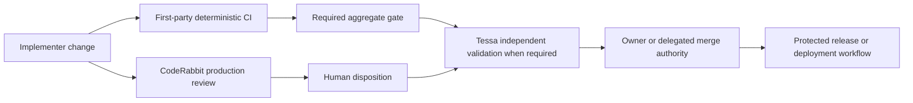

# CI/CD Process Standard

| Field | Value |
|---|---|
| **Document ID** | HX-SD-CI-001 |
| **Version** | 2.4 |
| **Status** | ADOPTED |
| **Owner** | Jarvis Richardson, Chief AI Officer, Hana-X AI |
| **Effective date** | 2026-08-18 |
| **Review cadence** | Semi-annual; after any material CI/CD incident; or when a governing platform changes behavior |
| **Applies to** | Hana-X repositories and delivery pipelines, subject to the applicability profiles in Part 2 |
| **v2.4 editor** | ChatGPT, acting as Chief of Staff, at owner direction |
| **Source basis** | HX-SD-CI-001 v2.3; current Hana-X standing directives; current GitHub Actions and CodeRabbit primary documentation verified 2026-08-18 |

> **Approval record.** Jarvis Richardson, Chief AI Officer, approved HX-SD-CI-001 v2.4 on 2026-08-18. This document is effective as the standing Hana-X CI/CD standard from that date.

## Change history

| Version | Date | Change |
|---|---|---|
| 1.0 | 2026-08-18 | Initial repository-specific review and recommendations. |
| 2.0 | 2026-08-18 | Separated normative controls from repository evidence. |
| 2.1 | 2026-08-18 | Added pinned-commit verification corrections and cache/dependency concerns. |
| 2.2 | 2026-08-18 | Reworked third-party blocking conditions and assigned owner. |
| 2.3 | 2026-08-18 | Qualified human-invoked writes and added a first-party check condition. Classified as an adoption candidate. |
| **2.4** | **2026-08-18** | **Adopted by the owner. Corrects the cache model; establishes production CodeRabbit adoption in Stage 5; restores the no-self-validation boundary; adds feature-branch review-config protection, always-running aggregate gates, expected check-source controls, ecosystem-portable dependency integrity, matrix coverage contracts, risk-register authority, applicability profiles, acceptance evidence, and controlled exception handling. Removes repository-specific evidence from the normative body.** |

---

## Executive directive

Hana-X will use CI/CD as an evidence-producing delivery system, not as a collection of green badges.

This standard requires:

1. deterministic first-party checks that fail closed;
2. least-privilege workflow execution;
3. reproducible dependencies and immutable automation inputs;
4. clear separation between implementation, AI-assisted review, independent validation, and owner acceptance;
5. retained evidence sufficient to reproduce why a change was accepted; and
6. controls proportional to the repository's actual risk profile.

**CodeRabbit is adopted as a production AI review capability for HX-Ai-Platform in Foundation Stage 5.** Its initial production role is automatic, assertive review and CI-analysis assistance. It is not the sole merge authority, an independent validator, or a deployment authority. Direct-branch Autofix is disabled. This is an operating boundary, not a trial designation.

## Control flow



The diagram expresses authority, not chronology. CodeRabbit and first-party CI may run concurrently. Tessa does not remediate the implementation she validates.

---

# Part 1 — Normative standard

## 1. Scope, authority, and language

### 1.1 Source authority

For this standard, the authority order is:

1. explicit current owner decisions and adopted Hana-X standing directives;
2. this adopted standard and its approved applicability profile;
3. repository-specific policy and control registries;
4. current as-built evidence and first-party test results;
5. current official platform documentation;
6. historical reviews and implementation examples; and
7. inference.

A historical repository or reference implementation can inform a control but cannot redefine the control merely to obtain a compliance result.

### 1.2 Normative terms

- **MUST** and **MUST NOT** are mandatory.
- **SHOULD** and **SHOULD NOT** are strong defaults. A deviation requires a written exception under Section 16.
- **MAY** identifies an allowed choice.
- **NOT APPLICABLE** requires a recorded applicability rationale; silence is not a determination.
- **NOT VERIFIED** means evidence was unavailable or insufficient. It is not a pass.

### 1.3 Defined roles

- **First-party check:** automation owned or directly governed by Hana-X and executed from reviewed repository or organization configuration.
- **Third-party reviewer:** an external App or service that analyzes or comments on a change, including an AI reviewer.
- **Independent validation:** validation performed under the Tessa methodology or another owner-approved independent role that did not implement or remediate the change being accepted.
- **Aggregate gate:** an always-running first-party job whose sole purpose is to evaluate the expected results of required subordinate checks and fail if any mandatory result is missing, failed, cancelled, unexpectedly skipped, neutral, or inconclusive.
- **Artifact:** a file, image, package, report, model, or evidence object produced or consumed by a workflow.
- **Protected branch:** a branch governed by an adopted ruleset that requires pull-request review and defined checks before merge.

## S1 — The merge gate MUST be real

1. CI MUST run automatically on every pull request and every push to the default branch. Draft-PR behavior MUST be explicit.
2. Protected branches MUST require a pull request, the named required checks, linear history, and blocked force-push and deletion unless an approved exception states otherwise.
3. Every required check MUST have a stable, unique name. Renaming a required job is a protection-changing operation and MUST update the ruleset in the same controlled change.
4. Where GitHub supports it, each required external check MUST be bound to its expected GitHub App source. “Any source” MUST NOT be used without a documented reason.
5. Because GitHub may treat `successful`, `skipped`, or `neutral` as satisfying a required check, every repository with multiple mandatory first-party jobs MUST expose one required aggregate gate that:
   - runs with `if: always()` or an equivalent fail-closed mechanism;
   - knows the expected subordinate job set;
   - fails on missing, failed, cancelled, or unexpectedly skipped results;
   - permits a skipped result only when an explicit, tested applicability condition authorizes it; and
   - emits success only after evaluating the complete expected set.
6. A required check that can silently disappear, remain pending indefinitely, or report neutral without an approved condition is a broken gate.
7. Ruleset configuration and required-check inventory MUST be retained as governed evidence and audited under S9.

## S2 — Credentials and secrets MUST fail closed

1. Ordinary pull-request and verification CI MUST receive no production API keys, service credentials, or long-lived cloud credentials.
2. Tests in ordinary CI SHOULD mock external services. Controlled integration tests MAY contact a sandbox service only when:
   - the workflow is explicitly classified as an integration workflow;
   - the credential is non-production, least-privilege, and short-lived where possible;
   - fork and untrusted contributions cannot access it;
   - an environment or equivalent approval boundary protects it; and
   - the external dependency and failure behavior are documented.
3. Deployment MUST use OIDC federation or another approved short-lived identity mechanism instead of stored long-lived cloud credentials wherever the target supports it.
4. A secret scanner MUST run as a required first-party check. A confirmed credential in git history is treated as compromised and MUST be rotated; deleting the line is not remediation.
5. Workflow logs, caches, artifacts, test fixtures, and retained evidence MUST NOT contain credentials or bearer tokens.
6. Secret-access failures MUST fail the affected privileged job. A job MUST NOT silently fall back to weaker authentication.

## S3 — Workflow privilege MUST be proportional to its trigger

1. The repository or organization default `GITHUB_TOKEN` permission MUST be read-only.
2. Workflows MUST default to `permissions: contents: read`. Additional permissions MUST be assigned at the narrowest practical job scope.
3. Public-repository workflows triggered by human-authored text—comments, reviews, issue bodies, issue titles, or equivalent surfaces—MUST gate privileged jobs at the job level on an authorized actor or association. A step-level gate is insufficient.
4. Text commands MUST use an explicit command grammar. Substring matches such as “contains `@agent`” MUST NOT grant write capability.
5. `pull_request_target` MUST NOT check out or execute pull-request-controlled code. Its permitted use is bounded metadata work against trusted base-branch code.
6. `id-token: write` MUST appear only in a job performing an approved OIDC-backed purpose, such as cloud federation or artifact attestation. It MUST NOT be placed at workflow scope for convenience.
7. Privileged `workflow_dispatch` jobs MUST use protected environments or equivalent approval when they can modify infrastructure, releases, or repository state.
8. Scheduled workflows with write capability MUST run reviewed default-branch code, declare least-privilege permissions, and have a named owner.
9. The broadest permission set MUST have the narrowest and most-reviewed trigger. The inverse is a finding.

## S4 — Third-party AI and automation MUST remain subordinate to Hana-X authority

### S4.1 Default and production roles

1. Third-party review systems are subordinate controls. They MAY review, summarize, classify, and recommend.
2. A third-party reviewer MUST NOT be the sole merge authority, independent validator, owner acceptance authority, or deployment authority.
3. Human invocation authorizes an action; it does not make the resulting output independently validated.
4. First-party deterministic CI remains the technical source of merge evidence. Tessa or another owner-approved independent role remains the independent validation authority when required by repository policy.

### S4.2 Blocking eligibility

A third-party check MAY be required only when all of the following are true:

1. the check has completed successfully across every applicable PR class used by the repository;
2. its check name is stable and its expected App source is bound in the ruleset where supported;
3. an auditable per-PR override or documented break-glass path exists and does not require silently weakening the standing ruleset;
4. the third-party check is not the sole required check;
5. at least one first-party deterministic gate evaluates the changed artifact;
6. inconclusive, missing, skipped, rate-limited, or service-unavailable outcomes fail closed or invoke the documented break-glass process; and
7. the provider's access, configuration, retention, removal, and incident response have been recorded.

Blocking status does not convert a third-party AI judgment into independent validation.

### S4.3 Configuration integrity

1. Third-party configuration stored in the repository is part of the CI control surface.
2. If a provider uses the feature branch's configuration to review that same branch, the configuration file MUST be protected by CODEOWNERS or an equivalent owner-review control.
3. A change to a security-sensitive reviewer configuration MUST be isolated in a dedicated governance PR unless the owner explicitly approves combined scope.
4. First-party CI MUST detect configuration changes and verify at minimum:
   - the file parses against the supported schema;
   - prohibited capabilities remain disabled;
   - required review paths are not silently excluded;
   - the change is presented as a policy change; and
   - the change does not remove the first-party gate.
5. A review that names a third-party system but does not read its effective configuration has not reviewed that system.

### S4.4 Write capability

1. Direct-branch AI Autofix is disabled in the HX default profile.
2. A future owner-approved write profile MAY allow human-requested fixes only through a separate stacked PR or equivalent reviewable branch.
3. AI-generated fixes MUST pass the full first-party CI suite and any required independent validation. A provider's own verification is implementation evidence, not acceptance.
4. A generated change MUST NOT be accepted when required verification failed, even if the provider delivers the change.
5. An AI reviewer MUST NOT approve or independently validate its own generated fix.
6. Automatic review-fix-review loops are prohibited unless separately designed, bounded, tested, cost-limited, and owner-approved.

### S4.5 Adoption record

Every third-party App adoption MUST record:

- the business purpose;
- repository and organization scope;
- read, comment, status, and write permissions;
- data and retention considerations;
- whether output is advisory or blocking;
- effective configuration location;
- incident and service-outage behavior;
- removal and access-revocation procedure;
- decision owner and review date; and
- evidence required before authority is expanded.

## S5 — Runner security MUST protect the fleet

1. GitHub-hosted runners are the default.
2. Self-hosted runners are prohibited for public repositories and on shared or long-lived workload hosts unless an owner-approved exception exists.
3. **HXS-1 through HXS-4 and hxs-cp MUST NOT serve as general GitHub Actions runners.** Model servers and the control-plane host are delivery targets or administrative systems, not disposable execution sandboxes.
4. Any exempted self-hosted runner MUST be ephemeral, single-job, isolated, free of unrelated credentials and workloads, and governed by restricted network egress.
5. Runner images and labels MUST be explicit enough to reproduce the environment. Moving labels such as `ubuntu-latest` MAY be used only when the project accepts and tests platform drift; otherwise pin the supported runner generation.

## S6 — Dependency and automation inputs MUST be reproducible

1. Each ecosystem MUST use its strongest supported native reproducibility mechanism:
   - lockfile or resolved manifest for direct and transitive dependencies;
   - integrity hashes where the ecosystem produces or enforces them;
   - frozen or immutable install mode in CI;
   - full commit SHA for GitHub Actions;
   - image digest for containers; and
   - immutable release, snapshot, or repository metadata for operating-system packages when exact reproduction is required.
2. Floating dependency ranges MUST NOT be the final CI install authority.
3. When an ecosystem cannot provide hash-bearing lockfiles, the repository MUST document the strongest available mechanism and the residual risk. The absence of an ecosystem feature is not automatic non-compliance.
4. A consistency check MUST fail when source constraints and resolved dependencies disagree.
5. Dependency update automation MUST cover every supported ecosystem present, including GitHub Actions. An unsupported ecosystem MUST be recorded with a manual review cadence.
6. Security updates and routine version updates are distinct channels: confirmed security remediation is prioritized by severity; routine updates follow the repository cadence.
7. Initial adoption of an external action or reusable workflow requires source and maintainer vetting. SHA pinning preserves that decision; it does not prove trustworthiness.

## S7 — Caches MUST be treated as untrusted accelerators

1. Reproducibility MUST come from immutable dependency inputs and frozen installation, never from a cache.
2. A cache key MUST represent the material inputs to the cached data, including relevant lockfile content, operating system, architecture, runtime/toolchain version, and trust scope.
3. Broad restore prefixes MUST NOT allow materially incompatible or less-trusted entries to satisfy a protected workflow.
4. Normal GitHub `pull_request` caches are scoped to the PR merge ref and cannot be restored by the base branch or sibling PRs. Controls MUST preserve—not assume away—that boundary.
5. Low-trust workflows that execute in default-branch context MUST have restore-only cache access unless the trigger and actor are explicitly trusted.
6. Protected-branch and deployment jobs MUST write caches only from trusted triggers and MUST NOT execute unverified scripts, binaries, virtual environments, or workspace content restored from a less-trusted cache.
7. Package-manager download, HTTP, or wheel caches MAY be used when installs still verify immutable dependency inputs. Cached installed environments require stronger exact keys and MUST NOT cross trust, runtime, or architecture boundaries.
8. Cache paths MUST NOT contain secrets, tokens, credentials, signing material, or retained evidence.
9. Cache keys and restore behavior MUST be inspectable. A suspected poisoned cache is an incident: stop restoration, invalidate the affected namespace, preserve relevant logs, and rebuild from immutable inputs.

## S8 — Matrix builds MUST prove expected coverage, not artificial sameness

1. Every matrix dimension MUST have a declared purpose and expected coverage contract.
2. When configurations are intended to execute the same logical suite, CI MUST compare normalized test identities and fail on unexplained shrinkage.
3. Configuration-specific tests, exclusions, or skips are permitted only when they are declared, justified, and version-controlled.
4. The gate MUST distinguish:
   - an expected applicability difference;
   - a test that did not execute because a dependency or output disappeared; and
   - a true coverage regression.
5. Custom coverage gates MUST have their own unit tests and MUST smoke-assert their runtime inputs: required files present, non-empty, parseable, and equal to the expected count.
6. A vacuous comparison is a failure. A tool's unit tests prove its logic, not that the workflow supplied the correct evidence.

## S9 — Ruleset and wiring drift MUST be detected

1. Required checks, exact names, expected App sources, pull-request requirements, review requirements, linear history, force-push, deletion, and bypass actors MUST be compared against the governed control registry:
   - after any ruleset or workflow change;
   - at every release; and
   - at least quarterly for active repositories.
2. Drift results MUST be retained as evidence.
3. Every bypass actor or role MUST be removed, time-boxed with expiry, or retained with a named owner and written justification.
4. A break-glass event MUST produce an incident or exception record identifying who used it, why, what changed, and how normal controls were restored.
5. Ruleset claims that could not be retrieved with sufficient authority MUST be marked NOT VERIFIED.

## S10 — Public and fork contribution paths MUST remain safe and usable

1. Public fork pull requests MUST receive no secrets and a read-only token.
2. Every required check applicable to public contributions MUST be able to complete under fork conditions, or the contribution path MUST explicitly state its controlled maintainer-hand-off process.
3. Public fork paths MUST NOT use `pull_request_target` to execute fork-controlled code.
4. Base-branch caches readable by fork PRs MUST contain no sensitive material.
5. This section is NOT APPLICABLE to a private repository with forks disabled, but that determination MUST be recorded in its profile.

## S11 — Workflow artifacts and evidence MUST preserve integrity

1. Cross-job reports and build outputs consumed as gate evidence MUST use an explicit artifact transfer mechanism with configured retention.
2. A consuming gate MUST validate artifact presence, expected count, type, parseability, producer identity where available, and content schema before trusting it.
3. Evidence artifacts MUST be immutable within an attempt. A rerun creates a new attempt or a clearly versioned replacement under repository policy.
4. Retention MUST align with the Hana-X evidence policy and the repository's release, incident, and audit needs. “Platform default” is not a retention decision.
5. Externally consumed binaries, packages, and container images MUST receive provenance attestation before release when the GitHub plan and target support it.
6. Attestation generation alone is not acceptance. The release or consumer process MUST verify subject identity, digest, repository, and expected workflow provenance.
7. Test logs, source snapshots, documentation, and transient build products SHOULD NOT be attested merely to increase artifact count.

## S12 — Operational and supply-chain hygiene MUST be explicit

1. Every job MUST set `timeout-minutes`.
2. Workflows SHOULD use concurrency groups and `cancel-in-progress` when a newer commit makes an in-flight run obsolete. Deployment concurrency MUST prevent two runs racing the same environment.
3. Required jobs MUST NOT use `continue-on-error` for the control they are intended to enforce.
4. Each component MUST have at least one automated gate that can fail on a realistic defect class. “No automated test” requires an accepted-risk record.
5. GitHub Actions and reusable workflows MUST be pinned to full commit SHAs.
6. Where available, Hana-X SHOULD enforce an organization-level allowlist for approved actions and reusable workflows.
7. Workflow dependencies, including composite actions and scripts invoked by actions, are part of the reviewed supply chain.
8. If strict checks and linear history create merge contention, evaluate merge queue operation before weakening controls.

## S13 — Accepted risk and control evidence MUST be truthful

1. The governed repository risk register is the authoritative location for accepted risks. The README MUST provide an executive summary or link when users need visibility.
2. Each accepted risk MUST identify the condition, impact, rationale, owner, acceptance date, review date, and retirement or reversal criteria.
3. A control MUST NOT receive credit for evidence it did not inspect or behavior it did not test.
4. A review MUST distinguish VERIFIED, REPORTED, NOT VERIFIED, NOT APPLICABLE, and INFERRED claims.
5. Non-obvious workflow choices MUST include a concise “why” comment or link to the governing decision.
6. A new maintainer MUST be able to reconstruct each material CI decision from retained policy, configuration, and evidence without relying on chat history.

## S14 — Deployment MUST be a separately protected authority plane

1. No deployment may originate from an unprotected branch.
2. Production deployments MUST use protected environments with required reviewers or an equivalent owner-approved control.
3. Deployment workflow permissions MUST be isolated from verification CI. A test job MUST NOT inherit deployment credentials or scopes.
4. OIDC or approved short-lived identity is required where supported.
5. Deployment concurrency MUST prevent simultaneous changes to the same environment.
6. The deployed artifact MUST be the exact digest or immutable identity that passed the release gate. Rebuilding after approval creates a new artifact requiring new evidence.
7. Deployment MUST have a tested rollback or forward-recovery procedure and retained outcome evidence.
8. HX-Ai-Platform Foundation work does not authorize GitHub Actions deployment to HXS hosts. That authority requires a separate owner-approved deployment profile.

---

# Part 2 — Applicability profiles

Every repository adopts the **Core** plus each profile that applies. The profile selection is retained in the repository control registry.

| Profile | Applies when | Additional requirements |
|---|---|---|
| **Core** | Every Hana-X repository | S1–S9, S11–S13 as applicable to present components; explicit NOT APPLICABLE records allowed only where defined. |
| **HX Infrastructure** | Repository defines or operates Hana-X hosts, local AI platforms, networking, storage, or model services | GitHub-hosted CI; no HXS host as a runner; no CI deployment until separately authorized; Bash/SSH implementation remains governed by existing HX directives; infrastructure changes require retained evidence and Tessa validation where specified. |
| **Public / OSS** | Public repository or external fork contribution | S10 mandatory; no privileged human-text trigger without actor gating; public log and cache exposure reviewed. |
| **Release / Deployment** | Repository publishes consumer artifacts or changes environments | S11 attestation/verification where supported; S14 mandatory; environment protection and rollback evidence required. |
| **AI Review** | Third-party AI App reviews, comments, sets status, or writes code | S4 mandatory; provider adoption record, config integrity, outage behavior, and revocation procedure required. |

## Profile selection rule

A repository MUST NOT declare a profile NOT APPLICABLE merely because the corresponding control has not been implemented. Applicability is determined by repository behavior and risk, not current maturity.

---

# Part 3 — HX-Ai-Platform production adoption decision

## 3.1 CodeRabbit decision

CodeRabbit is **ADOPTED FOR PRODUCTION IMPLEMENTATION IN FOUNDATION STAGE 5**, contingent on the Stage 5 first-party validation workflow being present in the same implementation sequence.

This is not a proof-of-concept or optional pilot. It is the approved initial production authority boundary.

### Required production configuration

| Capability | Required state |
|---|---|
| Automatic PR review | Enabled |
| Review profile | Assertive |
| PR summaries and walkthroughs | Enabled |
| GitHub Checks analysis | Enabled |
| Pre-merge AI checks | Warning until required-check acceptance below completes |
| `request_changes_workflow` | Disabled initially |
| Direct-branch Autofix | Disabled |
| Custom Finishing Touch write recipes | Disabled |
| Merge authority | First-party ruleset and human authority only |
| Independent validation | Tessa when required; never CodeRabbit self-validation |
| Configuration protection | CODEOWNERS plus first-party config-integrity check |

### Minimum repository configuration

The exact file MUST be validated against the current CodeRabbit schema during implementation. The minimum intent is:

```yaml
language: en-US

reviews:
  profile: assertive
  request_changes_workflow: false
  auto_review:
    enabled: true
    drafts: false
  finishing_touches:
    autofix:
      enabled: false
  tools:
    github-checks:
      enabled: true
```

### Required-check activation

CodeRabbit becomes a required check after one implementation acceptance run proves all of the following against the repository's actual PR classes:

1. the emitted check name is stable;
2. the expected CodeRabbit App source can be bound in the ruleset;
3. normal, draft-to-ready, documentation-only, and configuration-only PRs receive a deterministic terminal result or an explicitly documented applicability result;
4. provider outage, rate-limit, and inconclusive behavior are documented;
5. an auditable break-glass procedure exists; and
6. first-party CI is already required and remains authoritative.

This acceptance run is an installation verification, not a pilot program. If any item fails, CodeRabbit remains in production as advisory review while the specific integration defect is corrected.

## 3.2 First-party Stage 5 controls

Stage 5 MUST establish, at minimum:

1. repository structure validation;
2. secret scanning;
3. Markdown/YAML/JSON syntax and schema validation for governed files;
4. agent contract and Library Read Gate validation;
5. CodeRabbit configuration-integrity validation;
6. stable required job names;
7. an always-running aggregate gate; and
8. ruleset evidence sufficient to reproduce the required-check configuration.

## 3.3 Configuration-change rule

A PR that changes `.coderabbit.yaml`, CODEOWNERS controls over it, or the first-party aggregate gate MUST be classified as a CI policy change. It SHOULD contain no unrelated implementation changes. Owner-approved emergency exceptions MUST be recorded.

---

# Part 4 — Conformance and evidence

## 4.1 Minimum control registry

Each active repository MUST retain a machine-readable or deterministically parseable registry containing:

- repository identity and selected profiles;
- default and protected branches;
- required check name;
- expected source App;
- producing workflow and job;
- trigger classes;
- permission summary;
- control owner;
- exception reference, if any;
- last verified date; and
- current verification status.

## 4.2 Acceptance evidence

A CI/CD implementation is not accepted until retained evidence demonstrates:

1. required workflows triggered from their intended events;
2. mandatory failures block the aggregate gate;
3. missing or malformed artifacts fail closed;
4. an intentionally skipped mandatory subordinate job causes aggregate-gate failure;
5. fork behavior passes where the Public / OSS profile applies;
6. secret and permission boundaries match the selected profiles;
7. external required checks come from the expected App source where supported;
8. protected-branch configuration matches the registry;
9. cache boundaries and keys match S7;
10. locked dependency installation reproduces; and
11. rollback or removal procedures exist for third-party Apps and deployment authority.

## 4.3 Validation separation

- The implementer runs and reports first-party verification.
- CodeRabbit performs production AI review within S4.
- Tessa independently traces requirements, examines retained evidence, reproduces selected checks, stress-tests failure boundaries, and issues PASS, FAIL, BLOCKED, or STOPPED.
- The owner or delegated authority accepts the result.

No actor may convert its own implementation report into independent acceptance.

## 4.4 Incident reporting

A CI/CD incident includes, at minimum:

- a bypass or required check that did not enforce its stated policy;
- third-party service behavior that blocked or silently permitted a merge;
- a credential exposed to workflow, log, artifact, or cache;
- poisoned or untrusted executable cache content;
- ruleset drift;
- an artifact accepted without provenance or required evidence; or
- a deployment of an artifact other than the approved digest.

The incident MUST produce a retained report under the repository's governed report plane.

---

# Part 5 — Exceptions and change control

## 5.1 Exception requirements

An exception MUST be written, dated, and retained. It MUST identify:

1. the exact control and repository scope;
2. the business or technical reason;
3. the risk introduced;
4. compensating controls;
5. owner;
6. effective and expiry dates;
7. evidence required during the exception; and
8. removal, renewal, or reversal criteria.

Standing exceptions without an owner or review date are invalid.

## 5.2 Emergency change

Emergency operation MAY use a documented break-glass path. It MUST NOT silently rewrite policy. The operator MUST preserve the reason, actor, affected refs, actions taken, validation performed, and restoration of normal controls.

## 5.3 Standard changes

Normative changes require:

1. a version increment;
2. change-history entry;
3. owner review;
4. technical verification against current primary documentation when platform behavior is involved; and
5. an impact statement for existing repositories.

Reference implementations and historical reviews remain evidence. They do not become normative merely by citation.

---

# Part 6 — Implementation sequence

For HX-Ai-Platform, the authorized sequence is:

1. complete the active Foundation Stage 4 work without scope interruption;
2. implement first-party CI and CodeRabbit together in Stage 5;
3. validate repository checks and CodeRabbit configuration integrity;
4. run the one-time required-check installation acceptance;
5. configure the adopted ruleset and expected App sources;
6. complete Foundation Stage 6 evidence/reporting obligations;
7. perform Tessa independent validation; and
8. proceed to infrastructure implementation under the accepted foundation.

The sequence deliberately avoids two errors: delaying useful production review until every future control is perfect, and granting a reviewer mutation or acceptance authority before the first-party gate exists.

---

# Part 7 — Matters closed by v2.4

The following questions are closed unless new evidence materially changes them:

1. **CodeRabbit adoption:** adopted for production implementation in Stage 5.
2. **CodeRabbit initial authority:** automatic assertive review and CI analysis; no direct-branch write, self-validation, merge, or deployment authority.
3. **Cache model:** caches are untrusted accelerators; normal PR merge-ref isolation is recognized; lockfiles—not caches—provide reproducibility.
4. **Matrix behavior:** expected coverage contracts replace universal identical-test-set requirements.
5. **Dependency integrity:** strongest ecosystem-native reproducibility replaces an impossible universal hash-lockfile formulation.
6. **Accepted risk:** the governed risk register is authoritative; the README summarizes or links.
7. **Repository-specific evidence:** HX-SD-CI-001 v2.3 and its pinned `sdd-core-citadel` appendix remain retained historical evidence and are not part of this normative standard.
8. **Self-hosted runners:** HXS model servers and hxs-cp are not general CI runners.

---

# Part 8 — Current primary source basis

Verified 2026-08-18:

1. GitHub dependency caching reference: <https://docs.github.com/en/actions/reference/workflows-and-actions/dependency-caching>
2. Official `actions/setup-python` caching behavior: <https://github.com/actions/setup-python/blob/main/README.md>
3. pip caching behavior: <https://pip.pypa.io/en/stable/topics/caching/>
4. GitHub protected branches and required-check semantics: <https://docs.github.com/en/repositories/configuring-branches-and-merges-in-your-repository/managing-protected-branches/about-protected-branches>
5. GitHub secure workflow use: <https://docs.github.com/en/actions/reference/security/secure-use>
6. GitHub artifact attestations: <https://docs.github.com/en/actions/how-tos/secure-your-work/use-artifact-attestations/use-artifact-attestations>
7. GitHub matrix jobs: <https://docs.github.com/en/actions/how-tos/write-workflows/choose-what-workflows-do/run-job-variations>
8. CodeRabbit YAML configuration behavior: <https://docs.coderabbit.ai/getting-started/yaml-configuration>
9. CodeRabbit Autofix behavior: <https://docs.coderabbit.ai/finishing-touches/autofix>
10. CodeRabbit pre-merge checks: <https://docs.coderabbit.ai/pr-reviews/pre-merge-checks>
11. CodeRabbit GitHub Checks integration: <https://docs.coderabbit.ai/tools/github-checks>
12. CodeRabbit custom Finishing Touch capability: <https://docs.coderabbit.ai/finishing-touches/custom-finishing-touches>

Current upstream documentation establishes platform behavior. The owner decision establishes Hana-X policy.

---

# Owner approval

| Decision field | Value |
|---|---|
| **Decision** | APPROVED |
| **Owner** | Jarvis Richardson, Chief AI Officer |
| **Approval date** | 2026-08-18 |
| **Conditions or decision reference** | Owner statement: “I approve, CI/CD Process Standard v2.4.” |

HX-SD-CI-001 v2.4 is **ADOPTED**. Its Stage 5 implementation sequence is authorized subject to the repository's existing stage and execution controls.

---

*End of HX-SD-CI-001 v2.4.*
