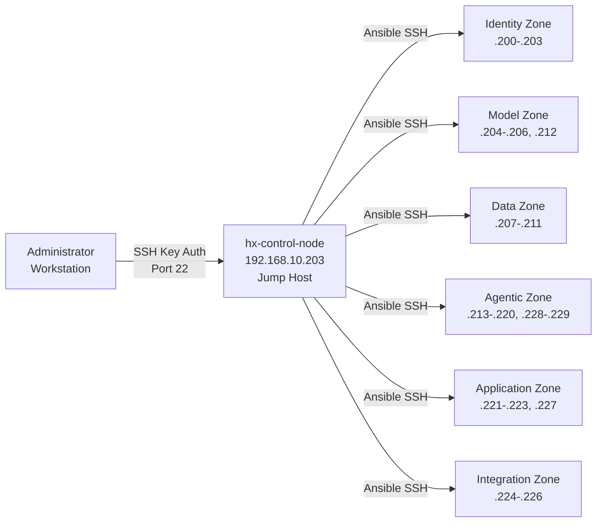
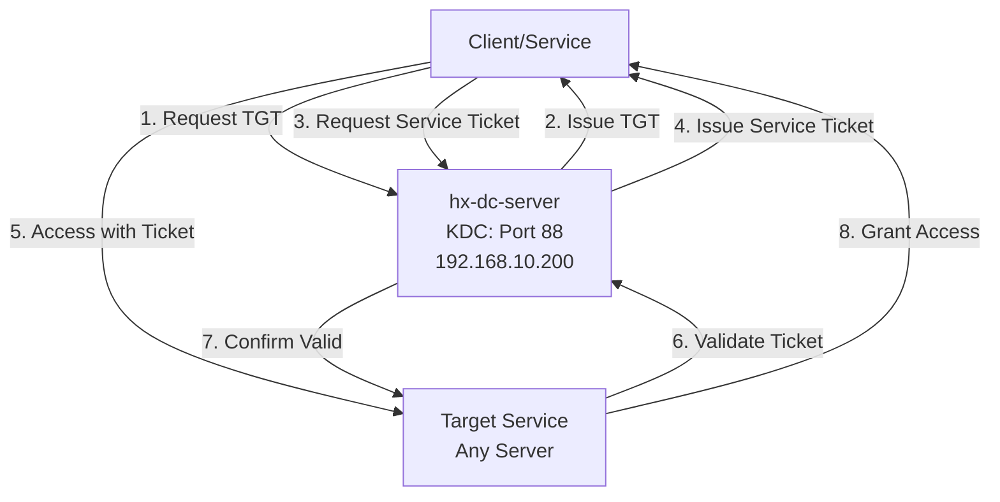

# HX-Infrastructure Network Topology

**Document Type**: Current State Documentation - Network Architecture  
**Created**: 2025-11-04  
**Last Updated**: 2025-11-15  
**Status**: ACTIVE - Production Network Reference  
**Location**: `/home/agent0/HX-Infrastructure/network/network-topology.md`

---

## Document Purpose

This document provides comprehensive network topology documentation for HX-Infrastructure's currently deployed network. This is a **snapshot of actual production infrastructure** as of the last update date, not a template.

### Document Classification

**Type**: Current State Documentation
- ✅ Represents actual deployed infrastructure
- ✅ Specific server names and IPs are production values
- ✅ Updated as network changes occur
- ⚠️ For template guidance, see `templates/network-topology-template.md` (when created)

**Intended Audience**:
- Infrastructure administrators
- Network engineers
- Service deployment teams
- Troubleshooting and operations staff

**Update Frequency**: Updated whenever network topology, IP assignments, or security zones change

---

## 1. High-Level Network Overview

### 1.1 Network Summary

**Network Details**:
- **Network**: 192.168.10.0/24
- **Gateway**: 192.168.10.1
- **DNS Server**: 192.168.10.200 (hx-dc-server)
- **Domain**: hx.dev.local
- **Total Hosts**: 30 servers allocated
  - **Deployed**: 28 servers (192.168.10.200-227)
  - **Reserved**: 2 servers (192.168.10.228-229)

**Network Characteristics**:
- 100% isolated development network
- All nodes domain-joined to hx.dev.local
- Centralized authentication via Kerberos/LDAP
- Internal CA for TLS certificates
- Reverse proxy ingress via hx-ssl-server

**Network Quality Gates**:
- ✅ All deployed servers domain-joined
- ✅ DNS resolution functional across all zones
- ✅ Kerberos authentication operational
- ✅ TLS certificates issued by internal CA
- ✅ All security zones properly segmented

---

## 2. Physical Network Topology

### 2.1 Network Layout Diagram

```mermaid
graph TB
    subgraph External["External Network / Internet"]
        User[User Workstations]
        GitHub[GitHub]
        ExtServices[External Services]
    end

    subgraph Gateway["Network Gateway"]
        Router[Router/Gateway<br/>192.168.10.1]
    end

    subgraph DMZ["Ingress Layer"]
        SSL[hx-ssl-server<br/>192.168.10.202<br/>TLS Termination<br/>Reverse Proxy<br/>✅ Operational]
    end

    subgraph InternalNetwork["Internal Network: 192.168.10.0/24<br/>Domain: hx.dev.local"]

        subgraph IdentityZone["Identity & Trust Zone (.200-.203)"]
            DC[hx-dc-server<br/>192.168.10.200<br/>Domain Controller<br/>DNS, Kerberos, LDAP<br/>✅ Operational]
            CA[hx-ca-server<br/>192.168.10.201<br/>Certificate Authority<br/>TLS Certs<br/>✅ Operational]
            Control[hx-control-node<br/>192.168.10.203<br/>Ansible Control<br/>Config Management<br/>✅ Operational]
        end

        subgraph ModelZone["Model & Inference Zone (.204-.206, .212)"]
            Ollama1[hx-ollama1-server<br/>192.168.10.204<br/>General Models<br/>✅ Operational]
            Ollama2[hx-ollama2-server<br/>192.168.10.205<br/>Code Models<br/>✅ Operational]
            Ollama3[hx-ollama3-server<br/>192.168.10.206<br/>Embeddings + Prompt<br/>✅ Operational]
            LiteLLM[hx-litellm-server<br/>192.168.10.212<br/>API Gateway<br/>✅ Operational]
        end

        subgraph DataZone["Data Plane Zone (.207-.211)"]
            Qdrant[hx-qdrant-server<br/>192.168.10.207<br/>Vector DB<br/>✅ Operational]
            QdrantUI[hx-qdrant-ui-server<br/>192.168.10.208<br/>Vector UI<br/>✅ Operational]
            Postgres[hx-postgres-server<br/>192.168.10.209<br/>SQL Database<br/>✅ Operational]
            Redis[hx-redis-server<br/>192.168.10.210<br/>Cache + Redis UI<br/>✅ Operational]
            QMCP[hx-qmcp-server<br/>192.168.10.211<br/>Qdrant MCP<br/>✅ Operational]
        end

        subgraph AgenticZone["Agentic & Toolchain Zone (.213-.220, .228-.229)"]
            FastMCP[hx-fastmcp-server<br/>192.168.10.213<br/>MCP Gateway<br/>✅ Operational]
            N8NMCP[hx-n8n-mcp-server<br/>192.168.10.214<br/>N8N MCP<br/>✅ Operational]
            N8N[hx-n8n-server<br/>192.168.10.215<br/>Workflows<br/>✅ Operational]
            Docling[hx-docling-server<br/>192.168.10.216<br/>Doc Worker<br/>✅ Operational]
            DoclingMCP[hx-docling-mcp-server<br/>192.168.10.217<br/>Docling MCP<br/>✅ Operational]
            CrawlMCP[hx-crawl4ai-mcp-server<br/>192.168.10.218<br/>Crawl4AI MCP<br/>✅ Operational]
            Crawl[hx-crawl4ai-server<br/>192.168.10.219<br/>Crawl Worker<br/>✅ Operational]
            LightRAG[hx-literag-server<br/>192.168.10.220<br/>RAG Framework<br/>✅ Operational]
            CodeRabbit[hx-coderabbit-server<br/>192.168.10.228<br/>Code Review MCP<br/>⚠️ Reserved]
            Shadcn[hx-shadcn-server<br/>192.168.10.229<br/>Component MCP<br/>⚠️ Reserved]
        end

        subgraph AppZone["Application Zone (.221-.223, .227)"]
            AGUI[hx-agui-server<br/>192.168.10.221<br/>Admin Dashboards<br/>🛠️ In Development]
            Dev[hx-dev-server<br/>192.168.10.222<br/>Development<br/>🛠️ In Development]
            Demo[hx-demo-server<br/>192.168.10.223<br/>Demo Environment<br/>🛠️ In Development]
            WebUI[hx-webui-server<br/>192.168.10.227<br/>Open WebUI<br/>✅ Operational]
        end

        subgraph IntegrationZone["Integration & Governance Zone (.224-.226)"]
            CC[hx-cc-server<br/>192.168.10.224<br/>Claude Code<br/>Systems Integrator<br/>✅ Operational]
            Metric[hx-metric-server<br/>192.168.10.225<br/>Metrics<br/>✅ Operational]
            Lang[hx-lang-server<br/>192.168.10.226<br/>LangGraph<br/>✅ Operational]
        end
    end

    User -->|HTTPS| Router
    GitHub -.->|API| Router
    ExtServices -.->|API| Router

    Router --> SSL

    SSL --> WebUI
    SSL --> AGUI
    SSL --> Dev
    SSL --> Demo

    WebUI --> LiteLLM
    Dev --> LiteLLM
    Demo --> LiteLLM

    LiteLLM --> Ollama1
    LiteLLM --> Ollama2
    LiteLLM --> Ollama3

    WebUI -.Direct Bypass.-> Ollama3
    Dev -.Direct Bypass.-> Ollama3

    WebUI --> FastMCP
    Dev --> FastMCP

    FastMCP --> QMCP
    FastMCP --> DoclingMCP
    FastMCP --> CrawlMCP
    FastMCP --> N8NMCP
    FastMCP --> CodeRabbit

    QMCP --> Qdrant
    DoclingMCP --> Docling
    CrawlMCP --> Crawl

    Docling --> Postgres
    Crawl --> Postgres
    LightRAG --> Qdrant
    LightRAG --> Postgres

    Lang --> Postgres
    Lang --> Redis
    Lang --> Qdrant

    DC -.Auth/DNS.-> IdentityZone
    DC -.Auth/DNS.-> ModelZone
    DC -.Auth/DNS.-> DataZone
    DC -.Auth/DNS.-> AgenticZone
    DC -.Auth/DNS.-> AppZone
    DC -.Auth/DNS.-> IntegrationZone

    CA -.TLS Certs.-> SSL
    CA -.TLS Certs.-> AppZone
    CA -.TLS Certs.-> ModelZone

    Control -.Ansible.-> IdentityZone
    Control -.Ansible.-> ModelZone
    Control -.Ansible.-> DataZone
    Control -.Ansible.-> AgenticZone
    Control -.Ansible.-> AppZone
    Control -.Ansible.-> IntegrationZone

    CC -.Orchestration.-> IntegrationZone
    CC -.Orchestration.-> AppZone
    CC -.Orchestration.-> AgenticZone
```



**Status Legend**:
- ✅ **Operational** - Deployed, tested, and validated
- 🛠️ **In Development** - Deployed but not yet validated for production
- ⚠️ **Reserved** - IP allocated, server not yet deployed

---

## 3. IP Address Allocation Map

### 3.1 Complete IP Mapping (Current State)

| IP Address | Hostname | FQDN | Zone | Status | Primary Role |
|------------|----------|------|------|--------|--------------|
| 192.168.10.1 | gateway | - | Gateway | ✅ | Network Gateway |
| 192.168.10.200 | hx-dc-server | hx-dc-server.hx.dev.local | Identity | ✅ | Domain Controller, DNS, Auth |
| 192.168.10.201 | hx-ca-server | hx-ca-server.hx.dev.local | Identity | ✅ | Certificate Authority |
| 192.168.10.202 | hx-ssl-server | hx-ssl-server.hx.dev.local | DMZ | ✅ | TLS Termination, Reverse Proxy |
| 192.168.10.203 | hx-control-node | hx-control-node.hx.dev.local | Identity | ✅ | Ansible Control |
| 192.168.10.204 | hx-ollama1-server | hx-ollama1-server.hx.dev.local | Model | ✅ | General LLM Models |
| 192.168.10.205 | hx-ollama2-server | hx-ollama2-server.hx.dev.local | Model | ✅ | Code-Focused Models |
| 192.168.10.206 | hx-ollama3-server | hx-ollama3-server.hx.dev.local | Model | ✅ | Embeddings + Prompt Enhancement |
| 192.168.10.207 | hx-qdrant-server | hx-qdrant-server.hx.dev.local | Data | ✅ | Vector Database |
| 192.168.10.208 | hx-qdrant-ui-server | hx-qdrant-ui-server.hx.dev.local | Data | ✅ | Qdrant Web UI |
| 192.168.10.209 | hx-postgres-server | hx-postgres-server.hx.dev.local | Data | ✅ | PostgreSQL Database |
| 192.168.10.210 | hx-redis-server | hx-redis-server.hx.dev.local | Data | ✅ | Redis Cache + UI |
| 192.168.10.211 | hx-qmcp-server | hx-qmcp-server.hx.dev.local | Data | ✅ | Qdrant MCP Server |
| 192.168.10.212 | hx-litellm-server | hx-litellm-server.hx.dev.local | Model | ✅ | LiteLLM API Gateway |
| 192.168.10.213 | hx-fastmcp-server | hx-fastmcp-server.hx.dev.local | Agentic | ✅ | FastMCP Gateway (w/ Brave) |
| 192.168.10.214 | hx-n8n-mcp-server | hx-n8n-mcp-server.hx.dev.local | Agentic | ✅ | N8N MCP Server |
| 192.168.10.215 | hx-n8n-server | hx-n8n-server.hx.dev.local | Agentic | ✅ | N8N Workflows |
| 192.168.10.216 | hx-docling-server | hx-docling-server.hx.dev.local | Agentic | ✅ | Docling Worker |
| 192.168.10.217 | hx-docling-mcp-server | hx-docling-mcp-server.hx.dev.local | Agentic | ✅ | Docling MCP Server |
| 192.168.10.218 | hx-crawl4ai-mcp-server | hx-crawl4ai-mcp-server.hx.dev.local | Agentic | ✅ | Crawl4AI MCP Server |
| 192.168.10.219 | hx-crawl4ai-server | hx-crawl4ai-server.hx.dev.local | Agentic | ✅ | Crawl4AI Worker |
| 192.168.10.220 | hx-literag-server | hx-literag-server.hx.dev.local | Agentic | ✅ | LightRAG Server |
| 192.168.10.221 | hx-agui-server | hx-agui-server.hx.dev.local | Application | 🛠️ | Admin Dashboards |
| 192.168.10.222 | hx-dev-server | hx-dev-server.hx.dev.local | Application | 🛠️ | Development Environment |
| 192.168.10.223 | hx-demo-server | hx-demo-server.hx.dev.local | Application | 🛠️ | Demo Environment |
| 192.168.10.224 | hx-cc-server | hx-cc-server.hx.dev.local | Integration | ✅ | Claude Code Server |
| 192.168.10.225 | hx-metric-server | hx-metric-server.hx.dev.local | Integration | ✅ | Metrics/Observability |
| 192.168.10.226 | hx-lang-server | hx-lang-server.hx.dev.local | Integration | ✅ | LangGraph Server |
| 192.168.10.227 | hx-webui-server | hx-webui-server.hx.dev.local | Application | ✅ | Web UI Server |
| 192.168.10.228 | hx-coderabbit-server | hx-coderabbit-server.hx.dev.local | Agentic | ⚠️ | CodeRabbit MCP Server (Reserved) |
| 192.168.10.229 | hx-shadcn-server | hx-shadcn-server.hx.dev.local | Agentic | ⚠️ | Shadcn MCP Server (Reserved) |

**Current Deployment Status**:
- **Total Servers**: 30 allocated
- **Operational (✅)**: 25 servers
- **In Development (🛠️)**: 3 servers (agui, dev, demo)
- **Reserved (⚠️)**: 2 servers (coderabbit, shadcn)

**Last Inventory Update**: 2025-11-15

---

## 4. Security Zone Architecture

### 4.1 Security Zones and Trust Boundaries

**Zone Hierarchy** (Strictest → Most Permissive):

1. **Identity & Trust Zone** (192.168.10.200-203)
   - **Purpose**: Authentication, authorization, configuration management
   - **Trust Level**: Highest - Foundation for all other zones
   - **Servers**: hx-dc-server, hx-ca-server, hx-control-node
   - **Access**: Restricted - Admin only via hx-control-node
   - **Dependencies**: None (self-sufficient)

2. **DMZ / Ingress Layer** (192.168.10.202)
   - **Purpose**: TLS termination, reverse proxy, external ingress
   - **Trust Level**: Medium - Public-facing with strict controls
   - **Servers**: hx-ssl-server
   - **Access**: Public HTTPS (443), managed by Identity zone
   - **Dependencies**: Identity zone (auth), CA (certificates)

3. **Model & Inference Zone** (192.168.10.204-206, 212)
   - **Purpose**: LLM inference, embeddings, model gateway
   - **Trust Level**: Medium - Compute-intensive, minimal data storage
   - **Servers**: hx-ollama1/2/3-server, hx-litellm-server
   - **Access**: Internal only, authenticated via Identity zone
   - **Dependencies**: Identity zone (auth)

4. **Data Plane Zone** (192.168.10.207-211)
   - **Purpose**: Data storage, caching, vector databases
   - **Trust Level**: High - Contains persistent data
   - **Servers**: hx-qdrant-server, hx-postgres-server, hx-redis-server, etc.
   - **Access**: Internal only, authenticated services
   - **Dependencies**: Identity zone (auth), backup systems

5. **Agentic & Toolchain Zone** (192.168.10.213-220, 228-229)
   - **Purpose**: MCP servers, workflow automation, tool orchestration
   - **Trust Level**: Medium - Orchestration and integration
   - **Servers**: hx-fastmcp-server, hx-n8n-server, hx-docling-server, etc.
   - **Access**: Internal, orchestrated via Integration zone
   - **Dependencies**: Data zone, Model zone, Integration zone

6. **Application Zone** (192.168.10.221-223, 227)
   - **Purpose**: User-facing applications, dashboards, development
   - **Trust Level**: Medium - User interaction layer
   - **Servers**: hx-agui-server, hx-dev-server, hx-demo-server, hx-webui-server
   - **Access**: Via DMZ (hx-ssl-server), authenticated users
   - **Dependencies**: Model zone, Agentic zone, Data zone

7. **Integration & Governance Zone** (192.168.10.224-226)
   - **Purpose**: System integration, orchestration, observability
   - **Trust Level**: High - Control plane functions
   - **Servers**: hx-cc-server, hx-metric-server, hx-lang-server
   - **Access**: Internal only, admin and system services
   - **Dependencies**: All zones (orchestration and monitoring)

### 4.2 Trust Relationships

**Authentication Flow**:
```
All Zones → hx-dc-server (192.168.10.200) → Kerberos Auth → Access Granted
```

**Certificate Chain**:
```
hx-ca-server (Root CA) → Issues Certs → All Services → TLS Enabled
```

**Management Access**:
```
Admin → hx-control-node (192.168.10.203) → Ansible → All Zones
```

---

## 5. Network Quality Gates

### 5.1 Pre-Deployment Quality Gates

Before any new server is added to the network, the following must be verified:

**Foundation Requirements**:
- [ ] IP address allocated and documented in this file
- [ ] FQDN registered in DNS (hx-dc-server)
- [ ] Server domain-joined to hx.dev.local
- [ ] Kerberos authentication functional
- [ ] TLS certificate issued by hx-ca-server
- [ ] Security zone assignment documented

**Network Connectivity**:
- [ ] Gateway reachable (192.168.10.1)
- [ ] DNS resolution functional
- [ ] NTP time synchronization configured
- [ ] Firewall rules configured per zone
- [ ] Port mappings documented

**Management Access**:
- [ ] Ansible control from hx-control-node functional
- [ ] SSH key authentication configured
- [ ] Logging configured (if hx-metric-server available)

### 5.2 Service Deployment Quality Gates

Before promoting any service to operational:

**Network Validation**:
- [ ] Service port documented in port mapping
- [ ] Health check endpoint accessible
- [ ] Integration points tested
- [ ] DNS entries validated
- [ ] TLS certificate valid and trusted

**Security Validation**:
- [ ] Authentication mechanism tested
- [ ] Authorization rules verified
- [ ] Network segmentation validated
- [ ] Firewall rules tested
- [ ] Certificate expiration monitoring configured

**Documentation**:
- [ ] IP address in allocation table
- [ ] Service connectivity documented
- [ ] Dependencies mapped
- [ ] Troubleshooting procedures documented

---

## 6. Network Testing Procedures

### 6.1 Connectivity Test Suite

**Test Case 1: DNS Resolution**
```bash
# Test forward DNS
nslookup <hostname>.hx.dev.local 192.168.10.200

# Test reverse DNS
dig -x <ip-address> @192.168.10.200

# Expected: All servers resolve correctly
# Pass Criteria: All 28 deployed servers resolve in both directions
```

**Test Case 2: Network Reachability**
```bash
# Ping test from control node
for ip in {200..227}; do
  ping -c 1 192.168.10.$ip && echo "✅ .${ip}" || echo "❌ .${ip}"
done

# Expected: All deployed servers respond
# Pass Criteria: 100% success rate for deployed servers
```

**Test Case 3: Port Connectivity**
```bash
# Test critical service ports
nc -zv hx-dc-server.hx.dev.local 88      # Kerberos
nc -zv hx-dc-server.hx.dev.local 389     # LDAP
nc -zv hx-postgres-server.hx.dev.local 5432  # PostgreSQL
nc -zv hx-qdrant-server.hx.dev.local 6333    # Qdrant
nc -zv hx-redis-server.hx.dev.local 6379     # Redis

# Expected: All ports respond
# Pass Criteria: All critical services accessible
```

**Test Case 4: Kerberos Authentication**
```bash
# Test Kerberos ticket acquisition
kinit admin@HX.DEV.LOCAL
klist

# Test service principal
kvno HTTP/hx-webui-server.hx.dev.local@HX.DEV.LOCAL

# Expected: Tickets acquired successfully
# Pass Criteria: No authentication errors
```

**Test Case 5: TLS Certificate Validation**
```bash
# Test certificate chain
openssl s_client -connect hx-webui-server.hx.dev.local:443 -showcerts

# Check certificate expiration
echo | openssl s_client -connect hx-webui-server.hx.dev.local:443 2>/dev/null | \
  openssl x509 -noout -dates

# Expected: Valid certificate chain from hx-ca-server
# Pass Criteria: Certificates valid and not expiring within 30 days
```

### 6.2 Integration Test Suite

**Test Case 6: End-to-End Application Flow**
```bash
# Test: User → SSL → WebUI → LiteLLM → Ollama
# 1. Access web UI via reverse proxy
curl -k https://hx-ssl-server.hx.dev.local/webui

# 2. Verify LiteLLM API accessible
curl http://hx-litellm-server.hx.dev.local:4000/health

# 3. Verify Ollama backend accessible
curl http://hx-ollama1-server.hx.dev.local:11434/api/tags

# Expected: All components respond
# Pass Criteria: Complete chain functional
```

**Test Case 7: Data Plane Integration**
```bash
# Test: Service → MCP → Data Store
# 1. Test Qdrant connectivity
curl http://hx-qdrant-server.hx.dev.local:6333/collections

# 2. Test PostgreSQL connectivity
psql -h hx-postgres-server.hx.dev.local -U <user> -c "SELECT version();"

# 3. Test Redis connectivity
redis-cli -h hx-redis-server.hx.dev.local PING

# Expected: All data stores accessible
# Pass Criteria: No connection errors
```

### 6.3 Performance Baseline Tests

**Test Case 8: Network Latency**
```bash
# Measure latency between zones
ping -c 100 hx-dc-server.hx.dev.local | tail -1
ping -c 100 hx-postgres-server.hx.dev.local | tail -1
ping -c 100 hx-ollama1-server.hx.dev.local | tail -1

# Expected: < 1ms latency (local network)
# Pass Criteria: Average latency < 2ms
```

**Test Case 9: Bandwidth**
```bash
# Test bandwidth between nodes (requires iperf3)
# On server: iperf3 -s
# On client: iperf3 -c hx-postgres-server.hx.dev.local

# Expected: > 1Gbps on gigabit network
# Pass Criteria: Throughput meets infrastructure requirements
```

### 6.4 Security Validation Tests

**Test Case 10: Zone Isolation**
```bash
# Verify security zone segmentation
# Test from Application zone to Data zone should succeed (authenticated)
# Test from external should fail (blocked)

# From hx-webui-server to hx-postgres-server (should succeed)
ssh hx-webui-server "nc -zv hx-postgres-server.hx.dev.local 5432"

# Expected: Proper zone access control
# Pass Criteria: Only authorized zone-to-zone communication allowed
```

---

## 7. Service Port Mapping

### 7.1 Critical Service Ports (Current Deployment)

| Server | Service | Port(s) | Protocol | Status | Notes |
|--------|---------|---------|----------|--------|-------|
| hx-dc-server | Kerberos KDC | 88 | TCP/UDP | ✅ | Authentication |
| hx-dc-server | LDAP | 389, 636 | TCP | ✅ | Directory services |
| hx-dc-server | DNS | 53 | TCP/UDP | ✅ | Name resolution |
| hx-ssl-server | HTTPS | 443 | TCP | ✅ | Reverse proxy |
| hx-postgres-server | PostgreSQL | 5432 | TCP | ✅ | Database |
| hx-redis-server | Redis | 6379 | TCP | ✅ | Cache |
| hx-redis-server | Redis UI | 8001 | TCP | ✅ | Web interface |
| hx-qdrant-server | Qdrant API | 6333 | TCP | ✅ | Vector DB API |
| hx-qdrant-server | Qdrant gRPC | 6334 | TCP | ✅ | Vector DB gRPC |
| hx-qdrant-ui-server | Qdrant UI | 3000 | TCP | ✅ | Web interface |
| hx-ollama1-server | Ollama API | 11434 | TCP | ✅ | LLM inference |
| hx-ollama2-server | Ollama API | 11434 | TCP | ✅ | LLM inference |
| hx-ollama3-server | Ollama API | 11434 | TCP | ✅ | LLM inference |
| hx-litellm-server | LiteLLM API | 4000 | TCP | ✅ | API gateway |
| hx-fastmcp-server | MCP Gateway | 8000 | TCP | ✅ | MCP services |
| hx-n8n-server | N8N UI | 5678 | TCP | ✅ | Workflow UI |
| hx-webui-server | Web UI | 3000 | TCP | ✅ | User interface |
| hx-cc-server | Claude Code | 22 | TCP | ✅ | SSH access |
| hx-metric-server | Prometheus | 9090 | TCP | ✅ | Metrics |
| hx-metric-server | Grafana | 3001 | TCP | ✅ | Dashboards |

**Port Allocation Policy**:
- DNS/Auth services: 53, 88, 389, 636
- Web interfaces: 3000-3999, 5678, 8000-8999
- LLM services: 11434, 4000
- Data stores: 5432 (Postgres), 6333-6334 (Qdrant), 6379 (Redis)
- Monitoring: 9090-9099
- SSH: 22 (admin access only)

---

## 8. Data Flow Patterns

### 8.1 User Request Flow

**Pattern: User → Web UI → LLM**
```
1. User HTTPS request → hx-ssl-server:443 (TLS termination)
2. Reverse proxy → hx-webui-server:3000 (web application)
3. Web UI → hx-litellm-server:4000 (API gateway)
4. LiteLLM → hx-ollama1-server:11434 (model inference)
5. Response flows back through same path
```

**Pattern: User → Development → Tools**
```
1. Developer → hx-dev-server:3000 (development environment)
2. Dev environment → hx-fastmcp-server:8000 (MCP gateway)
3. FastMCP → hx-docling-mcp-server (document processing)
4. Docling MCP → hx-docling-server (worker process)
5. Worker → hx-postgres-server:5432 (store results)
```

### 8.2 Data Persistence Patterns

**Vector Storage**:
```
Services → hx-qdrant-server:6333 → Vector embeddings stored
Query → hx-qmcp-server → hx-qdrant-server → Results
```

**Relational Storage**:
```
Services → hx-postgres-server:5432 → Structured data stored
Backup → Daily snapshots → External storage
```

**Cache Layer**:
```
Services → hx-redis-server:6379 → Cache hit/miss
TTL expires → Eviction → Re-query source
```

### 8.3 Authentication Flow

**Kerberos Authentication**:
```
1. Client → hx-dc-server:88 (request TGT)
2. KDC validates → Issues TGT → Client caches
3. Client → hx-dc-server:88 (request service ticket)
4. KDC issues service ticket → Client caches
5. Client → Target service with ticket
6. Service validates ticket with KDC
7. Access granted
```

---

## 9. High Availability and Disaster Recovery

### 9.1 Current HA Status

**Single Points of Failure** (Current State):
- ⚠️ hx-dc-server (Domain Controller) - Critical single point
- ⚠️ hx-postgres-server (Database) - No replication
- ⚠️ hx-redis-server (Cache) - No sentinel
- ⚠️ hx-ssl-server (Ingress) - No load balancer

**Mitigation Strategies** (Current):
- Regular backups of critical services
- VM snapshots for quick recovery
- Configuration management via Ansible for rapid rebuild

### 9.2 Backup and Recovery Procedures

**Critical Services - Backup Schedule**:

| Service | Component | Backup Frequency | Retention | RPO | RTO |
|---------|-----------|------------------|-----------|-----|-----|
| hx-dc-server | AD Database | Daily | 30 days | 24h | 4h |
| hx-postgres-server | PostgreSQL | Hourly | 7 days | 1h | 2h |
| hx-qdrant-server | Vector DB | Daily | 14 days | 24h | 4h |
| hx-redis-server | Cache | None | N/A | N/A | 1h rebuild |
| hx-ca-server | Certificate DB | Weekly | 90 days | 7d | 24h |
| All Servers | VM Snapshots | Weekly | 4 weeks | 7d | 4-8h |

**RPO**: Recovery Point Objective (maximum acceptable data loss)  
**RTO**: Recovery Time Objective (maximum acceptable downtime)

---

## 10. Network Expansion Roadmap

### 10.1 Planned Enhancements

**Phase 1 - Reserved Deployments** (Immediate):
- Deploy hx-coderabbit-server (192.168.10.228) - Code review automation
- Deploy hx-shadcn-server (192.168.10.229) - Component library MCP
- Complete validation of hx-agui-server, hx-dev-server, hx-demo-server

**Phase 2 - High Availability** (Future):
- Add secondary domain controller (hx-dc-server-2)
- Implement PostgreSQL streaming replication
- Add Redis Sentinel cluster for cache HA
- Deploy load balancer for web tier (hx-ssl-server-2)

**Phase 3 - Monitoring Enhancement** (In Progress):
- Expand hx-metric-server capabilities
  - Prometheus metrics collection (port 9090) ✅
  - Grafana dashboards (port 3001) ✅
  - Alertmanager notifications (port 9093) - Planned
- Implement distributed tracing
- Add centralized logging

**Phase 4 - Container Orchestration** (Future):
- Evaluate Kubernetes cluster deployment
- Container registry for service images
- Ingress controller for containerized services

### 10.2 IP Address Reservation Plan

**Reserved for Future Expansion**:
- 192.168.10.230-240: Reserved for HA replicas and secondary services
- 192.168.10.241-250: Reserved for monitoring/logging expansion
- 192.168.10.251-254: Reserved for network infrastructure

---

## 11. Operational Network Diagrams

### 11.1 SSH Access Pattern (Administrative)



**Security Note**: Direct SSH access to individual servers (other than hx-control-node) is restricted. All administrative access and configuration management flows through hx-control-node via Ansible automation.

### 11.2 Kerberos Authentication Flow



---

## 12. Network Troubleshooting Reference

### 12.1 Connectivity Verification Commands

**DNS Resolution Check**:
```bash
# Verify DNS resolution
nslookup hx-dc-server.hx.dev.local 192.168.10.200
dig @192.168.10.200 hx-webui-server.hx.dev.local

# Verify reverse DNS
dig -x 192.168.10.227 @192.168.10.200

# Expected: All deployed servers resolve in both directions
```

**Network Connectivity Check**:
```bash
# Ping test
ping -c 3 192.168.10.200

# Port connectivity test
nc -zv hx-litellm-server.hx.dev.local 4000
telnet hx-postgres-server.hx.dev.local 5432

# Trace route
traceroute 192.168.10.227
```

**Kerberos Authentication Check**:
```bash
# Test Kerberos ticket acquisition
kinit admin@HX.DEV.LOCAL
klist

# Verify service principals
kvno HTTP/hx-webui-server.hx.dev.local@HX.DEV.LOCAL

# Check ticket expiration
klist -e
```

**Service Port Check**:
```bash
# Check listening ports on local server
ss -tlnp | grep <port>
netstat -tlnp | grep <port>

# Check open ports from remote
nmap -p 5432,6379,6333,11434 192.168.10.207-212

# Check specific service availability
curl -v http://hx-litellm-server.hx.dev.local:4000/health
```

### 12.2 Common Network Issues

| Issue | Symptom | Diagnostic Command | Resolution |
|-------|---------|-------------------|------------|
| DNS Failure | Cannot resolve hostnames | `nslookup <host> 192.168.10.200`<br/>`cat /etc/resolv.conf` | Point nameserver to 192.168.10.200<br/>Restart systemd-resolved |
| Auth Failure | Kerberos errors | `klist`<br/>`kinit admin@HX.DEV.LOCAL` | Check time sync with DC<br/>Run `ntpdate` or verify DC reachability |
| Port Blocked | Connection timeout | `nc -zv <host> <port>`<br/>`ss -tlnp \| grep <port>` | Check firewall rules<br/>Verify service is running<br/>Check listening interface |
| TLS Error | Certificate invalid/expired | `openssl s_client -connect <host>:443`<br/>`openssl x509 -noout -dates` | Renew certificate from hx-ca-server<br/>Check certificate trust chain |
| Route Missing | Host unreachable | `ip route`<br/>`traceroute <host>` | Add default route via 192.168.10.1<br/>Check gateway configuration |
| Time Sync | Kerberos auth fails | `timedatectl status`<br/>`ntpdate -q 192.168.10.200` | Configure NTP to sync with DC<br/>`timedatectl set-ntp true` |

### 12.3 Network Health Check Script

```bash
#!/bin/bash
# HX-Infrastructure Network Health Check
# Location: /home/agent0/HX-Infrastructure/procedures/network-health-check.sh

echo "=== HX-Infrastructure Network Health Check ==="
echo "Timestamp: $(date)"
echo ""

# Test 1: Gateway
echo "1. Testing Gateway..."
ping -c 1 192.168.10.1 >/dev/null 2>&1 && echo "✅ Gateway reachable" || echo "❌ Gateway unreachable"

# Test 2: DNS
echo "2. Testing DNS..."
nslookup hx-dc-server.hx.dev.local 192.168.10.200 >/dev/null 2>&1 && echo "✅ DNS functional" || echo "❌ DNS failure"

# Test 3: Domain Controller
echo "3. Testing Domain Controller..."
nc -zv 192.168.10.200 88 2>&1 | grep -q succeeded && echo "✅ Kerberos KDC reachable" || echo "❌ KDC unreachable"

# Test 4: Critical Services
echo "4. Testing Critical Services..."
for service in "192.168.10.209:5432" "192.168.10.207:6333" "192.168.10.210:6379" "192.168.10.212:4000"; do
  nc -zv ${service/:/ } 2>&1 | grep -q succeeded && echo "✅ ${service} reachable" || echo "❌ ${service} unreachable"
done

echo ""
echo "=== Health Check Complete ==="
```

---

## 13. Appendix: Network Configuration Files

### 13.1 Sample /etc/hosts Entry (All Servers)

```
# HX-Infrastructure - Static hosts file
# Domain: hx.dev.local
# Updated: 2025-11-15

127.0.0.1   localhost
::1         localhost ip6-localhost ip6-loopback

# Gateway
192.168.10.1    gateway

# Identity & Trust Zone
192.168.10.200  hx-dc-server.hx.dev.local            hx-dc-server
192.168.10.201  hx-ca-server.hx.dev.local            hx-ca-server
192.168.10.202  hx-ssl-server.hx.dev.local           hx-ssl-server
192.168.10.203  hx-control-node.hx.dev.local         hx-control-node

# Model & Inference Zone
192.168.10.204  hx-ollama1-server.hx.dev.local       hx-ollama1-server
192.168.10.205  hx-ollama2-server.hx.dev.local       hx-ollama2-server
192.168.10.206  hx-ollama3-server.hx.dev.local       hx-ollama3-server
192.168.10.212  hx-litellm-server.hx.dev.local       hx-litellm-server

# Data Plane Zone
192.168.10.207  hx-qdrant-server.hx.dev.local        hx-qdrant-server
192.168.10.208  hx-qdrant-ui-server.hx.dev.local     hx-qdrant-ui-server
192.168.10.209  hx-postgres-server.hx.dev.local      hx-postgres-server
192.168.10.210  hx-redis-server.hx.dev.local         hx-redis-server
192.168.10.211  hx-qmcp-server.hx.dev.local          hx-qmcp-server

# Agentic & Toolchain Zone
192.168.10.213  hx-fastmcp-server.hx.dev.local       hx-fastmcp-server
192.168.10.214  hx-n8n-mcp-server.hx.dev.local       hx-n8n-mcp-server
192.168.10.215  hx-n8n-server.hx.dev.local           hx-n8n-server
192.168.10.216  hx-docling-server.hx.dev.local       hx-docling-server
192.168.10.217  hx-docling-mcp-server.hx.dev.local   hx-docling-mcp-server
192.168.10.218  hx-crawl4ai-mcp-server.hx.dev.local  hx-crawl4ai-mcp-server
192.168.10.219  hx-crawl4ai-server.hx.dev.local      hx-crawl4ai-server
192.168.10.220  hx-literag-server.hx.dev.local       hx-literag-server
192.168.10.228  hx-coderabbit-server.hx.dev.local    hx-coderabbit-server
192.168.10.229  hx-shadcn-server.hx.dev.local        hx-shadcn-server

# Application Zone
192.168.10.221  hx-agui-server.hx.dev.local          hx-agui-server
192.168.10.222  hx-dev-server.hx.dev.local           hx-dev-server
192.168.10.223  hx-demo-server.hx.dev.local          hx-demo-server
192.168.10.227  hx-webui-server.hx.dev.local         hx-webui-server

# Integration & Governance Zone
192.168.10.224  hx-cc-server.hx.dev.local            hx-cc-server
192.168.10.225  hx-metric-server.hx.dev.local        hx-metric-server
192.168.10.226  hx-lang-server.hx.dev.local          hx-lang-server
```

### 13.2 Sample /etc/resolv.conf (All Servers)

```
# DNS Configuration for hx.dev.local domain
# Primary DNS: hx-dc-server (192.168.10.200)
# Secondary DNS: Gateway (192.168.10.1)

search hx.dev.local
nameserver 192.168.10.200
nameserver 192.168.10.1
options timeout:2 attempts:3 rotate
```

### 13.3 Sample /etc/network/interfaces (Static IP Configuration)

```
# Static IP configuration for HX-Infrastructure servers
# Example for server at 192.168.10.XXX

auto lo
iface lo inet loopback

auto eth0
iface eth0 inet static
    address 192.168.10.XXX
    netmask 255.255.255.0
    gateway 192.168.10.1
    dns-nameservers 192.168.10.200 192.168.10.1
    dns-search hx.dev.local
    
    # Optional: Set MTU if needed
    # mtu 1500
```

---

## 14. Change Log

### 14.1 Network Changes

| Date | Change Type | Description | Affected Servers | Changed By |
|------|-------------|-------------|------------------|------------|
| 2025-11-04 | Initial | Network topology initial documentation | All 30 servers | Infrastructure Team |
| 2025-11-15 | Adaptation | Adapted for HX-Infrastructure from Hana-X | All documentation | HX-Infrastructure Team |
| 2025-11-15 | Enhancement | Added quality gates, testing procedures, change log | Documentation only | HX-Infrastructure Team |
| 2025-11-15 | Correction | Corrected hx-lang-server: LangChain → LangGraph | hx-lang-server (.226) | HX-Infrastructure Team |

### 14.2 Pending Changes

| Planned Date | Change Type | Description | Impact | Priority |
|--------------|-------------|-------------|--------|----------|
| TBD | Deployment | Deploy hx-coderabbit-server (.228) | New MCP service | Medium |
| TBD | Deployment | Deploy hx-shadcn-server (.229) | New MCP service | Medium |
| TBD | Validation | Complete testing of dev/demo/agui servers | Application zone | High |
| TBD | Enhancement | Add secondary domain controller | HA improvement | High |
| TBD | Enhancement | Implement PostgreSQL replication | Data redundancy | High |

---

## 15. Document Maintenance

### 15.1 Update Triggers

This document MUST be updated when:
- ✅ New servers added to the network
- ✅ IP address changes occur
- ✅ Security zones are modified or new zones created
- ✅ Network topology changes (new segments, VLANs, etc.)
- ✅ Service ports change or new services deployed
- ✅ Integration patterns evolve
- ✅ Quality gates are modified
- ✅ Testing procedures are updated

### 15.2 Version History

| Version | Date | Changes | Author |
|---------|------|---------|--------|
| 1.0 | 2025-11-04 | Initial network topology documentation | Infrastructure Team |
| 1.1 | 2025-11-15 | Adapted for HX-Infrastructure, added quality gates, testing procedures, change log | HX-Infrastructure Team |
| 1.1.1 | 2025-11-15 | Corrected hx-lang-server: LangChain → LangGraph | HX-Infrastructure Team |

### 15.3 Related Documents

**HX-Infrastructure Core Documents**:
- `constitution.md` - Project principles and philosophy
- `README.md` - Repository overview and navigation
- `action-plan-v2-updated.md` - Project roadmap and status

**Inventory and State**:
- `inventory/nodes.md` - Complete server inventory (when created)
- `inventory/services.md` - Service deployment status (when created)
- `nodes/<node-name>/node-spec.md` - Individual node specifications (when created)

**Standards and Guidelines**:
- `standards/naming-conventions.md` - Naming standards
- `standards/architecture-standards.md` - Architecture guidelines
- `standards/deployment-requirements.md` - Deployment procedures

**Agent Documentation**:
- `hx-agents/hx-agent-inventory.md` - 45 agents and capabilities
- `hx-agents/hx-orchestration-guide.md` - Multi-agent workflows
- `CLAUDE.md` - Agent Zero orchestration instructions

**Knowledge Base**:
- `hx-knowledge/repos/` - Technology repository references
- `hx-knowledge/docs/` - Additional technical documentation

**Procedures** (when created):
- `procedures/network-troubleshooting.md` - Network issue resolution
- `procedures/service-deployment.md` - Service deployment workflow
- `procedures/test-execution.md` - Testing procedures

---

**Document Information**:
- **Version**: 1.1.1
- **Status**: ACTIVE - Production Network Reference
- **Maintained By**: HX-Infrastructure Team
- **Review Frequency**: Monthly or as network changes occur
- **Last Review**: 2025-11-15
- **Next Review**: 2025-12-15 (or upon significant network change)

---

*This network topology document represents the current state of HX-Infrastructure's production network. It serves as the authoritative reference for network architecture, IP allocation, security zones, and operational procedures. All network changes must be reflected in this document within 48 hours of implementation.*
