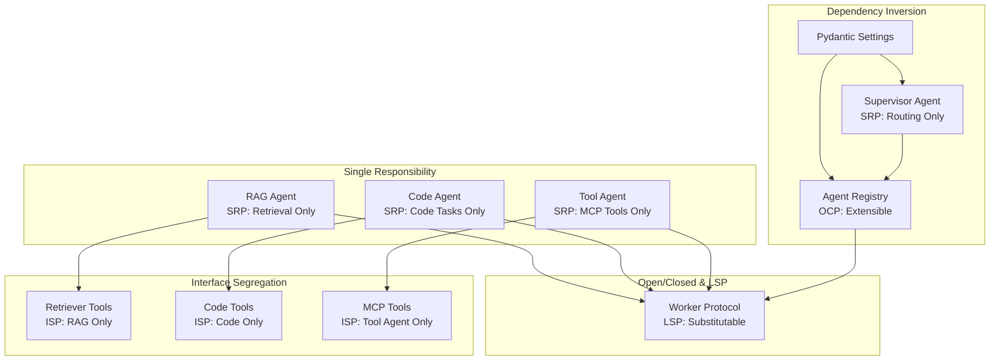

# Charter Review: Sophia (LangGraph SME - Technical Lead)

**Review Date:** 2025-12-01
**Charter Version:** 1.1
**Reviewer Role:** Technical Lead, LangGraph Orchestration SME

---

## Executive Summary

The hx-lang-server charter presents a sound architectural vision for deploying LangGraph as the central orchestration hub for HX-Infrastructure. The multi-agent supervisor pattern with specialized workers (RAG, Code, Tool agents) aligns well with proven LangGraph patterns. The state management approach combining PostgreSQL checkpoints with Redis sessions is technically appropriate, though implementation details require careful attention. Overall, this is a well-conceived charter with a few areas requiring clarification before proceeding to specification.

---

## Strengths

1. **Sound Supervisor Pattern Selection**: The choice of a supervisor pattern with specialized worker agents (RAG Agent, Code Agent, Tool Agent) directly mirrors the `langgraph-supervisor` prebuilt library patterns. This is a proven approach for multi-step, adaptive workflows.

2. **Appropriate Technology Stack**: The selection of `langgraph-checkpoint-postgres` for durable state persistence is the recommended approach for production systems. Using `langchain-ollama` for LLM integration is well-documented and stable.

3. **Clear Phased Approach**: Breaking the implementation into Phase 1 (Core LangGraph + RAG) and Phase 2 (n8n + MCP Integration) allows for incremental validation and reduces risk. This aligns with LangGraph best practices of "start simple, add complexity."

4. **Strategic Integration Points**: The architecture correctly identifies integration with existing HX-Infrastructure services (Ollama servers, LightRAG, Qdrant, Redis, PostgreSQL). This leverages existing investments.

5. **SOLID Principles Mandate**: Explicitly requiring SOLID OOP principles in the operational constraints demonstrates architectural rigor and will improve maintainability.

6. **FastAPI Wrapper Pattern**: Using FastAPI for API exposure is consistent with LangGraph deployment patterns and enables custom endpoints, middleware, and webhook handling for n8n integration.

7. **Comprehensive Success Criteria**: The measurable success criteria cover adaptive RAG, multi-Ollama routing, n8n integration, state persistence, and MCP tool integration - all key capabilities.

---

## Concerns / Risks

### HIGH Severity

1. **R-LANG-001: PostgreSQL Checkpointer Configuration Complexity**
   - **Concern**: The charter mentions `langgraph-checkpoint-postgres` but does not address critical configuration requirements documented in the library:
     - Connections MUST include `autocommit=True` and `row_factory=dict_row`
     - The `.setup()` method must be called before first use
     - Schema migrations may be needed for version upgrades
   - **Impact**: Incorrect configuration will cause `TypeError` exceptions during checkpointer operations
   - **Recommendation**: Add explicit task for PostgreSQL checkpointer configuration validation with specific connection parameters

2. **R-LANG-002: State Schema Definition Not Addressed**
   - **Concern**: The charter does not mention the state schema that will govern the LangGraph workflow. LangGraph requires a well-defined TypedDict or Pydantic model for state management.
   - **Impact**: Without upfront state schema design, agent communication will be ad-hoc and difficult to maintain
   - **Recommendation**: Add a deliverable for state schema design in Phase 1, including:
     - Message state with reducers for message accumulation
     - Conversation context fields
     - Routing decision metadata
     - Tool call tracking

3. **R-LANG-003: Memory Store vs. Checkpointer Distinction**
   - **Concern**: The charter conflates "session caching" (Redis) with "checkpoint persistence" (PostgreSQL) but does not address the LangGraph Memory Store pattern for cross-thread persistent memory
   - **Impact**: May miss the ability to retain user preferences, conversation history, or learned patterns across different thread sessions
   - **Recommendation**: Clarify whether Redis serves as:
     - A) Session state cache (ephemeral, per-request)
     - B) Cross-thread Memory Store (persistent, across conversations)
     - C) Both (with clear separation of concerns)

### MEDIUM Severity

4. **R-LANG-004: Human-in-the-Loop Not Addressed**
   - **Concern**: The charter does not mention human-in-the-loop (HITL) capabilities, which are a core LangGraph feature. Given n8n integration is in scope, HITL patterns (interrupts, approvals) should be considered.
   - **Impact**: May need to retrofit HITL support later, requiring state schema changes
   - **Recommendation**: Add consideration for HITL patterns in Phase 2 scope, or explicitly defer to future charter

5. **R-LANG-005: Graph Recursion and Error Handling**
   - **Concern**: No mention of recursion limits, circuit breakers, or error handling strategies for agent loops
   - **Impact**: Agents could enter infinite loops, consuming resources and stalling workflows
   - **Recommendation**: Specify recursion limits (e.g., `max_iterations=25`), timeout policies, and fallback behaviors

6. **R-LANG-006: Subgraph Architecture Not Specified**
   - **Concern**: The charter mentions specialized worker agents but does not clarify if they will be implemented as subgraphs or inline nodes
   - **Impact**: Subgraphs provide better encapsulation, testing, and reusability but add complexity
   - **Recommendation**: Document architectural decision on subgraph usage in deployment-architecture.md

7. **R-LANG-007: MCP Adapter Version Compatibility**
   - **Concern**: Risk R-003 mentions MCP adapter compatibility but does not specify which version of `langchain-mcp-adapters` will be used or how version compatibility will be validated
   - **Impact**: MCP protocol versions may differ between FastMCP gateway and LangGraph adapters
   - **Recommendation**: Add explicit version pinning and compatibility testing task

### LOW Severity

8. **R-LANG-008: Streaming Not Addressed**
   - **Concern**: No mention of streaming response patterns for LangGraph outputs
   - **Impact**: Without streaming, long-running agent workflows will appear unresponsive
   - **Recommendation**: Consider adding streaming support via FastAPI's StreamingResponse for agent outputs

9. **R-LANG-009: Observability Integration Deferred**
   - **Concern**: Observability is listed as out of scope but trace data is critical for debugging multi-agent systems
   - **Impact**: Debugging production issues will be challenging without tracing
   - **Recommendation**: Consider minimal tracing integration (e.g., structured logging) in Phase 1, even if full observability is Phase 2

---

## Recommendations

### Architecture Recommendations

1. **Define State Schema Early**: Create a formal state schema specification before implementation:

```python
from typing import Annotated, TypedDict
from langgraph.graph import add_messages

class HXLangState(TypedDict):
    messages: Annotated[list, add_messages]
    current_agent: str
    routing_decision: dict
    tool_results: list
    conversation_id: str
    user_id: str
```

2. **Use Async PostgreSQL Checkpointer**: Given FastAPI's async nature, prefer `AsyncPostgresSaver` over synchronous `PostgresSaver`:

```python
from langgraph.checkpoint.postgres.aio import AsyncPostgresSaver

async with AsyncPostgresSaver.from_conn_string(DB_URI) as checkpointer:
    checkpointer.setup()
    graph = workflow.compile(checkpointer=checkpointer)
```

3. **Implement Handoff Tools Pattern**: For supervisor-to-worker communication, use the documented handoff pattern with `Command` primitives rather than raw message passing. This provides better control flow and state isolation.

4. **Consider Prebuilt Supervisor**: Evaluate using `langgraph-supervisor.create_supervisor()` for initial implementation before building custom supervisor logic. This reduces initial complexity.

### Process Recommendations

5. **Add LangGraph-Specific Test Categories**:
   - Node-level unit tests (individual agent functions)
   - Edge condition tests (routing logic validation)
   - Checkpoint persistence tests (state serialization/deserialization)
   - Subgraph integration tests
   - End-to-end workflow tests with mocked Ollama responses

6. **Create Architecture Decision Record (ADR)**: Document the decision to use supervisor pattern vs. hierarchical or swarm patterns in an ADR with rationale.

7. **Specify Ollama Model Mapping**: Document which Ollama models on which servers handle which query types:
   - hx-ollama1-server: General queries (llama3, mistral, etc.)
   - hx-ollama2-server: Code queries (codellama, deepseek-coder, etc.)
   - hx-ollama3-server: Embeddings (via LightRAG - nomic-embed-text, etc.)

---

## Technical Feasibility Assessment

**Overall Assessment: FEASIBLE with Medium Complexity**

The proposed architecture is technically sound and aligns with proven LangGraph patterns. The key feasibility considerations are:

| Aspect | Feasibility | Notes |
|--------|-------------|-------|
| LangGraph Framework | High | Stable, well-documented, active development |
| Supervisor Pattern | High | Prebuilt library available, documented patterns |
| PostgreSQL Checkpointing | High | Production-ready library, requires careful configuration |
| Redis Session Management | High | Standard pattern, well-supported |
| Ollama Integration | High | `langchain-ollama` is mature and stable |
| LightRAG Integration | Medium | HTTP client integration, may need custom tooling |
| MCP Adapter Integration | Medium | Newer library, version compatibility needs validation |
| n8n Integration | Medium | HTTP/webhook straightforward, custom node more complex |

**Critical Path Items:**
1. PostgreSQL checkpointer configuration and `.setup()` execution
2. State schema definition and validation
3. Ollama connectivity and model availability verification
4. LightRAG API compatibility testing

**Recommended Proof of Concept (PoC):**
Before full implementation, create a minimal PoC that validates:
- Supervisor agent with one worker agent
- PostgreSQL checkpoint persistence across restarts
- Single Ollama model invocation via `langchain-ollama`
- LightRAG retrieval via HTTP client

---

## SOLID Principles Alignment

The charter mandates SOLID OOP principles. Here is how they can be applied to LangGraph patterns:

### Single Responsibility Principle (SRP)
- **Application**: Each agent (RAG, Code, Tool) should have a single, well-defined responsibility
- **LangGraph Pattern**: Implement each agent as a separate subgraph with clear input/output contracts
- **Risk**: Supervisor agent may accumulate too many routing decisions - consider decomposing routing logic

### Open/Closed Principle (OCP)
- **Application**: System should be extensible for new agent types without modifying existing agents
- **LangGraph Pattern**: Use the handoff tool pattern with dynamic agent registration
- **Implementation**: Define an `AgentRegistry` interface that allows adding new agents without modifying supervisor

### Liskov Substitution Principle (LSP)
- **Application**: Worker agents should be interchangeable from supervisor perspective
- **LangGraph Pattern**: All worker agents should implement a common state interface and return types
- **Implementation**: Define `WorkerAgentProtocol` with standardized `invoke()` and `stream()` methods

### Interface Segregation Principle (ISP)
- **Application**: Agents should only depend on interfaces they need
- **LangGraph Pattern**: Create focused tool interfaces rather than monolithic tool bundles
- **Example**: RAG agent gets retriever tools only, Code agent gets code tools only

### Dependency Inversion Principle (DIP)
- **Application**: High-level supervisor should depend on agent abstractions, not concrete implementations
- **LangGraph Pattern**: Inject agent dependencies via configuration rather than hardcoding
- **Implementation**: Use Pydantic Settings for configuration injection, allowing different implementations for testing vs. production

**Mermaid Diagram - SOLID-Aligned Architecture:**



---

## Approval Status

- [ ] Approved as-is
- [x] Approved with minor changes
- [ ] Requires changes before approval
- [ ] Not approved

**Conditions for Full Approval:**

1. Add state schema design as Phase 1 deliverable
2. Clarify Redis usage (session cache vs. Memory Store or both)
3. Add PostgreSQL checkpointer configuration task with specific connection parameters
4. Add recursion limit and error handling specification to deployment architecture
5. Consider adding ADR for supervisor pattern selection

---

## Additional Notes

### Reference Materials Used
- `/home/agent0/HX-Infrastructure/hx-knowledge/repos/langgraph-main/` - Core LangGraph library
- `/home/agent0/HX-Infrastructure/hx-knowledge/repos/langgraph-main/docs/docs/tutorials/multi_agent/agent_supervisor.md` - Supervisor pattern
- `/home/agent0/HX-Infrastructure/hx-knowledge/repos/langgraph-main/libs/checkpoint-postgres/README.md` - PostgreSQL checkpointer
- `/home/agent0/HX-Infrastructure/hx-knowledge/repos/langgraph-main/docs/docs/concepts/persistence.md` - Persistence concepts
- `/home/agent0/HX-Infrastructure/hx-knowledge/repos/agentic-design-patterns-docs-main/pattern-discussion/multi-agent-collaboration.md` - Multi-agent patterns
- `/home/agent0/HX-Infrastructure/hx-knowledge/repos/solid-principles/README.md` - SOLID principles reference

### Coordination Required
- **Laura Patel (LangChain SME)**: LangChain-Ollama integration patterns
- **Trinity (PostgreSQL DBA)**: Checkpoint database schema and connection pooling
- **Sri (Redis SME)**: Session management and Memory Store implementation
- **Bob (FastAPI SME)**: API wrapper and async patterns

---

**Signature:** Sophia (LangGraph Orchestration SME)
**Date:** 2025-12-01
