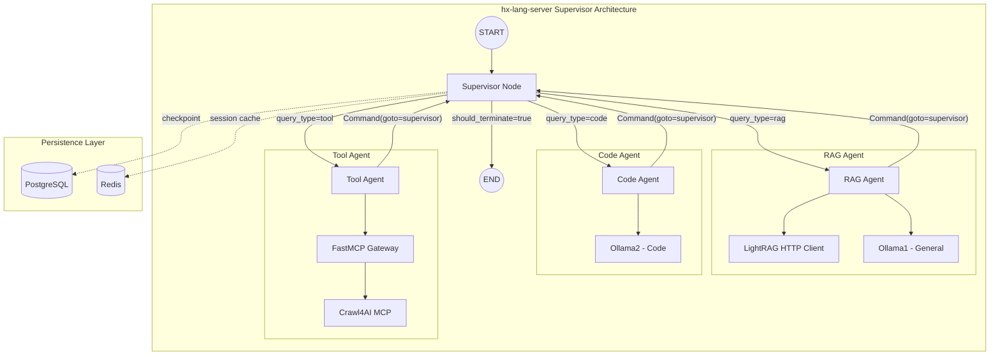

# Specification Contribution: Sophia (LangGraph SME)

**Contribution Date:** 2025-12-01
**Spec Version:** 1.0
**Focus Areas:** LangGraph patterns, state schema, supervisor architecture, error handling, human-in-the-loop
**Knowledge Sources Reviewed:**
- `/home/agent0/HX-Infrastructure/hx-knowledge/repos/langgraph-main/` (Core library)
- `/home/agent0/HX-Infrastructure/hx-knowledge/repos/langgraph-main/docs/docs/concepts/multi_agent.md`
- `/home/agent0/HX-Infrastructure/hx-knowledge/repos/langgraph-main/docs/docs/concepts/persistence.md`
- `/home/agent0/HX-Infrastructure/hx-knowledge/repos/langgraph-main/docs/docs/concepts/human_in_the_loop.md`
- `/home/agent0/HX-Infrastructure/hx-knowledge/repos/langgraph-main/libs/checkpoint-postgres/README.md`

---

## Executive Summary

This contribution provides detailed LangGraph implementation specifications for hx-lang-server, addressing state schema design, supervisor pattern implementation, worker agent interfaces, error handling strategies, and human-in-the-loop patterns. The current specification draft is technically sound but requires additional detail in several areas to ensure production-ready implementation.

---

## 1. State Schema Enhancements

### Current Spec Analysis

The current `AgentState` TypedDict in node-spec.md is a good starting point but requires enhancements for production use.

### Enhanced State Schema

```python
from typing import TypedDict, Annotated, List, Optional, Dict, Any, Literal
from langgraph.graph.message import add_messages
from langchain_core.messages import BaseMessage
from datetime import datetime
from uuid import UUID

class RoutingDecision(TypedDict):
    """Structured routing decision from supervisor."""
    target_worker: str
    confidence: float
    reasoning: str
    fallback_worker: Optional[str]

class ToolInvocation(TypedDict):
    """Record of tool invocation for audit trail."""
    tool_name: str
    tool_server: str  # e.g., "crawl4ai", "lightrag"
    invocation_time: str
    status: Literal["pending", "success", "failed", "timeout"]
    result_summary: Optional[str]
    error_message: Optional[str]

class RAGContext(TypedDict):
    """Structured RAG context from LightRAG."""
    query: str
    mode: Literal["local", "global", "hybrid", "mix"]
    retrieved_chunks: List[Dict[str, Any]]
    retrieval_score: float
    iteration_count: int
    requires_iteration: bool

class HumanInterrupt(TypedDict):
    """Human-in-the-loop interrupt data."""
    interrupt_type: Literal["approval", "edit", "input", "review"]
    prompt: str
    context: Dict[str, Any]
    timeout_seconds: int
    default_action: Optional[str]

class AgentState(TypedDict):
    """
    Core state schema for hx-lang-server LangGraph supervisor.

    This schema follows LangGraph best practices:
    - Uses Annotated types with reducers for list accumulation
    - Separates ephemeral (per-turn) from persistent state
    - Includes metadata for observability and debugging
    """

    # === Message History (with reducer for append) ===
    messages: Annotated[List[BaseMessage], add_messages]

    # === Query Classification ===
    query_type: Literal["general", "code", "rag", "tool", "unknown"]
    classification_confidence: float  # 0.0 to 1.0
    classification_method: Literal["keyword", "llm", "hybrid"]

    # === Worker State ===
    current_worker: Optional[Literal["rag_agent", "code_agent", "tool_agent", None]]
    worker_history: List[str]  # Track worker invocation sequence

    # === RAG Context ===
    rag_context: Optional[RAGContext]

    # === Tool State ===
    tool_invocations: List[ToolInvocation]
    pending_tool_calls: List[Dict[str, Any]]

    # === Control Flow ===
    iteration_count: int
    max_iterations: int  # Configurable, default 25
    should_terminate: bool
    termination_reason: Optional[str]

    # === Human-in-the-Loop ===
    pending_interrupt: Optional[HumanInterrupt]
    human_response: Optional[Dict[str, Any]]

    # === Routing ===
    routing_decision: Optional[RoutingDecision]

    # === Session Metadata ===
    session_id: str
    thread_id: str
    user_id: Optional[str]
    created_at: str
    last_updated_at: str

    # === Error Tracking ===
    last_error: Optional[str]
    error_count: int
    recovery_attempts: int
```

### State Reducers

The specification should include custom reducers for complex state updates:

```python
from operator import add as list_add

def tool_invocation_reducer(
    existing: List[ToolInvocation],
    new: List[ToolInvocation]
) -> List[ToolInvocation]:
    """
    Reducer that appends new tool invocations and limits history.
    Keeps last 50 invocations to prevent unbounded growth.
    """
    combined = existing + new
    return combined[-50:]  # Sliding window

def error_count_reducer(existing: int, new: int) -> int:
    """Reducer that increments error count."""
    return existing + new

# Usage in state definition
class AgentStateWithReducers(TypedDict):
    messages: Annotated[List[BaseMessage], add_messages]
    tool_invocations: Annotated[List[ToolInvocation], tool_invocation_reducer]
    error_count: Annotated[int, error_count_reducer]
```

### Recommendation

**Add to node-spec.md Section "State Schema Design":**
- Include `RoutingDecision`, `ToolInvocation`, `RAGContext`, and `HumanInterrupt` TypedDicts
- Add `classification_confidence` and `classification_method` fields
- Add `worker_history` for execution tracing
- Add `max_iterations` as configurable field
- Add `pending_interrupt` and `human_response` for HITL support
- Document the reducer pattern for tool invocations

---

## 2. Supervisor Pattern Details

### Architecture Decision: Supervisor with Command Pattern

Based on LangGraph documentation review, I recommend the **Supervisor pattern with Command-based handoffs** for hx-lang-server. This provides:

1. **Centralized control** - Supervisor makes all routing decisions
2. **Clean handoffs** - Workers return control via `Command` objects
3. **State isolation** - Workers can have private scratchpads
4. **Extensibility** - New workers added without modifying supervisor logic

### Supervisor Implementation Pattern

```python
from typing import Literal
from langgraph.graph import StateGraph, START, END
from langgraph.types import Command
from langchain_ollama import ChatOllama

class HXLangSupervisor:
    """
    Supervisor agent for hx-lang-server multi-agent orchestration.

    Implements the LangGraph supervisor pattern with:
    - Dynamic worker routing based on query classification
    - Command-based handoffs with state updates
    - Configurable recursion limits
    - Graceful degradation on worker failure
    """

    def __init__(self, settings: Settings):
        self.settings = settings
        self.classifier = QueryClassifier()

        # Initialize Ollama clients for routing decisions
        self.routing_llm = ChatOllama(
            base_url=settings.ollama_general_url,
            model=settings.ollama_general_model,
        )

    async def supervisor_node(
        self,
        state: AgentState
    ) -> Command[Literal["rag_agent", "code_agent", "tool_agent", END]]:
        """
        Main supervisor node that routes to appropriate worker.

        Returns Command object for LangGraph control flow.
        """
        # Check termination conditions
        if state["iteration_count"] >= state["max_iterations"]:
            return Command(
                goto=END,
                update={
                    "should_terminate": True,
                    "termination_reason": "max_iterations_exceeded"
                }
            )

        if state["should_terminate"]:
            return Command(goto=END)

        # Get latest user message for classification
        last_message = state["messages"][-1]

        # Classify query
        classification = self.classifier.classify(last_message.content)

        # Determine target worker
        target_worker = self._route_to_worker(classification)

        # Create routing decision record
        routing_decision: RoutingDecision = {
            "target_worker": target_worker,
            "confidence": classification.confidence,
            "reasoning": classification.reasoning,
            "fallback_worker": self._get_fallback_worker(target_worker),
        }

        return Command(
            goto=target_worker,
            update={
                "query_type": classification.query_type,
                "classification_confidence": classification.confidence,
                "classification_method": classification.method,
                "current_worker": target_worker,
                "routing_decision": routing_decision,
                "iteration_count": state["iteration_count"] + 1,
                "last_updated_at": datetime.utcnow().isoformat(),
            }
        )

    def _route_to_worker(self, classification) -> str:
        """Map classification to worker agent."""
        routing_table = {
            "rag": "rag_agent",
            "code": "code_agent",
            "tool": "tool_agent",
            "general": "rag_agent",  # Default to RAG for general queries
            "unknown": "rag_agent",
        }
        return routing_table.get(classification.query_type, "rag_agent")

    def _get_fallback_worker(self, primary: str) -> Optional[str]:
        """Get fallback worker if primary fails."""
        fallbacks = {
            "rag_agent": "code_agent",
            "code_agent": "rag_agent",
            "tool_agent": "rag_agent",
        }
        return fallbacks.get(primary)
```

### Graph Construction Pattern

```python
from langgraph.checkpoint.postgres.aio import AsyncPostgresSaver

def build_supervisor_graph(
    supervisor: HXLangSupervisor,
    rag_agent: RAGAgent,
    code_agent: CodeAgent,
    tool_agent: ToolAgent,
    checkpointer: AsyncPostgresSaver,
) -> StateGraph:
    """
    Build the complete supervisor graph with all worker agents.

    Graph Structure:
        START -> supervisor -> {rag_agent, code_agent, tool_agent} -> supervisor -> END

    Workers always return to supervisor for next routing decision.
    """

    workflow = StateGraph(AgentState)

    # Add supervisor node with destinations annotation for visualization
    workflow.add_node(
        "supervisor",
        supervisor.supervisor_node,
        # NOTE: destinations is for visualization only
        destinations=("rag_agent", "code_agent", "tool_agent", END)
    )

    # Add worker agent nodes
    workflow.add_node("rag_agent", rag_agent.invoke)
    workflow.add_node("code_agent", code_agent.invoke)
    workflow.add_node("tool_agent", tool_agent.invoke)

    # Entry point
    workflow.add_edge(START, "supervisor")

    # Workers always return to supervisor
    workflow.add_edge("rag_agent", "supervisor")
    workflow.add_edge("code_agent", "supervisor")
    workflow.add_edge("tool_agent", "supervisor")

    # Compile with checkpointer for persistence
    return workflow.compile(checkpointer=checkpointer)
```

### Mermaid Diagram: Supervisor Architecture



---

## 3. Worker Agent Specifications

### Worker Agent Protocol

All worker agents must implement this protocol for interoperability:

```python
from typing import Protocol, runtime_checkable
from abc import abstractmethod

@runtime_checkable
class WorkerAgentProtocol(Protocol):
    """
    Protocol for hx-lang-server worker agents.

    All workers must:
    1. Accept AgentState and return Command to supervisor
    2. Update messages with their response
    3. Handle errors gracefully and update error_count
    4. Be idempotent for checkpoint recovery
    """

    name: str
    description: str

    @abstractmethod
    async def invoke(
        self,
        state: AgentState
    ) -> Command[Literal["supervisor"]]:
        """
        Execute worker logic and return control to supervisor.

        Args:
            state: Current agent state from supervisor

        Returns:
            Command object with goto="supervisor" and state updates
        """
        ...

    @abstractmethod
    async def health_check(self) -> Dict[str, Any]:
        """Check worker dependencies are healthy."""
        ...
```

### RAG Agent Implementation

```python
from langchain_core.messages import AIMessage

class RAGAgent:
    """
    RAG Agent for retrieval-augmented generation workflows.

    Integrates with:
    - LightRAG (hx-literag-server.hx.dev.local:8020) for retrieval
    - Ollama1 (hx-ollama1-server.hx.dev.local:11434) for generation

    Supports adaptive retrieval with iteration when initial results insufficient.
    """

    name = "rag_agent"
    description = "Handles knowledge retrieval and RAG workflows"

    def __init__(
        self,
        lightrag_client: LightRAGClient,
        ollama_client: ChatOllama,
        settings: Settings,
    ):
        self.lightrag = lightrag_client
        self.llm = ollama_client
        self.settings = settings
        self.max_retrieval_iterations = 3
        self.min_retrieval_score = 0.7

    async def invoke(
        self,
        state: AgentState
    ) -> Command[Literal["supervisor"]]:
        """
        Execute RAG workflow with adaptive retrieval.
        """
        try:
            last_message = state["messages"][-1]
            query = last_message.content

            # Initialize or continue RAG context
            rag_context = state.get("rag_context") or self._init_rag_context(query)

            # Perform retrieval with iteration if needed
            rag_context = await self._retrieve_with_iteration(query, rag_context)

            # Generate response using retrieved context
            response = await self._generate_response(query, rag_context)

            # Create response message
            response_message = AIMessage(
                content=response,
                name=self.name,
            )

            return Command(
                goto="supervisor",
                update={
                    "messages": [response_message],
                    "rag_context": rag_context,
                    "current_worker": None,
                    "last_updated_at": datetime.utcnow().isoformat(),
                }
            )

        except Exception as e:
            # Error handling - return to supervisor with error state
            error_message = AIMessage(
                content=f"RAG Agent encountered an error: {str(e)}",
                name=self.name,
            )
            return Command(
                goto="supervisor",
                update={
                    "messages": [error_message],
                    "last_error": str(e),
                    "error_count": 1,  # Will be accumulated by reducer
                    "current_worker": None,
                }
            )

    async def _retrieve_with_iteration(
        self,
        query: str,
        context: RAGContext
    ) -> RAGContext:
        """
        Perform retrieval with iteration until sufficient results.

        Implements adaptive RAG pattern:
        1. Initial retrieval
        2. Check score against threshold
        3. If insufficient, refine query and retry
        4. Max 3 iterations to prevent infinite loops
        """
        iteration = 0
        current_query = query

        while iteration < self.max_retrieval_iterations:
            # Call LightRAG
            results = await self.lightrag.query(
                current_query,
                mode=context["mode"],
            )

            context["retrieved_chunks"] = results.chunks
            context["retrieval_score"] = results.score
            context["iteration_count"] = iteration + 1

            # Check if results are sufficient
            if results.score >= self.min_retrieval_score:
                context["requires_iteration"] = False
                break

            # Refine query for next iteration
            current_query = await self._refine_query(query, results)
            iteration += 1
            context["requires_iteration"] = True

        return context

    async def health_check(self) -> Dict[str, Any]:
        """Check LightRAG and Ollama connectivity."""
        return {
            "lightrag": await self.lightrag.ping(),
            "ollama": await self.llm.ping(),
        }
```

### Code Agent Implementation

```python
class CodeAgent:
    """
    Code Agent for code-related queries.

    Routes to Ollama2 (hx-ollama2-server.hx.dev.local:11434)
    with code-specialized model (qwen3-coder:30b).
    """

    name = "code_agent"
    description = "Handles code generation, debugging, and analysis"

    def __init__(
        self,
        ollama_client: ChatOllama,
        settings: Settings,
    ):
        self.llm = ollama_client
        self.settings = settings

    async def invoke(
        self,
        state: AgentState
    ) -> Command[Literal["supervisor"]]:
        """Execute code-related query using code-specialized LLM."""
        try:
            # Build prompt with code context
            messages = self._build_code_prompt(state["messages"])

            # Invoke code LLM
            response = await self.llm.ainvoke(messages)

            response_message = AIMessage(
                content=response.content,
                name=self.name,
            )

            return Command(
                goto="supervisor",
                update={
                    "messages": [response_message],
                    "current_worker": None,
                    "last_updated_at": datetime.utcnow().isoformat(),
                }
            )

        except Exception as e:
            error_message = AIMessage(
                content=f"Code Agent encountered an error: {str(e)}",
                name=self.name,
            )
            return Command(
                goto="supervisor",
                update={
                    "messages": [error_message],
                    "last_error": str(e),
                    "error_count": 1,
                    "current_worker": None,
                }
            )

    async def health_check(self) -> Dict[str, Any]:
        return {"ollama_code": await self.llm.ping()}
```

### Tool Agent Implementation

```python
from langchain_mcp_adapters.client import MultiServerMCPClient

class ToolAgent:
    """
    Tool Agent for MCP tool invocations.

    Connects to FastMCP gateway for tool discovery and execution.
    Handles namespaced tool calls (e.g., crawl4ai__smart_crawl_url).
    """

    name = "tool_agent"
    description = "Handles external tool invocations via MCP"

    def __init__(
        self,
        mcp_client: MultiServerMCPClient,
        ollama_client: ChatOllama,
        settings: Settings,
    ):
        self.mcp = mcp_client
        self.llm = ollama_client
        self.settings = settings
        self._tools_cache: Optional[List] = None

    async def invoke(
        self,
        state: AgentState
    ) -> Command[Literal["supervisor"]]:
        """
        Execute tool invocation workflow.

        1. Get available tools from FastMCP gateway
        2. Let LLM decide which tool to call
        3. Execute tool and capture result
        4. Return to supervisor with result
        """
        try:
            # Ensure tools are discovered
            tools = await self._get_tools()

            # Build messages with tool schemas
            messages = state["messages"]

            # Let LLM decide tool call
            response = await self.llm.ainvoke(
                messages,
                tools=tools,
            )

            # Process tool calls
            tool_invocations = []
            if response.tool_calls:
                for tool_call in response.tool_calls:
                    invocation = await self._execute_tool(tool_call)
                    tool_invocations.append(invocation)

            # Format response
            response_message = AIMessage(
                content=self._format_tool_results(tool_invocations),
                name=self.name,
            )

            return Command(
                goto="supervisor",
                update={
                    "messages": [response_message],
                    "tool_invocations": tool_invocations,
                    "current_worker": None,
                    "last_updated_at": datetime.utcnow().isoformat(),
                }
            )

        except Exception as e:
            error_message = AIMessage(
                content=f"Tool Agent encountered an error: {str(e)}",
                name=self.name,
            )
            return Command(
                goto="supervisor",
                update={
                    "messages": [error_message],
                    "last_error": str(e),
                    "error_count": 1,
                    "current_worker": None,
                }
            )

    async def _get_tools(self) -> List:
        """Get tools from FastMCP gateway with caching."""
        if self._tools_cache is None:
            self._tools_cache = await self.mcp.get_tools()
        return self._tools_cache

    async def _execute_tool(self, tool_call) -> ToolInvocation:
        """Execute single tool call and record invocation."""
        start_time = datetime.utcnow()

        try:
            result = await self.mcp.invoke_tool(
                tool_call.name,
                tool_call.args,
            )

            return {
                "tool_name": tool_call.name,
                "tool_server": tool_call.name.split("__")[0],
                "invocation_time": start_time.isoformat(),
                "status": "success",
                "result_summary": str(result)[:500],
                "error_message": None,
            }

        except Exception as e:
            return {
                "tool_name": tool_call.name,
                "tool_server": tool_call.name.split("__")[0],
                "invocation_time": start_time.isoformat(),
                "status": "failed",
                "result_summary": None,
                "error_message": str(e),
            }

    async def health_check(self) -> Dict[str, Any]:
        return {
            "fastmcp": await self.mcp.ping(),
            "ollama": await self.llm.ping(),
        }
```

---

## 4. Error Handling Patterns

### Recursion Limits

The specification correctly identifies FR-005 (max 25 iterations). Here is the implementation pattern:

```python
class RecursionLimitError(Exception):
    """Raised when graph exceeds maximum iterations."""
    pass

def check_recursion_limit(state: AgentState) -> AgentState:
    """
    Check recursion limit before each supervisor iteration.

    This should be called at the start of supervisor_node.
    """
    if state["iteration_count"] >= state["max_iterations"]:
        raise RecursionLimitError(
            f"Exceeded max iterations: {state['max_iterations']}"
        )
    return state

# Graph-level recursion limit (additional safety)
graph = workflow.compile(
    checkpointer=checkpointer,
    # LangGraph built-in recursion limit
    recursion_limit=50,  # Higher than max_iterations for safety margin
)
```

### Circuit Breaker Pattern

```python
from enum import Enum
from dataclasses import dataclass
import asyncio

class CircuitState(Enum):
    CLOSED = "closed"      # Normal operation
    OPEN = "open"          # Failing, reject requests
    HALF_OPEN = "half_open"  # Testing recovery

@dataclass
class CircuitBreaker:
    """
    Circuit breaker for external service calls (Ollama, LightRAG, etc.)

    Configuration:
    - failure_threshold: Number of failures before opening circuit
    - recovery_timeout: Seconds to wait before testing recovery
    - success_threshold: Successes needed in half-open to close circuit
    """

    name: str
    failure_threshold: int = 5
    recovery_timeout: int = 30
    success_threshold: int = 2

    state: CircuitState = CircuitState.CLOSED
    failure_count: int = 0
    success_count: int = 0
    last_failure_time: Optional[float] = None

    async def call(self, func, *args, **kwargs):
        """Execute function with circuit breaker protection."""

        if self.state == CircuitState.OPEN:
            if self._should_attempt_recovery():
                self.state = CircuitState.HALF_OPEN
            else:
                raise CircuitOpenError(f"Circuit {self.name} is open")

        try:
            result = await func(*args, **kwargs)
            self._on_success()
            return result

        except Exception as e:
            self._on_failure()
            raise

    def _on_success(self):
        """Handle successful call."""
        if self.state == CircuitState.HALF_OPEN:
            self.success_count += 1
            if self.success_count >= self.success_threshold:
                self.state = CircuitState.CLOSED
                self.failure_count = 0
                self.success_count = 0
        else:
            self.failure_count = 0

    def _on_failure(self):
        """Handle failed call."""
        self.failure_count += 1
        self.last_failure_time = asyncio.get_event_loop().time()
        self.success_count = 0

        if self.failure_count >= self.failure_threshold:
            self.state = CircuitState.OPEN

    def _should_attempt_recovery(self) -> bool:
        """Check if enough time has passed to attempt recovery."""
        if self.last_failure_time is None:
            return True
        elapsed = asyncio.get_event_loop().time() - self.last_failure_time
        return elapsed >= self.recovery_timeout
```

### Retry with Exponential Backoff

```python
import asyncio
import random
from functools import wraps

def retry_with_backoff(
    max_retries: int = 3,
    base_delay: float = 1.0,
    max_delay: float = 30.0,
    exponential_base: float = 2.0,
    jitter: bool = True,
):
    """
    Decorator for async functions with exponential backoff retry.

    Args:
        max_retries: Maximum retry attempts
        base_delay: Initial delay in seconds
        max_delay: Maximum delay cap
        exponential_base: Base for exponential calculation
        jitter: Add randomness to prevent thundering herd
    """
    def decorator(func):
        @wraps(func)
        async def wrapper(*args, **kwargs):
            last_exception = None

            for attempt in range(max_retries + 1):
                try:
                    return await func(*args, **kwargs)
                except Exception as e:
                    last_exception = e

                    if attempt == max_retries:
                        break

                    # Calculate delay with exponential backoff
                    delay = min(
                        base_delay * (exponential_base ** attempt),
                        max_delay
                    )

                    # Add jitter (0.5 to 1.5 multiplier)
                    if jitter:
                        delay *= 0.5 + random.random()

                    await asyncio.sleep(delay)

            raise last_exception

        return wrapper
    return decorator

# Usage example
class OllamaClient:
    @retry_with_backoff(max_retries=3, base_delay=1.0)
    async def generate(self, prompt: str) -> str:
        # Ollama API call
        pass
```

### Graceful Degradation

```python
class GracefulDegradationHandler:
    """
    Handles graceful degradation when services are unavailable.

    Strategies:
    1. Fallback to cached responses
    2. Route to alternative worker
    3. Return partial results with warning
    4. Queue for later processing
    """

    def __init__(self, redis_client, settings: Settings):
        self.redis = redis_client
        self.settings = settings

    async def handle_ollama_failure(
        self,
        state: AgentState,
        error: Exception
    ) -> Command:
        """Handle Ollama service unavailability."""

        # Try cached response first
        cache_key = self._compute_cache_key(state["messages"][-1])
        cached = await self.redis.get(cache_key)

        if cached:
            return Command(
                goto="supervisor",
                update={
                    "messages": [AIMessage(
                        content=f"[Cached Response] {cached}",
                        name="degraded_response",
                    )],
                    "last_error": f"Ollama unavailable, using cache: {error}",
                }
            )

        # Return partial response with warning
        return Command(
            goto="supervisor",
            update={
                "messages": [AIMessage(
                    content="I apologize, but I'm currently unable to process your request. Please try again later.",
                    name="degraded_response",
                )],
                "should_terminate": True,
                "termination_reason": f"service_unavailable: {error}",
            }
        )
```

---

## 5. Human-in-the-Loop Patterns

### Dynamic Interrupt Pattern

```python
from langgraph.types import interrupt

class HumanApprovalNode:
    """
    Node for human approval workflows.

    Uses LangGraph's interrupt() for dynamic pausing.
    Integrates with n8n webhooks for notification.
    """

    def __init__(self, webhook_client):
        self.webhook = webhook_client

    async def approval_gate(self, state: AgentState) -> AgentState:
        """
        Pause for human approval before critical actions.

        Use cases:
        - Tool invocations with side effects (e.g., web crawling)
        - External API calls
        - Database modifications
        """

        pending_action = state.get("pending_tool_calls", [])

        if not pending_action:
            return state

        # Create interrupt with context
        approval_request = {
            "action": "approve_tool_call",
            "tool_name": pending_action[0]["name"],
            "tool_args": pending_action[0]["args"],
            "thread_id": state["thread_id"],
            "session_id": state["session_id"],
        }

        # Notify via webhook (non-blocking)
        await self.webhook.notify_pending_approval(approval_request)

        # Pause execution until human resumes
        # This uses LangGraph's interrupt() function
        human_response = interrupt({
            "type": "approval",
            "prompt": f"Approve tool call: {pending_action[0]['name']}?",
            "context": approval_request,
            "options": ["approve", "reject", "modify"],
        })

        # Process human response
        if human_response.get("action") == "approve":
            return {
                **state,
                "human_response": human_response,
            }
        elif human_response.get("action") == "reject":
            return {
                **state,
                "pending_tool_calls": [],
                "human_response": human_response,
            }
        elif human_response.get("action") == "modify":
            # Update tool args based on human input
            modified_call = pending_action[0].copy()
            modified_call["args"] = human_response.get("modified_args", {})
            return {
                **state,
                "pending_tool_calls": [modified_call],
                "human_response": human_response,
            }
```

### Static Interrupt (interrupt_before/interrupt_after)

```python
def build_graph_with_interrupts(
    supervisor: HXLangSupervisor,
    workers: Dict[str, WorkerAgentProtocol],
    checkpointer: AsyncPostgresSaver,
) -> StateGraph:
    """
    Build graph with static interrupts for debugging and control.

    Uses interrupt_before for tool_agent to allow human review
    before external tool calls.
    """

    workflow = StateGraph(AgentState)

    workflow.add_node("supervisor", supervisor.supervisor_node)
    workflow.add_node("rag_agent", workers["rag_agent"].invoke)
    workflow.add_node("code_agent", workers["code_agent"].invoke)
    workflow.add_node("tool_agent", workers["tool_agent"].invoke)

    workflow.add_edge(START, "supervisor")
    workflow.add_edge("rag_agent", "supervisor")
    workflow.add_edge("code_agent", "supervisor")
    workflow.add_edge("tool_agent", "supervisor")

    return workflow.compile(
        checkpointer=checkpointer,
        # Static interrupt before tool agent
        interrupt_before=["tool_agent"],
    )
```

### Resume After Interrupt

```python
async def resume_after_approval(
    graph: StateGraph,
    thread_id: str,
    approval_response: Dict[str, Any],
) -> None:
    """
    Resume graph execution after human approval.

    Called by FastAPI endpoint when human responds.
    """
    config = {"configurable": {"thread_id": thread_id}}

    # Get current state
    state = await graph.aget_state(config)

    # Update state with human response
    await graph.aupdate_state(
        config,
        {
            "human_response": approval_response,
            "pending_interrupt": None,
        },
    )

    # Resume execution
    async for event in graph.astream(None, config):
        # Process streaming events
        yield event
```

---

## 6. Production-Ready Code Examples

### Complete Graph Setup

```python
"""
hx-lang-server LangGraph Application

Production-ready setup with all components integrated.
"""

import asyncio
from contextlib import asynccontextmanager
from langgraph.checkpoint.postgres.aio import AsyncPostgresSaver
from psycopg import AsyncConnection
from psycopg.rows import dict_row
import redis.asyncio as redis

async def create_checkpointer(settings: Settings) -> AsyncPostgresSaver:
    """
    Create PostgreSQL checkpointer with required configuration.

    CRITICAL: Must include autocommit=True and row_factory=dict_row
    """
    conn = await AsyncConnection.connect(
        host=settings.postgres_host,
        port=settings.postgres_port,
        dbname=settings.postgres_db,
        user=settings.postgres_user,
        password=settings.postgres_password,
        autocommit=True,  # REQUIRED for checkpoint commits
        row_factory=dict_row,  # REQUIRED for langgraph-checkpoint-postgres
        prepare_threshold=0,  # Disable for pgBouncer compatibility
    )

    checkpointer = AsyncPostgresSaver(conn)

    # IMPORTANT: Call setup() on first use to create tables
    await checkpointer.setup()

    return checkpointer

async def create_redis_pool(settings: Settings) -> redis.ConnectionPool:
    """Create Redis connection pool for session management."""
    return redis.ConnectionPool.from_url(
        settings.redis_url,
        max_connections=20,
        socket_timeout=5.0,
        socket_connect_timeout=5.0,
        retry_on_timeout=True,
    )

@asynccontextmanager
async def lifespan_manager(settings: Settings):
    """
    Application lifespan manager for resource initialization.

    Initializes:
    - PostgreSQL checkpointer
    - Redis connection pool
    - LangGraph graph
    - Worker agents
    """
    # Initialize resources
    checkpointer = await create_checkpointer(settings)
    redis_pool = await create_redis_pool(settings)
    redis_client = redis.Redis(connection_pool=redis_pool)

    # Initialize agents
    supervisor = HXLangSupervisor(settings)
    rag_agent = RAGAgent(
        lightrag_client=LightRAGClient(settings.lightrag_url),
        ollama_client=ChatOllama(
            base_url=settings.ollama_general_url,
            model=settings.ollama_general_model,
        ),
        settings=settings,
    )
    code_agent = CodeAgent(
        ollama_client=ChatOllama(
            base_url=settings.ollama_code_url,
            model=settings.ollama_code_model,
        ),
        settings=settings,
    )
    tool_agent = ToolAgent(
        mcp_client=MultiServerMCPClient({
            "fastmcp": {
                "transport": "streamable_http",
                "url": f"{settings.fastmcp_url}/mcp",
            }
        }),
        ollama_client=ChatOllama(
            base_url=settings.ollama_general_url,
            model=settings.ollama_general_model,
        ),
        settings=settings,
    )

    # Build graph
    graph = build_supervisor_graph(
        supervisor=supervisor,
        rag_agent=rag_agent,
        code_agent=code_agent,
        tool_agent=tool_agent,
        checkpointer=checkpointer,
    )

    yield {
        "graph": graph,
        "checkpointer": checkpointer,
        "redis": redis_client,
        "settings": settings,
    }

    # Cleanup
    await redis_pool.disconnect()
    await checkpointer.conn.close()
```

### FastAPI Integration

```python
from fastapi import FastAPI, HTTPException
from fastapi.responses import StreamingResponse
import uuid

app = FastAPI(title="hx-lang-server")

@app.post("/invoke")
async def invoke_agent(request: InvokeRequest) -> InvokeResponse:
    """
    Synchronous agent invocation endpoint.
    """
    graph = app.state.graph

    # Generate thread_id if not provided
    thread_id = request.thread_id or str(uuid.uuid4())

    config = {
        "configurable": {
            "thread_id": thread_id,
        }
    }

    # Initialize state
    initial_state = {
        "messages": [{"role": "user", "content": request.query}],
        "session_id": request.session_id or str(uuid.uuid4()),
        "thread_id": thread_id,
        "user_id": request.user_id,
        "iteration_count": 0,
        "max_iterations": request.config.get("max_iterations", 25) if request.config else 25,
        "should_terminate": False,
        "error_count": 0,
        "recovery_attempts": 0,
        "created_at": datetime.utcnow().isoformat(),
        "last_updated_at": datetime.utcnow().isoformat(),
    }

    try:
        # Invoke graph
        result = await graph.ainvoke(initial_state, config)

        return InvokeResponse(
            thread_id=thread_id,
            response=result["messages"][-1].content,
            query_type=result.get("query_type", "unknown"),
            worker_used=result.get("worker_history", ["unknown"])[-1] if result.get("worker_history") else "unknown",
            iteration_count=result.get("iteration_count", 0),
            metadata={
                "classification_confidence": result.get("classification_confidence"),
                "rag_context": result.get("rag_context"),
                "tool_invocations": result.get("tool_invocations", []),
            }
        )

    except RecursionLimitError as e:
        raise HTTPException(
            status_code=400,
            detail=f"Agent exceeded maximum iterations: {e}"
        )
    except Exception as e:
        raise HTTPException(
            status_code=500,
            detail=f"Agent execution failed: {e}"
        )

@app.post("/stream")
async def stream_agent(request: InvokeRequest) -> StreamingResponse:
    """
    Streaming agent invocation endpoint (SSE).
    """
    graph = app.state.graph
    thread_id = request.thread_id or str(uuid.uuid4())

    config = {"configurable": {"thread_id": thread_id}}
    initial_state = {
        "messages": [{"role": "user", "content": request.query}],
        "session_id": request.session_id or str(uuid.uuid4()),
        "thread_id": thread_id,
        "iteration_count": 0,
        "max_iterations": 25,
        "should_terminate": False,
    }

    async def event_generator():
        async for event in graph.astream(initial_state, config):
            # Format as SSE
            yield f"data: {json.dumps(event)}\n\n"
        yield "data: [DONE]\n\n"

    return StreamingResponse(
        event_generator(),
        media_type="text/event-stream",
    )

@app.post("/threads/{thread_id}/resume")
async def resume_thread(
    thread_id: str,
    response: Dict[str, Any]
) -> InvokeResponse:
    """
    Resume interrupted thread with human response.
    """
    graph = app.state.graph
    config = {"configurable": {"thread_id": thread_id}}

    # Update state with human response
    await graph.aupdate_state(config, {"human_response": response})

    # Resume execution
    result = await graph.ainvoke(None, config)

    return InvokeResponse(
        thread_id=thread_id,
        response=result["messages"][-1].content,
        query_type=result.get("query_type", "unknown"),
        worker_used=result.get("current_worker", "unknown"),
        iteration_count=result.get("iteration_count", 0),
        metadata={},
    )
```

---

## 7. Spec Validation

### Items Confirmed Correct

1. **FR-001 to FR-005**: Agent orchestration requirements are well-specified
2. **FR-006 to FR-009**: State management requirements align with LangGraph best practices
3. **FR-010 to FR-013**: Ollama routing requirements are appropriate
4. **PostgreSQL Connection Config**: Correctly specifies `autocommit=True` and `row_factory=dict_row`
5. **API Endpoints**: Align with LangGraph async patterns
6. **systemd Configuration**: Appropriate for bare-metal deployment

### Items Requiring Correction

1. **State Schema (Section "State Schema Design")**: Current schema is incomplete
   - Missing: `classification_confidence`, `classification_method`
   - Missing: `worker_history` for execution tracing
   - Missing: `pending_interrupt`, `human_response` for HITL
   - Missing: `max_iterations` as configurable field
   - Missing: Custom reducers for tool invocations

2. **FR-004 Human-in-the-Loop**: Mentioned but not detailed
   - Need to specify interrupt patterns (dynamic vs static)
   - Need to specify resume mechanisms
   - Need to specify n8n webhook integration for notifications

3. **Error Handling**: Not specified in detail
   - Need circuit breaker configuration
   - Need retry policies with backoff parameters
   - Need graceful degradation strategies

4. **Query Classification Cache**: Mentioned in Redis key schema but classifier implementation not detailed
   - Need to specify classification caching strategy
   - Need to specify cache invalidation rules

---

## 8. Recommended Changes to node-spec.md

### Section: State Schema Design

**Replace current AgentState with enhanced version** (see Section 1 of this contribution)

### New Section: Error Handling (add after Dependencies)

```markdown
## Error Handling

### Recursion Limits
- Default max_iterations: 25
- Graph-level recursion_limit: 50 (safety margin)
- Termination on limit: Graceful with termination_reason

### Circuit Breaker Configuration
| Service | Failure Threshold | Recovery Timeout |
|---------|------------------|------------------|
| Ollama (General) | 5 | 30s |
| Ollama (Code) | 5 | 30s |
| LightRAG | 3 | 60s |
| FastMCP | 5 | 30s |

### Retry Policy
- Max retries: 3
- Base delay: 1 second
- Max delay: 30 seconds
- Exponential base: 2.0
- Jitter: enabled (0.5-1.5x multiplier)

### Graceful Degradation
1. Cached response fallback
2. Alternative worker routing
3. Partial response with warning
4. Service unavailable response
```

### New Section: Human-in-the-Loop (add after Error Handling)

```markdown
## Human-in-the-Loop

### Interrupt Patterns
- **Static interrupts**: `interrupt_before=["tool_agent"]` for tool approval
- **Dynamic interrupts**: `interrupt()` within nodes for context-sensitive pausing

### Resume Mechanisms
- `POST /threads/{thread_id}/resume` endpoint
- State update via `graph.aupdate_state()`
- Continuation with `graph.ainvoke(None, config)`

### n8n Integration
- Webhook notification on interrupt
- Callback URL registration
- Timeout handling (default: 1 hour)
```

### Section: Testing Strategy

**Add to test categories:**

| Category | Count | Coverage |
|----------|-------|----------|
| State Schema Tests | 10 | State reducers, serialization |
| Interrupt Tests | 8 | HITL patterns, resume |
| Error Recovery Tests | 12 | Circuit breaker, retry, degradation |

---

## Summary

This contribution provides:

1. **Enhanced State Schema** with proper TypedDicts, reducers, and HITL support
2. **Detailed Supervisor Pattern** implementation with Command-based handoffs
3. **Worker Agent Specifications** with protocol definition and implementations
4. **Comprehensive Error Handling** including circuit breakers and retry policies
5. **Human-in-the-Loop Patterns** with both static and dynamic interrupts
6. **Production-Ready Code Examples** for FastAPI integration

All patterns align with current LangGraph v0.2.x documentation and best practices from the knowledge repository.

---

**Signature:** Sophia (LangGraph Orchestration SME)
**Date:** 2025-12-01
**Review Status:** Contribution Complete - Ready for Spec Integration
