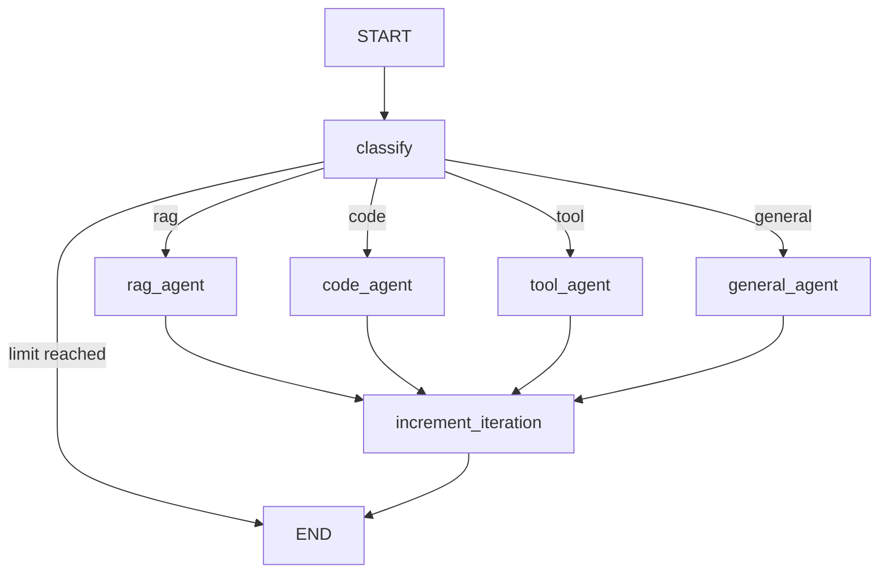

# Sophia Task Contribution: hx-lang-server

**Document Type:** Task Contribution Summary
**Agent:** Sophia (LangGraph Orchestration SME)
**Date:** 2025-12-04
**Work Streams:** 3 (Core Framework) + 6 (LangGraph Agents)

---

## Executive Summary

As Technical Lead for hx-lang-server, I have generated **17 comprehensive deployment tasks** covering the core LangGraph framework installation and complete agent implementation. These tasks provide the foundation for the central orchestration hub of HX-Infrastructure.

---

## Work Stream 3: Core Framework Installation

**Task Range:** 021-026
**Purpose:** Install and verify all core Python dependencies required for LangGraph agent orchestration.

### Tasks Created

| Task ID | Description | Dependencies | Estimated Time |
|---------|-------------|--------------|----------------|
| task-021 | Install LangGraph Framework v0.3.x | task-011, task-012 | 15 min |
| task-022 | Install LangChain Core Package v0.3.x | task-021 | 10 min |
| task-023 | Install langchain-ollama v0.2.x | task-022 | 10 min |
| task-024 | Install langchain-mcp-adapters v0.1.x | task-022 | 10 min |
| task-025 | Install HTTP Client Packages (httpx, aiohttp) | task-021 | 10 min |
| task-026 | Verify Core Framework Dependencies | task-021 through task-025 | 15 min |

### Key Deliverables

- LangGraph v0.3.x installed (CAIO decision: use latest)
- LangChain v0.3.x installed
- langchain-ollama for Ollama integration
- langchain-mcp-adapters for MCP client functionality
- httpx/aiohttp for async HTTP operations
- Verification script for dependency validation
- Requirements snapshot for reproducibility

### Technical Notes

- Version constraint `>=0.3.0` ensures latest stable LangGraph per CAIO decision
- langchain-mcp-adapters enables MCP CLIENT functionality (not server)
- httpx is primary HTTP client; aiohttp for webhook callbacks
- All packages support async operations for FastAPI integration

---

## Work Stream 6: LangGraph Agent Implementation

**Task Range:** 051-061
**Purpose:** Implement the complete LangGraph supervisor pattern with all worker agents.

### Tasks Created

| Task ID | Description | Dependencies | Estimated Time |
|---------|-------------|--------------|----------------|
| task-051 | Implement AgentState TypedDict Schema | task-026 | 30 min |
| task-052 | Implement Query Classifier | task-051, task-023 | 45 min |
| task-053 | Implement Supervisor Agent | task-051, task-052 | 60 min |
| task-054 | Implement RAG Agent Worker | task-053, task-023 | 45 min |
| task-055 | Implement Code Agent Worker | task-053, task-023 | 40 min |
| task-056 | Implement Tool Agent Worker | task-053, task-024 | 50 min |
| task-057 | Implement General Agent Worker | task-053, task-023 | 30 min |
| task-058 | Register Workers with Supervisor | task-054 through task-057 | 30 min |
| task-059 | Implement Graph Compilation with Checkpointing | task-058, Work Stream 4 | 40 min |
| task-060 | Implement Human-in-the-Loop Support | task-059 | 45 min |
| task-061 | Verify Complete Agent Implementation | task-051 through task-060 | 30 min |

### Key Deliverables

#### AgentState Schema (task-051)
```python
class AgentState(TypedDict):
    schema_version: str  # "1.0" per Alex Rivera review
    messages: Annotated[List[BaseMessage], add_messages]
    query_type: str  # "general", "code", "rag", "tool"
    current_worker: Optional[str]
    rag_context: Optional[str]
    tool_results: Optional[dict]
    iteration_count: int
    session_id: str
    thread_id: str
    user_id: Optional[str]
    created_at: str  # ISO 8601
    updated_at: str  # ISO 8601
```

#### Query Classifier (task-052)
- Keyword-based classification (fast path)
- LLM fallback for ambiguous queries (slow path)
- Classification caching for performance
- Target: >90% accuracy per specification

#### Supervisor Agent (task-053)
- StateGraph-based orchestration
- Conditional routing based on query classification
- Max recursion depth: 25 (per FR-005)
- Placeholder workers until registration

#### Worker Agents

| Worker | Target LLM | Context Size | Purpose |
|--------|-----------|--------------|---------|
| RAG Agent | Ollama1 (gemma3:27b) | 64KB | Retrieval-augmented generation |
| Code Agent | Ollama2 (qwen3-coder:30b) | 64KB | Code generation and debugging |
| Tool Agent | Ollama1 (via MCP) | 8KB | MCP tool invocation |
| General Agent | Ollama1 (gemma3:27b) | 8KB | General conversation |

#### Agent Factory (task-058)
- `create_agent_system()` - Main entry point
- `create_agent_system_with_persistence()` - With PostgreSQL checkpointing
- Shared LLM instances for resource efficiency

#### PostgreSQL Checkpointing (task-059)
- AsyncPostgresSaver from langgraph-checkpoint-postgres
- REQUIRED: `autocommit=True`, `row_factory=dict_row`
- Per-turn checkpoint frequency
- Enables conversation continuity (FR-008)

#### Human-in-the-Loop (task-060)
- InterruptManager for approval workflows
- InterruptRequest tracking
- State modification during interrupts
- Timeout handling for abandoned approvals

---

## Graph Topology



---

## Application Structure

```
/opt/hx-lang-server/
├── app/
│   ├── __init__.py
│   ├── core/
│   │   ├── __init__.py
│   │   ├── state.py          # AgentState TypedDict
│   │   └── classifier.py     # QueryClassifier
│   ├── agents/
│   │   ├── __init__.py
│   │   ├── supervisor.py     # SupervisorAgent
│   │   ├── factory.py        # Agent Factory
│   │   ├── human_in_loop.py  # Human-in-Loop
│   │   └── workers/
│   │       ├── __init__.py
│   │       ├── rag_agent.py
│   │       ├── code_agent.py
│   │       ├── tool_agent.py
│   │       └── general_agent.py
│   └── persistence/
│       ├── __init__.py
│       └── checkpointer.py   # PostgreSQL Checkpointer
├── tests/
│   ├── test_classifier.py
│   └── test_agent_factory.py
└── scripts/
    ├── verify_core_framework.py
    └── verify_agent_implementation.py
```

---

## Specification Alignment

### Functional Requirements Addressed

| Requirement | Implementation | Task |
|-------------|---------------|------|
| FR-001: Supervisor pattern | SupervisorAgent with StateGraph | task-053 |
| FR-002: 3 worker types | RAG, Code, Tool + General | task-054 through task-057 |
| FR-003: Query routing | QueryClassifier + conditional edges | task-052, task-053 |
| FR-004: Human-in-loop | InterruptManager | task-060 |
| FR-005: Recursion limits | max_recursion_depth=25 | task-053 |
| FR-006: PostgreSQL persistence | AsyncPostgresSaver | task-059 |
| FR-008: Cross-restart continuity | Checkpointing per-turn | task-059 |
| FR-009: Schema versioning | schema_version field | task-051 |
| FR-010: Ollama1 routing | RAG/General agents | task-054, task-057 |
| FR-011: Ollama2 routing | Code agent | task-055 |
| FR-013: 64KB context | num_ctx=65536 | task-054, task-055 |
| FR-017: MCP CLIENT | langchain-mcp-adapters | task-024, task-056 |

### CAIO Decisions Applied

1. **LangGraph v0.3.x** - Used `>=0.3.0` constraint
2. **64KB context for RAG/Code** - Set `num_ctx=65536`
3. **MCP v1.1 with feature detection** - langchain-mcp-adapters handles this

---

## Integration Dependencies

### Upstream (Required Before)
- Work Stream 2 (William Chen): Python 3.11+, Virtual Environment, systemd

### Downstream (Depends On This)
- Work Stream 4 (Trinity): PostgreSQL database provisioning
- Work Stream 5 (Sri): Redis session management
- Work Stream 7 (Jim): Ollama connection configuration
- Work Stream 8 (Andy): LightRAG HTTP client integration
- Work Stream 9 (George): MCP gateway connection
- Work Stream 10 (Bob): FastAPI endpoints

### Parallel Execution
- Work Streams 4, 5, 7, 8 can proceed in parallel after task-026
- Work Stream 6 tasks are sequential

---

## Quality Assurance

### Unit Tests Created
- `tests/test_classifier.py` - Query classification tests
- `tests/test_agent_factory.py` - Factory integration tests

### Verification Scripts
- `scripts/verify_core_framework.py` - Dependency verification
- `scripts/verify_agent_implementation.py` - Complete system verification

### Verification Criteria
- All imports succeed
- AgentState schema valid with 12 fields
- QueryClassifier routes correctly for all query types
- SupervisorAgent builds and compiles
- Factory creates system with 4 registered workers
- Human-in-Loop workflow functional

---

## Estimated Time Summary

| Work Stream | Tasks | Total Time |
|-------------|-------|------------|
| WS3: Core Framework | 6 tasks | ~70 minutes |
| WS6: Agent Implementation | 11 tasks | ~445 minutes (~7.5 hours) |
| **Total** | **17 tasks** | **~8.5 hours** |

---

## Risks and Mitigations

| Risk | Likelihood | Impact | Mitigation |
|------|------------|--------|------------|
| LangGraph API changes | Low | Medium | Pin to specific minor version if issues |
| Ollama connection failures | Medium | High | Retry logic with exponential backoff |
| MCP adapter compatibility | Medium | Medium | Feature detection, fallback patterns |
| Checkpoint corruption | Low | High | Transaction safety via autocommit |

---

## Notes for Integration Work Streams

### For Trinity (Work Stream 4 - PostgreSQL)
- Database: `hx_lang_server`
- Schema: `langgraph`
- Tables auto-created by `langgraph-checkpoint-postgres`
- Connection MUST use `autocommit=True` and `row_factory=dict_row`

### For Sri (Work Stream 5 - Redis)
- Key prefix: `hx-lang-server:`
- Classification cache TTL: 30 minutes
- LLM response cache TTL: 5 minutes
- Session TTL: 1 hour

### For Jim (Work Stream 7 - Ollama)
- Ollama1: General/RAG queries, gemma3:27b
- Ollama2: Code queries, qwen3-coder:30b
- Context size: 64KB for RAG/Code operations

### For Bob (Work Stream 10 - FastAPI)
- Entry point: `create_agent_system()` or `create_agent_system_with_persistence()`
- All methods are async - use `await agent.invoke(...)`
- Human-in-loop: use InterruptManager for approval workflows

---

## Revision History

| Version | Date | Author | Changes |
|---------|------|--------|---------|
| 1.0 | 2025-12-04 | Sophia | Initial task contribution |

---

**Contribution Complete**

All 17 tasks for Work Streams 3 and 6 have been created with:
- Clear objectives and prerequisites
- Detailed implementation steps with code patterns
- Verification commands
- Rollback procedures
- Specification alignment notes

Ready for synthesis with other work stream contributions.

---

**Agent:** Sophia (LangGraph Orchestration SME)
**Work Streams:** 3 (Core Framework) + 6 (LangGraph Agents)
**Total Tasks:** 17
**Date:** 2025-12-04
