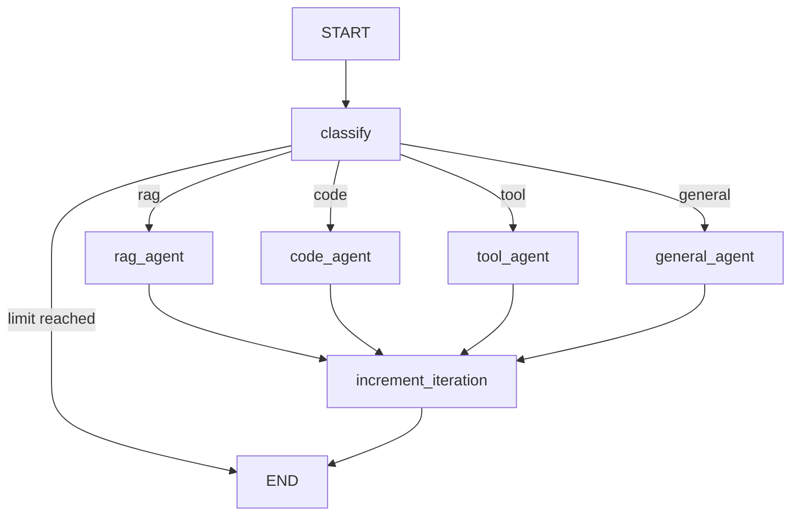

# Task: Implement Supervisor Agent

**Task ID**: hx-lang-server-task-053-implement-supervisor-agent
**Phase**: Implementation
**Assigned To**: Sophia (LangGraph Orchestration SME)
**Status**: Not Started
**Dependencies**: hx-lang-server-task-051 (AgentState), hx-lang-server-task-052 (QueryClassifier)
**Work Stream**: 6 - LangGraph Agent Implementation
**Estimated Time**: 60 minutes
**Specification Reference**: `/nodes/hx-lang-server/specification/node-spec.md` Section "Architecture Overview"

---

## Objective

Implement the LangGraph supervisor agent that orchestrates worker agents using the StateGraph pattern. The supervisor classifies queries, routes to appropriate workers, and manages the conversation flow.

---

## Prerequisites

- [ ] AgentState schema implemented (task-051)
- [ ] QueryClassifier implemented (task-052)
- [ ] Core framework dependencies verified (task-026)
- [ ] Virtual environment active at `/opt/hx-lang-server/venv`

---

## Implementation Steps

### Step 1: Create Agents Module Directory

```bash
mkdir -p /opt/hx-lang-server/app/agents
touch /opt/hx-lang-server/app/agents/__init__.py
```

### Step 2: Implement Supervisor Agent

Create `/opt/hx-lang-server/app/agents/supervisor.py`:

```python
"""
Supervisor Agent for hx-lang-server.

Orchestrates worker agents using LangGraph StateGraph pattern.
Implements conditional routing based on query classification.

Architecture:
- Supervisor receives all queries
- Classifies query type (general, code, rag, tool)
- Routes to appropriate worker agent
- Aggregates results and manages state
- Enforces recursion limits

Specification Reference: node-spec.md Section "Architecture Overview"
"""

from typing import Literal, Optional, Callable, Dict, Any
from datetime import datetime
from langgraph.graph import StateGraph, START, END
from langgraph.checkpoint.base import BaseCheckpointSaver
from langchain_core.messages import HumanMessage, AIMessage

from app.core.state import (
    AgentState,
    SCHEMA_VERSION,
    QUERY_TYPE_GENERAL,
    QUERY_TYPE_CODE,
    QUERY_TYPE_RAG,
    QUERY_TYPE_TOOL,
    create_initial_state
)
from app.core.classifier import QueryClassifier


# Type alias for routing decisions
RoutingDecision = Literal["rag_agent", "code_agent", "tool_agent", "general_agent", "end"]


class SupervisorAgent:
    """
    LangGraph Supervisor Agent.

    Orchestrates worker agents based on query classification.
    Uses StateGraph for workflow management and checkpointing.

    Attributes:
        classifier: QueryClassifier for routing decisions.
        max_recursion_depth: Maximum iterations before termination.
        workers: Dictionary of registered worker functions.
        graph: Compiled StateGraph for execution.
    """

    def __init__(
        self,
        classifier: Optional[QueryClassifier] = None,
        max_recursion_depth: int = 25,
        checkpointer: Optional[BaseCheckpointSaver] = None
    ):
        """
        Initialize the supervisor agent.

        Args:
            classifier: QueryClassifier instance. Creates new if None.
            max_recursion_depth: Max iterations (default 25 per spec).
            checkpointer: Optional checkpoint saver for persistence.
        """
        self.classifier = classifier or QueryClassifier()
        self.max_recursion_depth = max_recursion_depth
        self.checkpointer = checkpointer

        # Worker registry (populated via register_worker)
        self.workers: Dict[str, Callable] = {}

        # Graph (compiled after workers registered)
        self._graph: Optional[StateGraph] = None
        self._compiled_graph = None

    def register_worker(self, name: str, worker_fn: Callable) -> None:
        """
        Register a worker agent function.

        Args:
            name: Worker name (e.g., "rag_agent", "code_agent").
            worker_fn: Async function that processes state.
        """
        self.workers[name] = worker_fn

    async def _classify_node(self, state: AgentState) -> AgentState:
        """
        Classification node - determines query type.

        Called at the start of each supervisor invocation.
        Updates state with query_type for routing.
        """
        # Get the latest user message
        if not state["messages"]:
            return state

        last_message = state["messages"][-1]
        if not isinstance(last_message, HumanMessage):
            return state

        # Classify the query
        query = last_message.content
        query_type = await self.classifier.classify(query)

        # Update state
        return {
            **state,
            "query_type": query_type,
            "updated_at": datetime.utcnow().isoformat() + "Z"
        }

    def _route_query(self, state: AgentState) -> RoutingDecision:
        """
        Routing function - determines next node based on classification.

        Returns the name of the next worker agent to invoke.
        """
        # Check recursion limit
        if state["iteration_count"] >= self.max_recursion_depth:
            return "end"

        query_type = state["query_type"]

        if query_type == QUERY_TYPE_RAG:
            return "rag_agent"
        elif query_type == QUERY_TYPE_CODE:
            return "code_agent"
        elif query_type == QUERY_TYPE_TOOL:
            return "tool_agent"
        else:
            return "general_agent"

    async def _increment_iteration(self, state: AgentState) -> AgentState:
        """Increment the iteration counter."""
        return {
            **state,
            "iteration_count": state["iteration_count"] + 1,
            "updated_at": datetime.utcnow().isoformat() + "Z"
        }

    async def _placeholder_worker(self, state: AgentState, worker_name: str) -> AgentState:
        """
        Placeholder worker for unregistered agents.

        Returns a message indicating the worker is not implemented.
        """
        response = AIMessage(
            content=f"[{worker_name}] Worker not implemented yet."
        )
        return {
            **state,
            "messages": state["messages"] + [response],
            "current_worker": worker_name,
            "updated_at": datetime.utcnow().isoformat() + "Z"
        }

    def _create_worker_node(self, worker_name: str) -> Callable:
        """Create a node function for a worker."""
        async def worker_node(state: AgentState) -> AgentState:
            if worker_name in self.workers:
                # Use registered worker
                result = await self.workers[worker_name](state)
                return {
                    **result,
                    "current_worker": worker_name,
                    "updated_at": datetime.utcnow().isoformat() + "Z"
                }
            else:
                # Use placeholder
                return await self._placeholder_worker(state, worker_name)

        return worker_node

    def build_graph(self) -> StateGraph:
        """
        Build the LangGraph StateGraph.

        Creates nodes for supervisor and workers,
        adds conditional routing edges.
        """
        # Create the graph with AgentState schema
        graph = StateGraph(AgentState)

        # Add supervisor nodes
        graph.add_node("classify", self._classify_node)
        graph.add_node("increment_iteration", self._increment_iteration)

        # Add worker nodes
        graph.add_node("rag_agent", self._create_worker_node("rag_agent"))
        graph.add_node("code_agent", self._create_worker_node("code_agent"))
        graph.add_node("tool_agent", self._create_worker_node("tool_agent"))
        graph.add_node("general_agent", self._create_worker_node("general_agent"))

        # Entry point
        graph.add_edge(START, "classify")

        # Classification routes to appropriate worker
        graph.add_conditional_edges(
            "classify",
            self._route_query,
            {
                "rag_agent": "rag_agent",
                "code_agent": "code_agent",
                "tool_agent": "tool_agent",
                "general_agent": "general_agent",
                "end": END
            }
        )

        # All workers go to increment_iteration
        graph.add_edge("rag_agent", "increment_iteration")
        graph.add_edge("code_agent", "increment_iteration")
        graph.add_edge("tool_agent", "increment_iteration")
        graph.add_edge("general_agent", "increment_iteration")

        # After iteration, end (single turn for now)
        graph.add_edge("increment_iteration", END)

        self._graph = graph
        return graph

    def compile(self) -> Any:
        """
        Compile the graph for execution.

        Must be called after build_graph() and worker registration.
        """
        if self._graph is None:
            self.build_graph()

        compile_kwargs = {}
        if self.checkpointer is not None:
            compile_kwargs["checkpointer"] = self.checkpointer

        self._compiled_graph = self._graph.compile(**compile_kwargs)
        return self._compiled_graph

    async def invoke(
        self,
        query: str,
        session_id: str,
        thread_id: str,
        user_id: Optional[str] = None,
        config: Optional[Dict[str, Any]] = None
    ) -> AgentState:
        """
        Invoke the supervisor with a query.

        Args:
            query: User query string.
            session_id: Session identifier.
            thread_id: Thread identifier for conversation continuity.
            user_id: Optional user identifier.
            config: Optional configuration overrides.

        Returns:
            Final AgentState after processing.
        """
        if self._compiled_graph is None:
            self.compile()

        # Create initial state with user message
        state = create_initial_state(
            session_id=session_id,
            thread_id=thread_id,
            user_id=user_id
        )
        state["messages"] = [HumanMessage(content=query)]

        # Build config for invocation
        invoke_config = {
            "configurable": {
                "thread_id": thread_id
            }
        }
        if config:
            invoke_config.update(config)

        # Run the graph
        result = await self._compiled_graph.ainvoke(state, invoke_config)

        return result


def create_supervisor(
    classifier: Optional[QueryClassifier] = None,
    max_recursion_depth: int = 25,
    checkpointer: Optional[BaseCheckpointSaver] = None
) -> SupervisorAgent:
    """
    Factory function to create a configured supervisor agent.

    Args:
        classifier: Optional QueryClassifier.
        max_recursion_depth: Max iterations (default 25).
        checkpointer: Optional checkpoint saver.

    Returns:
        Configured SupervisorAgent instance.
    """
    return SupervisorAgent(
        classifier=classifier,
        max_recursion_depth=max_recursion_depth,
        checkpointer=checkpointer
    )
```

### Step 3: Update Package Exports

Update `/opt/hx-lang-server/app/agents/__init__.py`:

```python
"""Agents module for hx-lang-server."""

from .supervisor import SupervisorAgent, create_supervisor

__all__ = [
    "SupervisorAgent",
    "create_supervisor"
]
```

### Step 4: Verify Implementation

```bash
source /opt/hx-lang-server/venv/bin/activate
cd /opt/hx-lang-server

python -c "
import asyncio
from app.agents.supervisor import SupervisorAgent, create_supervisor

async def test_supervisor():
    # Create supervisor
    supervisor = create_supervisor(max_recursion_depth=25)

    # Build and compile graph
    supervisor.build_graph()
    supervisor.compile()

    # Test invocation
    result = await supervisor.invoke(
        query='Write a Python function to reverse a string',
        session_id='test-session',
        thread_id='test-thread',
        user_id='test-user'
    )

    print(f'Query Type: {result[\"query_type\"]}')
    print(f'Current Worker: {result[\"current_worker\"]}')
    print(f'Iteration Count: {result[\"iteration_count\"]}')
    print(f'Messages Count: {len(result[\"messages\"])}')
    print('\nSupervisor agent implementation verified!')

asyncio.run(test_supervisor())
"
```

---

## Code Structure

```
/opt/hx-lang-server/
├── app/
│   ├── __init__.py
│   ├── core/
│   │   ├── __init__.py
│   │   ├── state.py          # AgentState (task-051)
│   │   └── classifier.py     # QueryClassifier (task-052)
│   └── agents/
│       ├── __init__.py
│       └── supervisor.py     # SupervisorAgent (this task)
```

---

## Graph Topology



---

## Deliverables

| Deliverable | Location | Description |
|-------------|----------|-------------|
| Supervisor module | `/opt/hx-lang-server/app/agents/supervisor.py` | SupervisorAgent implementation |
| Package init | `/opt/hx-lang-server/app/agents/__init__.py` | Module exports |

---

## Verification Steps

- [ ] `supervisor.py` file exists at correct location
- [ ] SupervisorAgent can be imported
- [ ] Graph builds without errors
- [ ] Graph compiles without errors
- [ ] invoke() returns valid AgentState
- [ ] Query routing works correctly

### Verification Commands

```bash
source /opt/hx-lang-server/venv/bin/activate
cd /opt/hx-lang-server

# Import test
python -c "from app.agents.supervisor import SupervisorAgent, create_supervisor; print('Supervisor imports OK')"

# Full verification
python -c "
import asyncio
from app.agents.supervisor import create_supervisor

async def verify():
    s = create_supervisor()
    s.build_graph()
    s.compile()

    # Test different query types
    tests = [
        ('Hello there', 'general'),
        ('Write Python code', 'code'),
        ('Search for docs', 'rag'),
        ('Crawl this site', 'tool'),
    ]

    for query, expected_type in tests:
        result = await s.invoke(
            query=query,
            session_id='test',
            thread_id='test'
        )
        status = 'PASS' if result['query_type'] == expected_type else 'FAIL'
        print(f'[{status}] \"{query}\" -> {result[\"query_type\"]}')

asyncio.run(verify())
"
```

---

## Rollback Procedure

```bash
rm -rf /opt/hx-lang-server/app/agents/
mkdir -p /opt/hx-lang-server/app/agents
touch /opt/hx-lang-server/app/agents/__init__.py
```

---

## Notes

- Workers use placeholder implementation until registered in subsequent tasks
- Checkpointer integration tested in Work Stream 4 (Trinity - PostgreSQL)
- Max recursion depth of 25 per specification (FR-005)
- Single-turn execution for now; multi-turn added with worker implementations
- Graph topology can be visualized using LangGraph's draw methods

---

**Task Created By**: Sophia (LangGraph Orchestration SME)
**Task Created Date**: 2025-12-04
